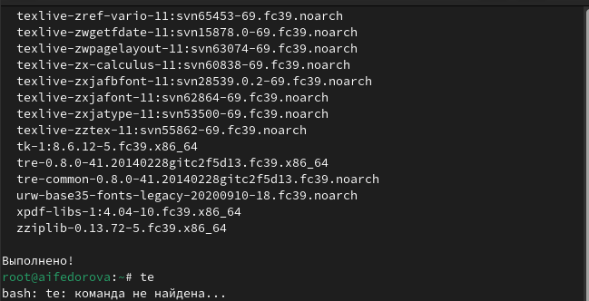

---
## Front matter
title: "Отчёт по лабораторной работе №1"
subtitle: "Операционные системы"
author: "Федорова Анжелика Игоревна"

## Generic otions
lang: ru-RU
toc-title: "Содержание"

## Bibliography
bibliography: bib/cite.bib
csl: pandoc/csl/gost-r-7-0-5-2008-numeric.csl

## Pdf output format
toc: true # Table of contents
toc-depth: 2
lof: true # List of figures
lot: true # List of tables
fontsize: 12pt
linestretch: 1.5
papersize: a4
documentclass: scrreprt
## I18n polyglossia
polyglossia-lang:
  name: russian
  options:
	- spelling=modern
	- babelshorthands=true
polyglossia-otherlangs:
  name: english
## I18n babel
babel-lang: russian
babel-otherlangs: english
## Fonts
mainfont: PT Serif
romanfont: PT Serif
sansfont: PT Sans
monofont: PT Mono
mainfontoptions: Ligatures=TeX
romanfontoptions: Ligatures=TeX
sansfontoptions: Ligatures=TeX,Scale=MatchLowercase
monofontoptions: Scale=MatchLowercase,Scale=0.9
## Biblatex
biblatex: true
biblio-style: "gost-numeric"
biblatexoptions:
  - parentracker=true
  - backend=biber
  - hyperref=auto
  - language=auto
  - autolang=other*
  - citestyle=gost-numeric
## Pandoc-crossref LaTeX customization
figureTitle: "Рис."
tableTitle: "Таблица"
listingTitle: "Листинг"
lofTitle: "Список иллюстраций"
lotTitle: "Список таблиц"
lolTitle: "Листинги"
## Misc options
indent: true
header-includes:
  - \usepackage{indentfirst}
  - \usepackage{float} # keep figures where there are in the text
  - \floatplacement{figure}{H} # keep figures where there are in the text
---

# Цель работы

Целью данной работы является приобретение практических навыков установки операционной системы на виртуальную машину, настройки минимально необходимых для дальнейшей работы сервисов.

# Задание

Здесь приводится описание задания в соответствии с рекомендациями
методического пособия и выданным вариантом.

# Выполнение лабораторной работы

Вхожу в ОС под заданной вами при установке учётной записью. Переключаюсь на роль супер-пользователя. И обновить все пакеты с помощью dnf -y update (рис. fig:001). 

{#fig:001 width=70%}

Устанавливаю программы для удобства работы в консоли. (рис. fig:002). 

{#fig:002 width=70%}

При необходимости можно использовать автоматическое обновление.
Установка необходимого программного обеспечения для этого(рис. fig:00)3

{#fig:003 width=70%}

Задаю необходимую конфигурацию в файле /etc/dnf/automatic.conf. Запускаю таймер(рис. fig:004)

{#fig:004 width=70%}

Теперь я отключу SELINUX.В файле /etc/selinux/config заменю значение SELINUX=enforcing на значение SELINUX=permissive (рис. fig:005)

{#fig:005 width=70%}

Перезагружу виртуальную машину с помощью команды reboot.

Теперь я попробую установить нужные драйвера, запустив терминальный мультиплексор tmux. Переключюсь на роль супер-пользователя. Затем я установлю  средства разработки "Development Tools"(рис. fig:006)

{#fig:006 width=70%}

Далее установлю пакет DKMS(рис. fig:007)

{#fig:007 width=70%}

Теперь я должна подмонтировать  диск с помощью команды mount. Зайдя в меню виртуальной машины, я вижу, что оптический диск уже установлен (рис. fig:008)

{#fig:008 width=70%}

Теперь я создаю  пользователя и вместо username указываю свой логин в дисплейном классе.Также меняю пароль и имя хоста. В конце я проверяю установленное имя хоста (рис. fig:009)

{#fig:009 width=70%}

 Внутри виртуальной машины я добавляю своего пользователя в группу vboxsf и подключаю разделяемую папку.
Далее я перезагружаю машину (рис. fig:010)

{#fig:010 width=70%}

Установливаю с помощью менеджера пакетов средство pandoc для работы с языком разметки Markdown.(рис.fig:011 и  fig:012) 

{#fig:011 width=70%}

{#fig:012 width=70%}

Установим дистрибутив TeXlive (рис. fig:013)

{#fig:013 width=70%}

Я получила информацию о версия ядра Linux, частоте процессора и модель процессора через команду dmesg | grep -i "то, что ищем" (рис. fig:015)

{#fig:015 width=70%}

Также я узнала о размере доступной памяти в данный момент и о типе обнаруженного гипервизора. (рис. fig:016)

{#fig:016 width=70%}

Я получила информацию о последовательности монтирования файловых систем (рис. fig:017)

{#fig:016 width=70%}

# Выводы

Я приобрела практические навыки установки операционной системы на виртуальную машину, настройки минимально необходимых для дальнейшей работы сервисов.

# Контрольные вопросы

1. Учётная запись, как правило, содержит сведения, необходимые для опо-
знания пользователя при подключении к системе, сведения для авториза-
ции и учёта. Это идентификатор пользователя (login) и его пароль. Пароль
или его аналог, как правило, хранится в зашифрованном или хэширован-
ном виде для обеспечения его безопасности.

2. Для получения справки по команде используется команда “man”: Пример:
man ls
Для перемещения по файловой системе используется команда “cd”: Пример:
cd Documents
Для просмотра содержимого каталога используется команда “ls”: Пример: ls
Для определения объёма каталога используется команда “du”: Пример: du -h
/home/user
Для создания каталогов используется команда “mkdir”, для удаления - коман-
да “rm”: Пример создания: mkdir new_directory Пример удаления: rm file.txt
Для задания определенных прав на файл/каталог используется команда
“chmod”: Пример: chmod 755 file.txt
Для просмотра истории команд используется команда “history”: Пример:
history

3. Файловая система — это структура, используемая операционной систе-
мой для организации и управления файлами на устройстве хранения, например на жестком диске, твердотельном накопителе (SSD) или USB-накопителе.

4. Команда findmnt — это простая утилита командной строки, используемая
для отображения списка смонтированных файловых систем или поиска
файловой системы в /etc/fstab, /etc/mtab и /proc/self/mountinfo. Чтобы отобразить список смонтированных файловых систем, выполните в команд-
ной строке следующую команду.

findmnt

Она отображает целевую точку монтирования (TARGET), исходное устройство
(SOURCE), тип файловой системы (FSTYPE) и соответствующие параметры мон-
тирования (OPTIONS) для каждой файловой системы, как показано в следующих
выходных данных.

5. Чтобы удалить зависший процесс, вначале мы должны узнать, какой у него
id: используем команду ps. Далее в терминале вводим команду kill < id про-
цесса >. Или можно использовать утилиту killall, что “убьет” все процессы,
которые есть в данный момент, для этого не нужно знать id процесса.

# Cписок литературы

[Важные команды Linux](https://habr.com/ru/articles/481398/)

[Команда findmnt](https://zalinux.ru/?p=4793)

[Зависший процесс](https://selectel.ru/blog/tutorials/kill-and-killall-commands-in-linux/)

:::
