---
## Front matter
lang: ru-RU
title: Презентация по лабораторной работе №2
subtitle: Операционные системы
author:
  - Федорова А. И.
institute:
  - Российский университет дружбы народов, Москва, Россия
  

## i18n babel
babel-lang: russian
babel-otherlangs: english

## Formatting pdf
toc: false
toc-title: Содержание
slide_level: 2
aspectratio: 169
section-titles: true
theme: metropolis
header-includes:
 - \metroset{progressbar=frametitle,sectionpage=progressbar,numbering=fraction}
 - '\makeatletter'
 - '\beamer@ignorenonframefalse'
 - '\makeatother'
 
## Fonts
mainfont: PT Serif
romanfont: PT Serif
sansfont: PT Sans
monofont: PT Mono
mainfontoptions: Ligatures=TeX
romanfontoptions: Ligatures=TeX
sansfontoptions: Ligatures=TeX,Scale=MatchLowercase
monofontoptions: Scale=MatchLowercase,Scale=0.9

---

## Актуальность

В наше время для специлиста в сфере программирования необходимо иметь многофункциональное хранилище для исходного кода многих проектов. Github является таким средством и необходимо знак как удаленно управлять своим репозиторием при помощи консоли.

## Цели и задачи

Цель данной лабораторной работы -- изучение идеологии и применения средств контроля версий, освоение умения по работе с git.

## Материалы и методы

1. Создать базовую конфигурацию для работы с git
2. Создать ключ SSH
3. Создать ключ GPG
4. Настроить подписи Git
5. Зарегистрироваться на GitHub
6. Создать локальный каталог для выполнения заданий по предмету.

## Установка ПО

- Устанавливаю необходимое программное обеспечение git с помощью команд: dnf install git (рис. fig:001).

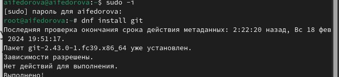{#fig:001 width=70%}

## Базовая настройка git

Также устанавливаю необходимое программное обеспечение gh с помощью команды dnf install gh  (рис. fig:002)

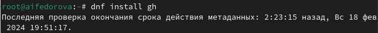{#fig:002 width=70%}

Задаю в качестве имени и email владельца репозитория свои имя, фамилию и электронную почту(рис. fig:003)

{#fig:003 width=70%}

## Создание ключа ssh 

Создаю ключ ssh размером 4096 бит по алгоритму rsa (рис. fig:005)

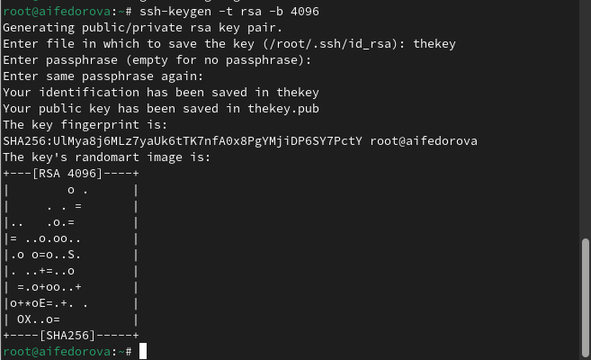{#fig:005 width=70%}

## Создание ключа GPG

Генерирую ключ GPG, затем выбираю тип ключа RSA and RSA, задаю максиммальную длину ключа: 4096, оставляю неограниченный срок действия ключа. (рис. fig:006)

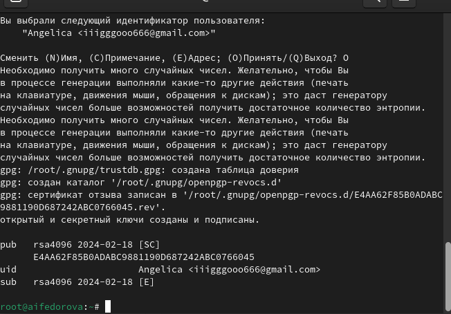{#fig:006 width=70%}

## Создание ключа GPG

Вывожу список созданных ключей в терминал, ищу в результате запроса отпечаток ключа (последовательность байтов для идентификации более длинного, по сравнению с самим отпечатком, ключа), он стоит после знака слеша, копирую его в буфер обмена (рис. fig:007)

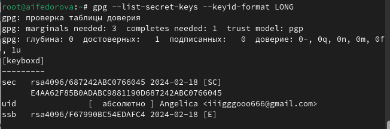{#fig:007 width=70%}

## Создание ключа GPG

Ввожу в терминале команду, с помощью которой копирую сам ключ GPG в буфер обмена (рис. fig:008)

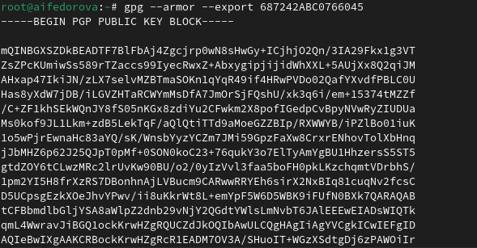{#fig:008 width=70%}

## Создание ключа GPG

Я добавила ключ GPG на GitHub (рис. fig:009)

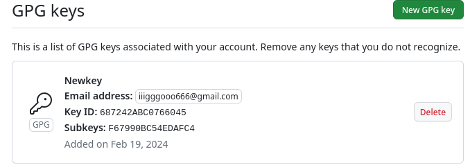{#fig:009 width=70%}

## Настройка подписи Git

 Настраиваю автоматические подписи коммитов git: используя введенный ранее email, указываю git использовать его при создании подписей коммитов (рис. fig:010)

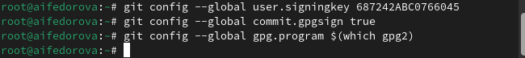{#fig:010 width=70%}

## Настройка gh

 Начинаю авторизацию в gh, отвечаю на наводящие вопросы от утилиты, в конце выбираю авторизоваться через браузер. После завершения получаю сообщение о завершении авторизации под своим именем. (рис. fig:011)

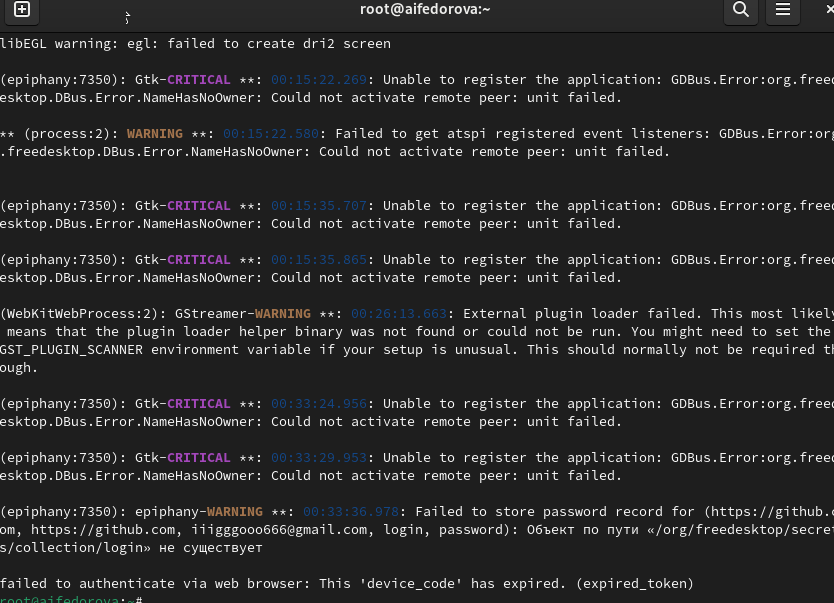{#fig:011 width=70%}

## Создание репозитория курса 

 Сначала создаю директорию с помощью утилиты mkdir и флага -p. После этого с помощью утилиты cd перехожу в только что созданную директорию "Операционные системы".(рис. fig:012)

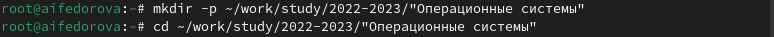{#fig:012 width=70%}

## Создание репозитория курса 

Теперь я снова захожу под своим именем через утилиту gh (рис. fig:013)

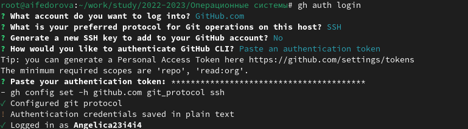{#fig:013 width=70%}

## Создание репозитория курса 

 Далее в терминале ввожу команду gh repo create study_2023-2024_os-intro --template yamadharma/course-directory-student-trmplate --public (рис. fig:014)

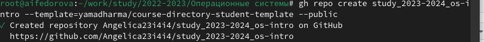{#fig:014 width=70%}

## Создание репозитория курса 

 После этого клонирую репозиторий к себе в директорию и указываю ссылку с протоколом https, а не ssh, потому что при авторизации в gh выбрала протокол https (рис. fig:015)

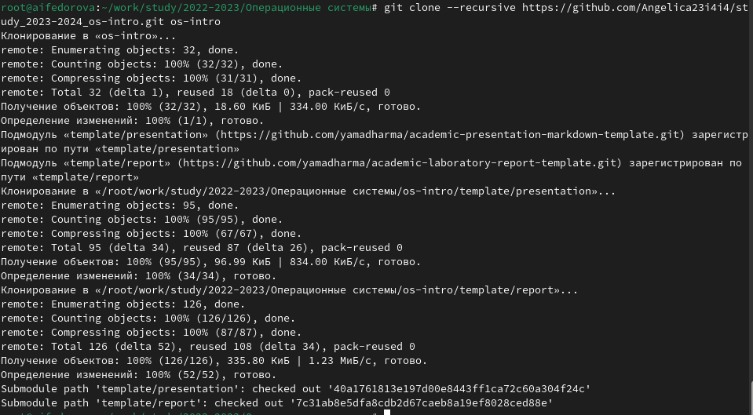{#fig:015 width=70%}

## Создание репозитория курса 

Перехожу в каталог курса с помощью утилиты cd и Удаляю лишние файлы с помощью утилиты rm  (рис. fig:016)

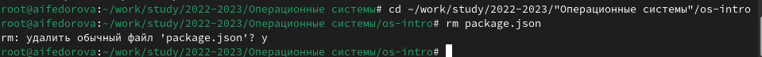{#fig:0016 width=70%}

## Cоздание репозитория курса 

Далее создаю необходимые каталоги используя makefile (рис. fig:017)

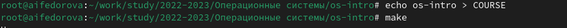{#fig:017 width=70%}

## Создание репозитория курса 

 Добавляю все новые файлы для отправки на сервер (сохраняю добавленные изменения) с помощью команды git add и комментирую их с помощью git commit (рис. fig:018)

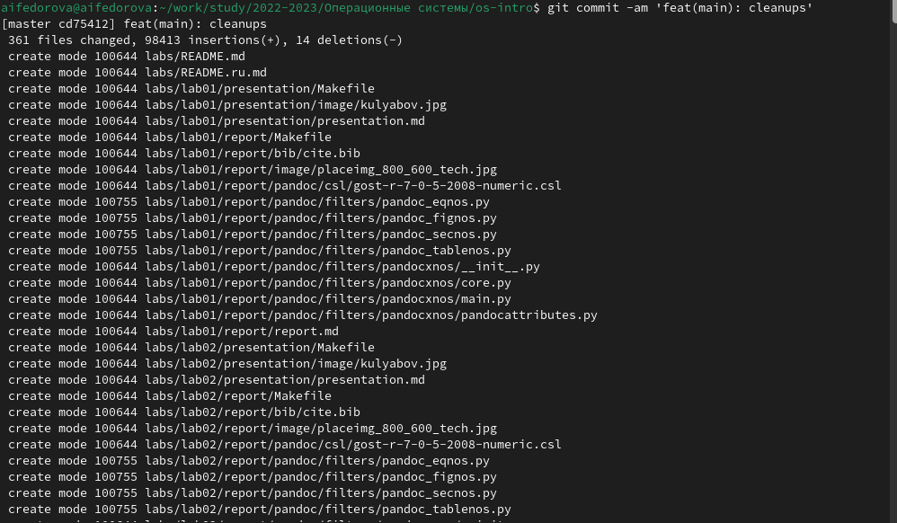{#fig:018 width=70%}

## Создание репозитория курса 

Отправляю файлы на сервер с помощью git push (рис. fig:019)

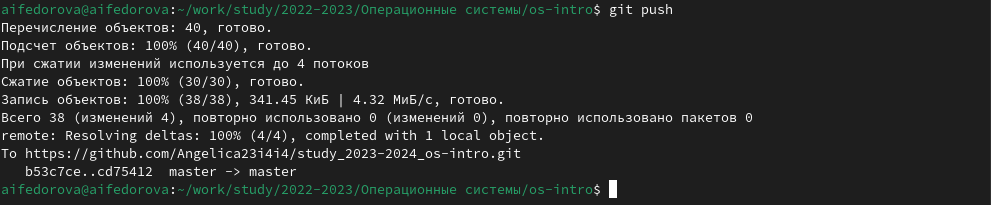{#fig:019 width=70%}

## Результаты

- Создала базовую конфигурацию для работы с git
- Научилась создавать ключи  SSH и GPG 
- Настроила подписи Git
- Создала локальный каталог для выполнения заданий по предмету.

## Итоговый слайд

Практикуйте свои навыки и прогресс придет быстрее.

