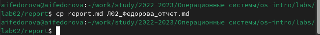
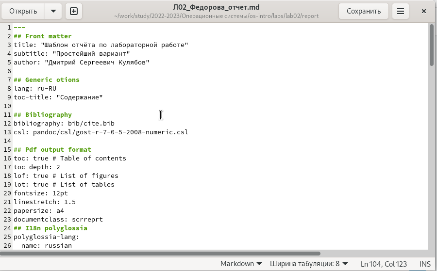
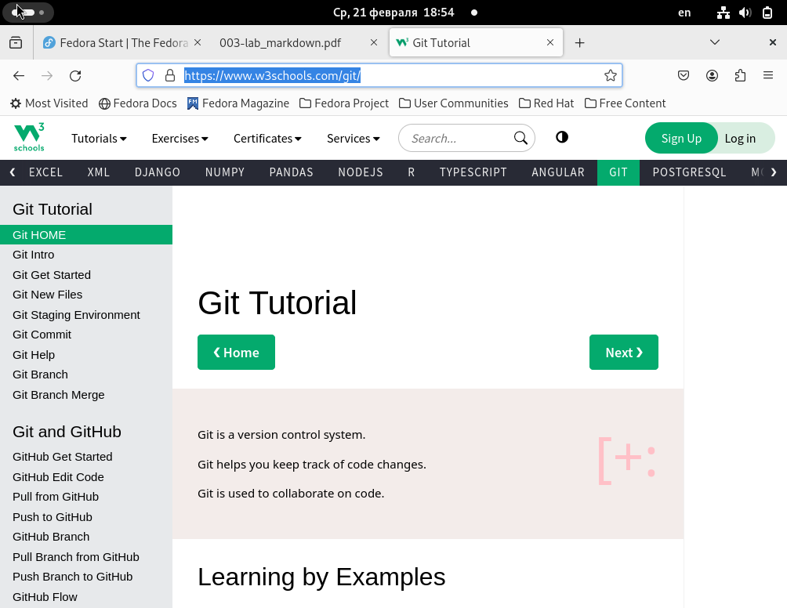
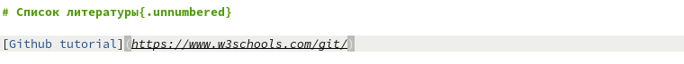
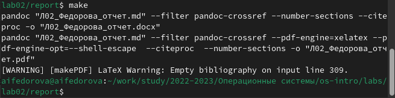
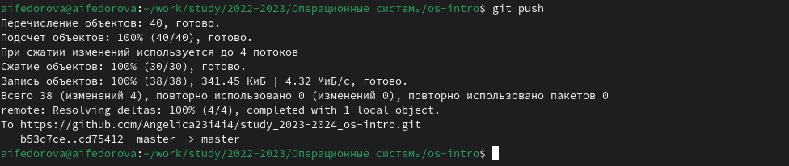

---
## Front matter
lang: ru-RU
title: Презентация по лабораторной работе №3
subtitle: Операционные системы
author:
  - Федорова А.И
institute:
  - Российский университет дружбы народов, Москва, Россия
  

## i18n babel
babel-lang: russian
babel-otherlangs: english

## Formatting pdf
toc: false
toc-title: Содержание
slide_level: 2
aspectratio: 169
section-titles: true
theme: metropolis
header-includes:
 - \metroset{progressbar=frametitle,sectionpage=progressbar,numbering=fraction}
 - '\makeatletter'
 - '\beamer@ignorenonframefalse'
 - '\makeatother'
 
## Fonts
mainfont: PT Serif
romanfont: PT Serif
sansfont: PT Sans
monofont: PT Mono
mainfontoptions: Ligatures=TeX
romanfontoptions: Ligatures=TeX
sansfontoptions: Ligatures=TeX,Scale=MatchLowercase
monofontoptions: Scale=MatchLowercase,Scale=0.9

---

## Актуальность

При написаннии научно-исследовательской работы очень важно соблюдать правильное оформление и позаботиться о ее подаче в разных форматах. Markdown предоставляет широкие возможности для редактирования и конвертации какого-либо доклада/презентации.

## Цели и задачи

- Сделать отчёт по предыдущей лабораторной работе в формате Markdown.
- В качестве отчёта нужно предоставить отчёты в 3 форматах: pdf, docx и md (в архиве,
поскольку он должен содержать скриншоты, Makefile и т.д.

## Теоретическое введение

Markdown — облегчённый язык разметки, созданный с целью обозначения форматирования в простом тексте, с максимальным сохранением его читаемости человеком, и пригодный для машинного преобразования в языки для продвинутых публикаций.

## Выполнение лабораторной работы. Копирование файла

Захожу в директорию report в каталоге lab02  и копирую содержание файла report.md с поомощью команды cp (рис. fig:001).

{#fig:001 width=70%}

## Выполнение лабораторной работы. Заполнение отчета, вставка ссылок

Теперь открываю текстовый редактор gedit и начинаю заполнять отчет по второй лабораторной (рис. fig:002). 

{#fig:002 width=70%}

## Выполнение лабораторной работы. Заполнение отчета, вставка ссылок

Захожу на сайт, который использовала как один из полезных источников и копирую ссылку на него(рис. fig:003).

{#fig:003 width=70%}

## Выполнение лабораторной работы. Заполнение отчета, вставка ссылок

Вставляю в квадратных скобках название для ссылки, а в круглых - саму ссылку(рис. fig:004).

{#fig:004 width=70%}

## Выполнение лабораторной работы. Конвертация отчета

Конвертирую файл отчета в pdf и docx форматы с помощью команды make(рис. fig:005)

{#fig:005 width=70%}

## Выполнение лабораторной работы. Отправка в репозиторий

Отправляю полученные файлы в свой репозиторий с помощью комнад git add ., git commt и git push.

{#fig:006 width=70%}

## Результаты

- Написала отчет по лабораторной работе, опираясь на основные академические требования к исследовательской работе
- Научилась работать с языком разметки Markdown.

## Итог

Cпасибо за внимание!

