---
## Front matter
lang: ru-RU
title: Презентация по лабораторной работе №5
subtitle: Операционные системы
author:
  - Федорова А.И
institute:
  - Российский университет дружбы народов, Москва, Россия
 

## i18n babel
babel-lang: russian
babel-otherlangs: english

## Formatting pdf
toc: false
toc-title: Содержание
slide_level: 2
aspectratio: 169
section-titles: true
theme: metropolis
header-includes:
 - \metroset{progressbar=frametitle,sectionpage=progressbar,numbering=fraction}
 - '\makeatletter'
 - '\beamer@ignorenonframefalse'
 - '\makeatother'
 
## Fonts
mainfont: PT Serif
romanfont: PT Serif
sansfont: PT Sans
monofont: PT Mono
mainfontoptions: Ligatures=TeX
romanfontoptions: Ligatures=TeX
sansfontoptions: Ligatures=TeX,Scale=MatchLowercase
monofontoptions: Scale=MatchLowercase,Scale=0.9

---

## Цели 

Научиться работать с менеджером паролей pass и использование chezmoi для управления файлами конфигурации домашнего каталога пользователя.

## Этапы

1. Установка ПО
2. Настроить хранилище паролей
3. Настройка интерфейса с браузером
4. Сохранение пароля
5. Установка дополнительного ПО
6. Создание собственного репозитория с помощью утилит
7. Подключение репозитория к своей системе
8. Ежедневные операции c chezmoi

## Установка ПО

Установлю  первый необходимый пакет(рис.1).

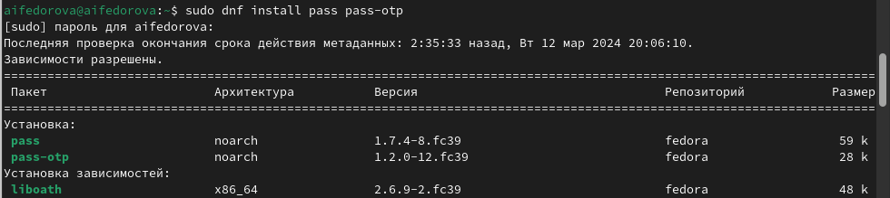{#fig:001 width=70%}

## Установка ПО

Установлю  второй необходимый пакет(рис.2).

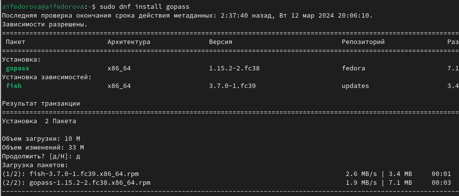{#fig:002 width=70%}

## Настройка хранилища паролей

Инициализирую хранилище (рис.4)

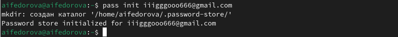{#fig:004 width=70%}

## Настройка хранилища паролей

Создаю структуру git для хранения паролей (рис.5)

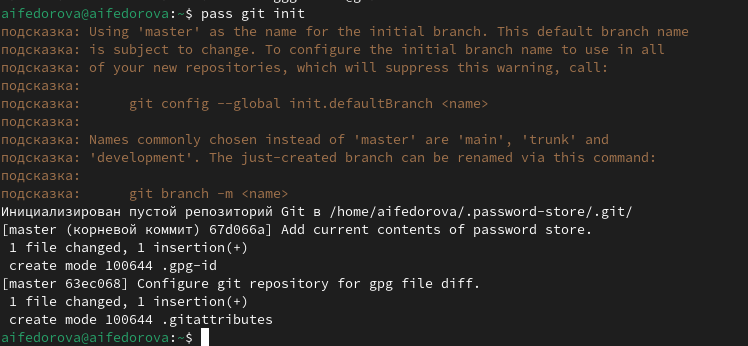{#fig:005 width=70%}

## Настройка хранилища паролей

Захожу  в созданный каталог  .password-store и задаю адрес репозитория на хостинге, куда будут передаваться все изменения в данном каталоге(рис.6)

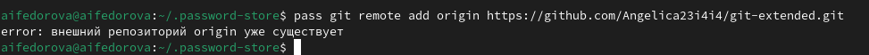{#fig:006 width=70%}

## Настройка хранилища паролей

Для синхронизации репозитория git-extended и каталога .password-store выполняю команды pass git pull (рис.7)

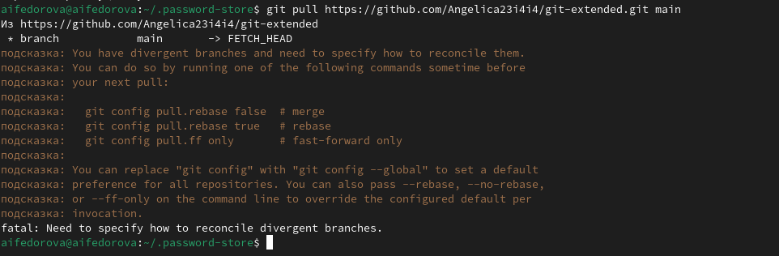{#fig:007 width=70%}

## Настройка хранилища паролей

Отправляю данные изменения в репозиторий с помощью команды pass git push  (рис.8)

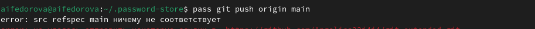{#fig:008 width=70%}

## Настройка интерфейса с браузером

Теперь скачиваю нужный интерфейс через консоль. (рис.10)

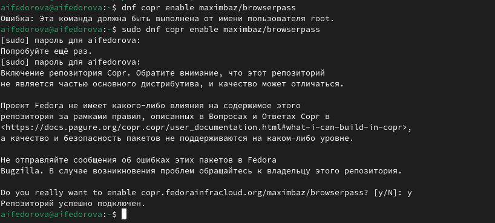{#fig:010 width=70%}

## Настройка интерфейса с браузером

Устанавливаю второй пакет для работы с  browserpass (рис.11)

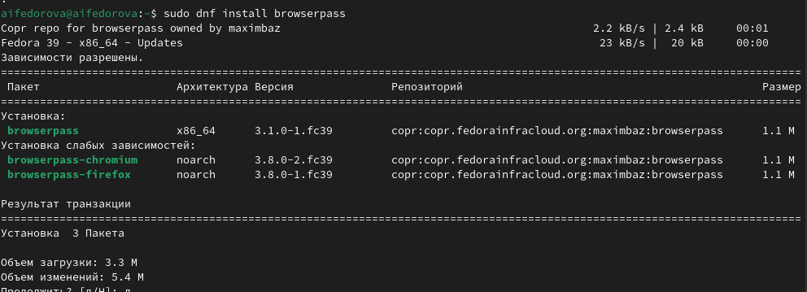{#fig:011 width=70%}

## Сохранение пароля

Теперь записываю новый пароль в каталог .password-store в файл passfile с помощью команды pass insert (рис.12)

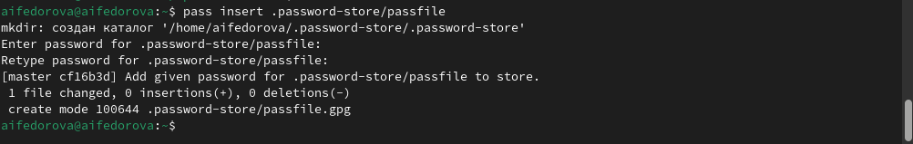{#fig:012 width=70%}

## Сохранение пароля

Отображаю введенный пароль, записанный в passfile с помощью команды pass (рис.13)

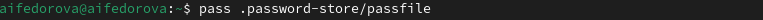{#fig:013 width=70%}

## Сохранение пароля

Генерирую новый пароль с помощью команды pass generate --in-place (рис.15)

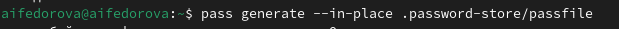{#fig:015 width=70%}

##  Установка дополнительного ПО

 Установливаю дополнительное программное обеспечение (рис.17)

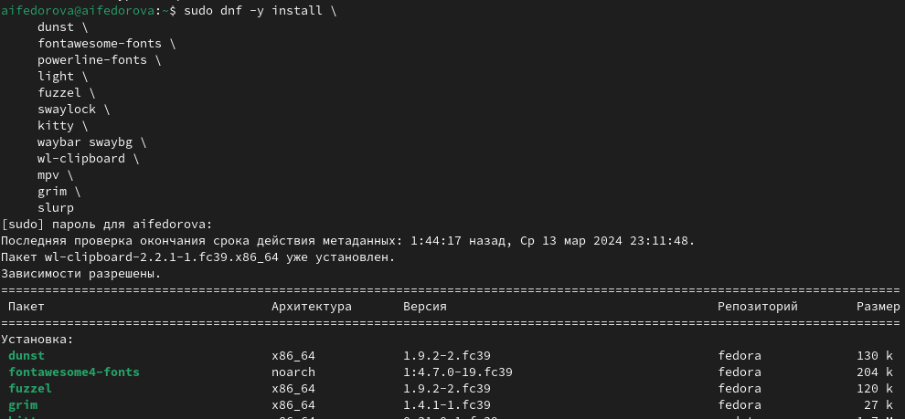{#fig:017 width=70%}

##  Установка дополнительного ПО

Установливаю шрифты(рис.18)

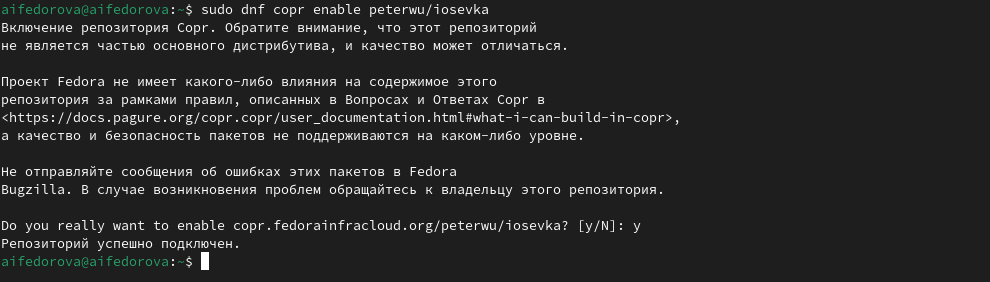{#fig:018 width=70%}

##  Установка дополнительного ПО

Установка бинарного файла. Скрипт определяет архитектуру процессора и операционную систему и скачивает необходимый файл для работы с chezmoi (рис.21)

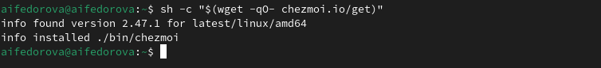{#fig:021 width=70%}

## Создание собственного репозитория с помощью утилит

Создам свой репозиторий для конфигурационных файлов на основе шаблона (рис.22)

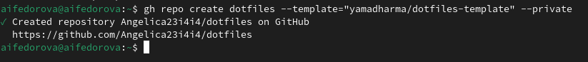{#fig:022 width=70%}

## Подключение репозитория к своей системе

Инициализирую chezmoi с вашим репозиторием dotfiles (рис.23)

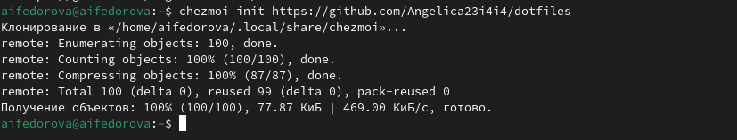{#fig:023 width=70%}

## Подключение репозитория к своей системе

Проверяю, какие изменения внесёт chezmoi в домашний каталог, запустив chezmoi diff. Вижу подробное описание изменений (рис.24)

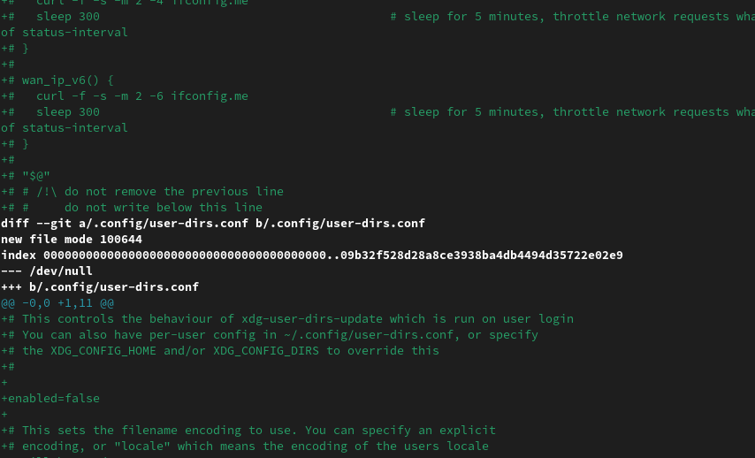{#fig:024 width=70%}

## Ежедневные операции c chezmoi

Я могу извлечь последние изменения из своего репозитория и посмотреть, что изменится, фактически не применяя изменения  (рис.27)

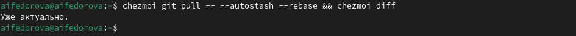{#fig:027 width=70%}

## Ежедневные операции c chezmoi

Можно автоматически фиксировать и отправлять изменения в исходный каталог в репозиторий. Эта функция отключена по умолчанию. Чтобы включить её, добавьте в файл конфигурации ~/.config/chezmoi/chezmoi.toml следующее  (рис.29)

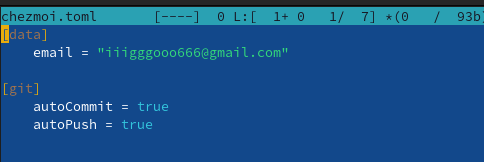{#fig:029 width=70%}

## Результаты

- Научилась работать с менеджером паролей pass
- Научилась управлять файлами с помощью chezmoi 

## Итоговый слайд

Спасибо за внимание!
