---
## Front matter
title: "Отчет по лабораторной работе №5"
subtitle: "Операционные системы"
author: "Федорова Анжелика"

## Generic otions
lang: ru-RU
toc-title: "Содержание"

## Bibliography
bibliography: bib/cite.bib
csl: pandoc/csl/gost-r-7-0-5-2008-numeric.csl

## Pdf output format
toc: true # Table of contents
toc-depth: 2
lof: true # List of figures
lot: true # List of tables
fontsize: 12pt
linestretch: 1.5
papersize: a4
documentclass: scrreprt
## I18n polyglossia
polyglossia-lang:
  name: russian
  options:
	- spelling=modern
	- babelshorthands=true
polyglossia-otherlangs:
  name: english
## I18n babel
babel-lang: russian
babel-otherlangs: english
## Fonts
mainfont: PT Serif
romanfont: PT Serif
sansfont: PT Sans
monofont: PT Mono
mainfontoptions: Ligatures=TeX
romanfontoptions: Ligatures=TeX
sansfontoptions: Ligatures=TeX,Scale=MatchLowercase
monofontoptions: Scale=MatchLowercase,Scale=0.9
## Biblatex
biblatex: true
biblio-style: "gost-numeric"
biblatexoptions:
  - parentracker=true
  - backend=biber
  - hyperref=auto
  - language=auto
  - autolang=other*
  - citestyle=gost-numeric
## Pandoc-crossref LaTeX customization
figureTitle: "Рис."
tableTitle: "Таблица"
listingTitle: "Листинг"
lofTitle: "Список иллюстраций"
lotTitle: "Список таблиц"
lolTitle: "Листинги"
## Misc options
indent: true
header-includes:
  - \usepackage{indentfirst}
  - \usepackage{float} # keep figures where there are in the text
  - \floatplacement{figure}{H} # keep figures where there are in the text
---

# Цель работы

Научиться работать с менеджером паролей pass и использование chezmoi для управления файлами конфигурации домашнего каталога пользователя.

# Задание

1. Установить ПО
2. Настроить хранилище
3. Сохранить пароль
4. Применить команды chezmoi

# Теоретическое введение

Менеджер паролей pass — программа, сделанная в рамках идеологии Unix. Также носит название стандартного менеджера паролей для Unix (The standard Unix password manager).

Свойства:

1. Данные хранятся в файловой системе в виде каталогов и файлов.
2. Файлы шифруются с помощью GPG-ключа.

**Структура базы паролей**

 - Структура базы может быть произвольной, если Вы собираетесь использовать её напрямую, без промежуточного программного обеспечения. Тогда семантику структуры базы данных Вы держите в своей голове.
 - Если же необходимо использовать дополнительное программное обеспечение, необходимо семантику заложить в структуру базы паролей.
 
**Управление файлами конфигурации**

Использование chezmoi для управления файлами конфигурации домашнего каталога пользователя.

# Выполнение лабораторной работы

Установлю  первый необходимый пакет(рис.1).

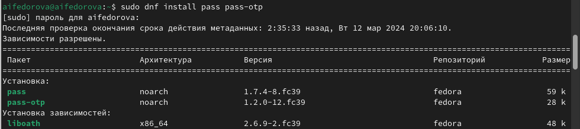{#fig:001 width=70%}

Установлю  второй необходимый пакет(рис.2).

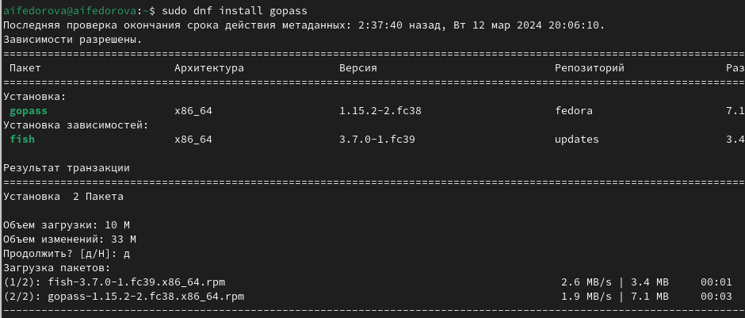{#fig:002 width=70%}

Просмотрю список ключей(рис.3).

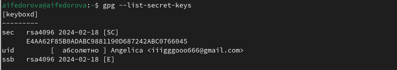{#fig:003 width=70%}

Инициализирую хранилище (рис.4)

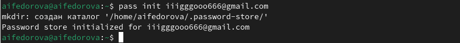{#fig:004 width=70%}

Создаю структуру git для хранения паролей (рис.5)

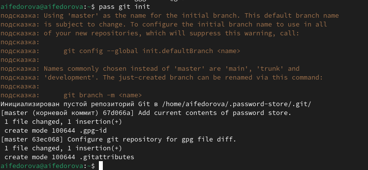{#fig:005 width=70%}

Захожу  в созданный каталог  .password-store и задаю адрес репозитория на хостинге, куда будут передаваться все изменения в данном каталоге(рис.6)

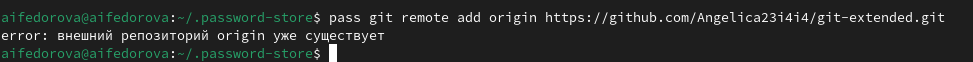{#fig:006 width=70%}

Для синхронизации репозитория git-extended и каталога .password-store выполняю команды pass git pull (рис.7)

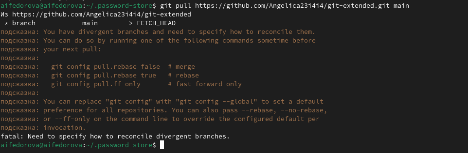{#fig:007 width=70%}

Отправляю данные изменения в репозиторий с помощью команды pass git push  (рис.8)

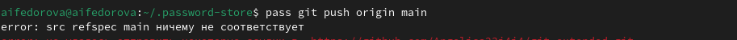{#fig:008 width=70%}

Устанавливаю плагин и расширешение с интерфейсом browserpass (рис.9)

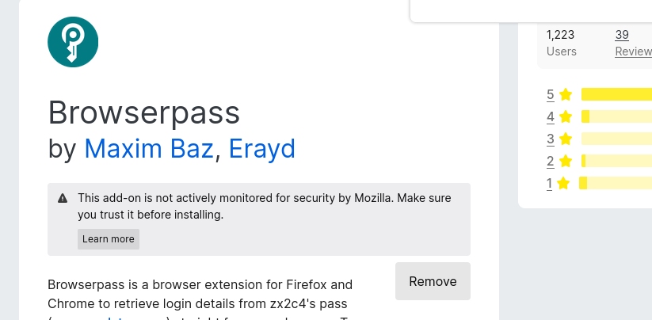{#fig:009 width=70%}

Теперь скачиваю данный интерфейс через консоль. (рис.10)

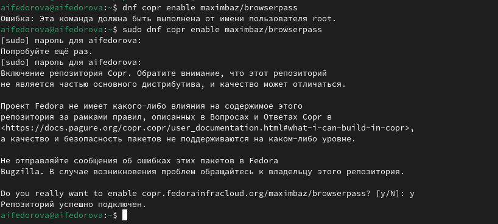{#fig:010 width=70%}

Устанавливаю второй пакет для работы с  browserpass (рис.11)

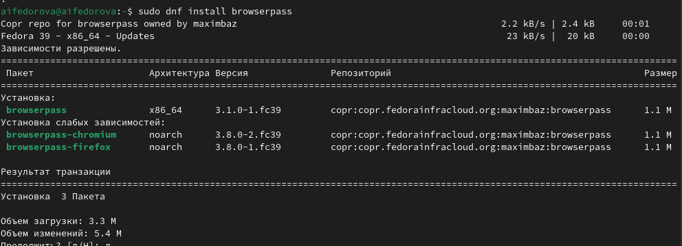{#fig:011 width=70%}

Теперь записываю новый пароль в каталог .password-store в файл passfile с помощью команды pass insert (рис.12)

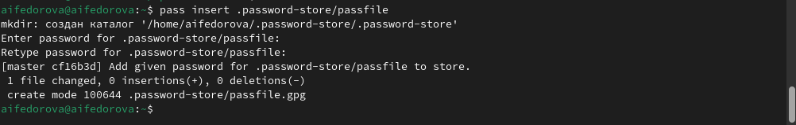{#fig:012 width=70%}

Отображаю введенный пароль, записанный в passfile с помощью команды pass (рис.13)

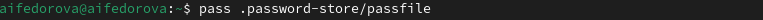{#fig:013 width=70%}

Вбиваю необходимую фразу-пароль (рис.14)

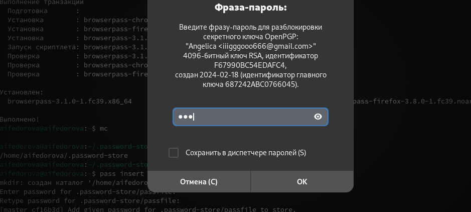{#fig:014 width=70%}

Генерирую новый пароль с помощью команды pass generate --in-place (рис.15)

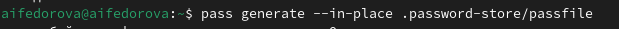{#fig:015 width=70%}

Снова вбиваю необходимую фразу для доступа к файлу(рис.16)

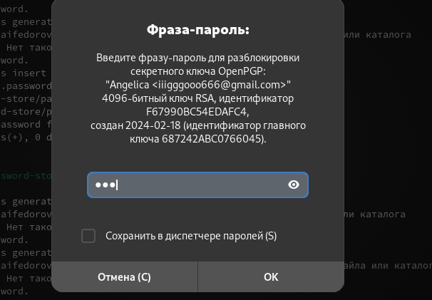{#fig:016 width=70%}

 Установливаю дополнительное программное обеспечение (рис.17)

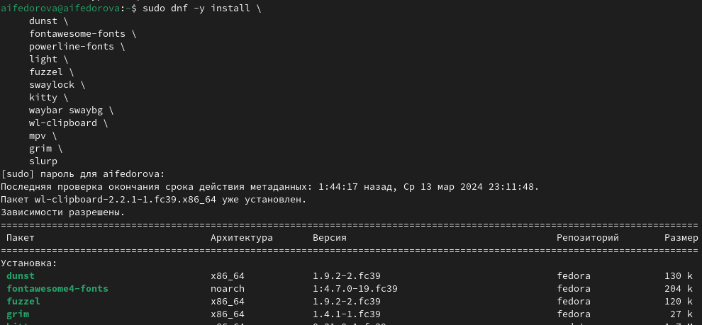{#fig:017 width=70%}

Установливаю шрифты(рис.18)

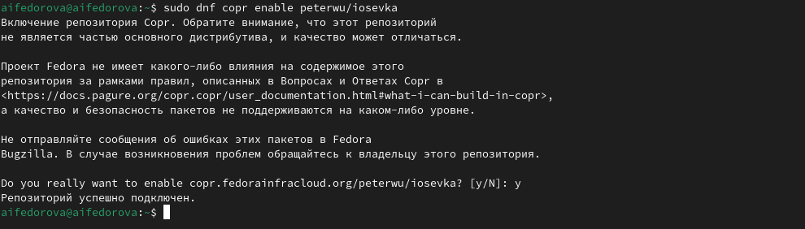{#fig:018 width=70%}

Второй пакет шрифтов (рис.19)

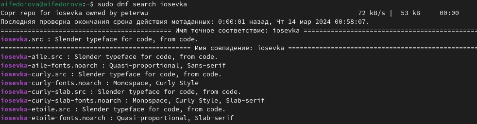{#fig:019 width=70%}

Третий пакет (рис.20)

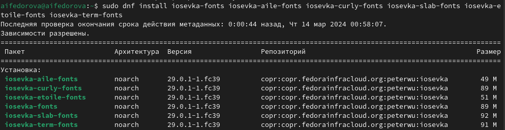{#fig:020 width=70%}

Установка бинарного файла. Скрипт определяет архитектуру процессора и операционную систему и скачивает необходимый файл для работы с chezmoi (рис.21)

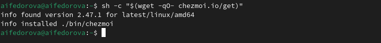{#fig:021 width=70%}

Создам свой репозиторий для конфигурационных файлов на основе шаблона (рис.22)

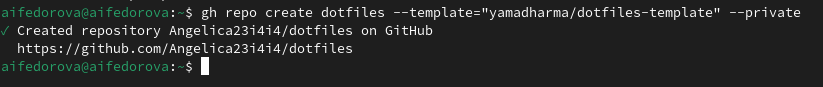{#fig:022 width=70%}

Инициализирую chezmoi с вашим репозиторием dotfiles (рис.23)

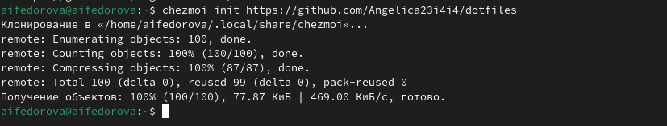{#fig:023 width=70%}

Проверяю, какие изменения внесёт chezmoi в домашний каталог, запустив chezmoi diff. Вижу подробное описание изменений (рис.24)

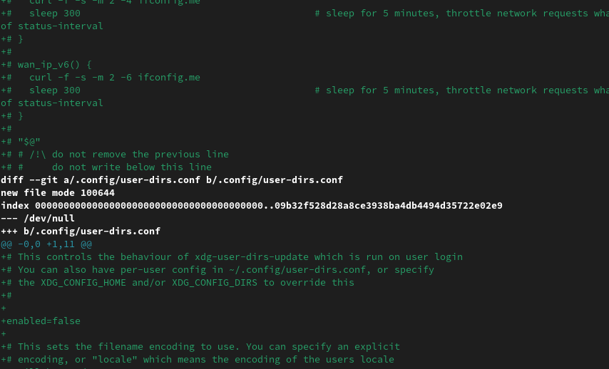{#fig:024 width=70%}

Если вас устраивают изменения, внесённые chezmoi, нужно запустить chezmoi apply -v (рис.25)

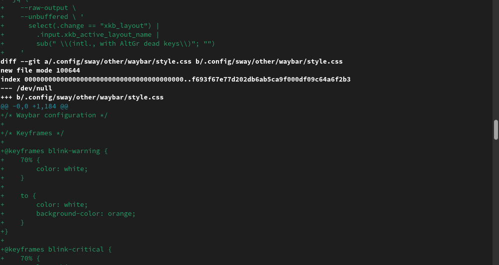{#fig:025 width=70%}

Извлекаю изменения из репозитория и применить их одной командой chezmoi update (рис.26)

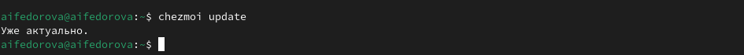{#fig:026 width=70%}

Я могу извлечь последние изменения из своего репозитория и посмотреть, что изменится, фактически не применяя изменения  (рис.27)

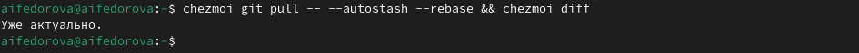{#fig:027 width=70%}

Если изменения устраивают, то нужно применить команду chezmoi apply (рис.28)

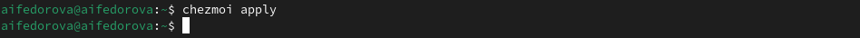{#fig:028 width=70%}

Можно автоматически фиксировать и отправлять изменения в исходный каталог в репозиторий. Эта функция отключена по умолчанию. Чтобы включить её, добавьте в файл конфигурации ~/.config/chezmoi/chezmoi.toml следующее  (рис.29)

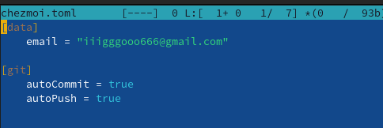{#fig:029 width=70%}

# Выводы

Я научилась работать с менеджером паролей pass и использовать chezmoi для управления файлами конфигурации домашнего каталога пользователя.

# Список литературы

[Лабораторная работа №5](https://esystem.rudn.ru/mod/page/view.php?id=1098796)
