---
## Front matter
lang: ru-RU
title: Презентация по лабораторной работе №6
subtitle: Операционные системы
author:
  - Федорова А.И
institute:
  - Российский университет дружбы народов, Москва, Россия
  

## i18n babel
babel-lang: russian
babel-otherlangs: english

## Formatting pdf
toc: false
toc-title: Содержание
slide_level: 2
aspectratio: 169
section-titles: true
theme: metropolis
header-includes:
 - \metroset{progressbar=frametitle,sectionpage=progressbar,numbering=fraction}
 - '\makeatletter'
 - '\beamer@ignorenonframefalse'
 - '\makeatother'
 
## Fonts
mainfont: PT Serif
romanfont: PT Serif
sansfont: PT Sans
monofont: PT Mono
mainfontoptions: Ligatures=TeX
romanfontoptions: Ligatures=TeX
sansfontoptions: Ligatures=TeX,Scale=MatchLowercase
monofontoptions: Scale=MatchLowercase,Scale=0.9

---

## Актуальность

Специалисту в сферах программирования важно уметь работать с консолью и знать все необходимые функции, чтобы выполнять и оптимизировать операции.

## Цели и задачи

Приобретение практических навыков взаимодействия пользователя с системой по-
средством командной строки.

## Задание

- Определение полного имемни домашнего каталога. 
- Выполненние команды ls и ее опций
- Выполнение команд mkdir, rmdir и rm
- Выполнение команды man
- Модификация и команда history 

## Определение полного имемни домашнего каталога

Определяю полное имя вашего домашнего каталога. (рис.1).

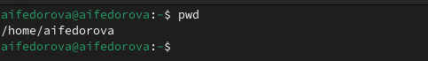{#fig:001 width=70%}

## Выполненние команды ls и ее опций

Перехожу в каталог  /tmp и вывожу его содержимое с помощью команды ls. Команда показывает все файлы и каталоги (рис.2).

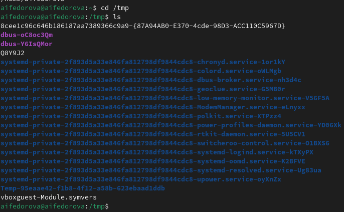{#fig:002 width=70%}

## Выполненние команды ls и ее опций

Если добавить к данной команде опцию -а, то отобразятся имена скрытых файлов (рис.3)

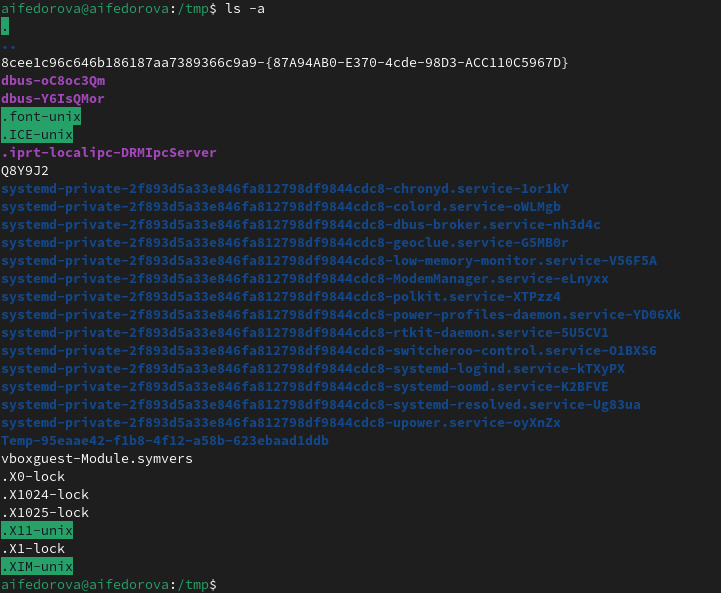{#fig:003 width=70%}

## Выполненние команды ls и ее опций

Если добавить к данной команде опцию -l, то будет выведена подробная информация о каждом файле и каталоге: тип файла, право доступа, число ссылок, владелец, размер, дата последней ревизии, имя файла или каталога.(рис.4)

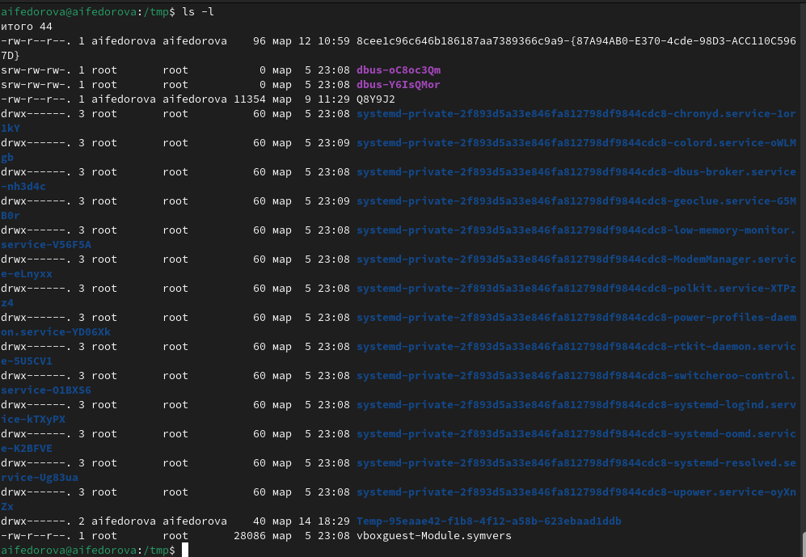{#fig:004 width=70%}

## Выполненние команды ls и ее опций

Если добавить к данной команде опцию -F, то отобразятся имена только входящих каталогов (рис.5)

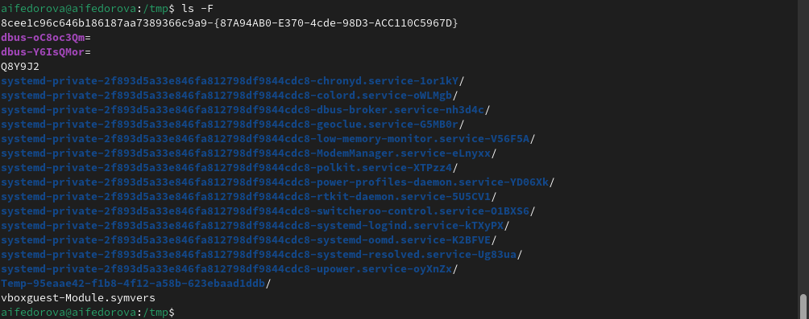{#fig:005 width=70%}

## Выполненние команды ls и ее опций

При помощи команды  ls -l я могу видеть имя владельца. Владельцем файлов является aifedorova aifedorova.  (рис.7)

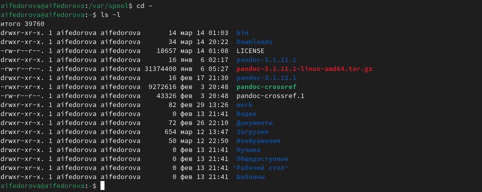{#fig:007 width=70%}

## Выполнение команд mkdir, rmdir и rm

В домашнем каталоге создаю новый каталог с именем newdir при помощи команды mkdir. В каталоге ~/newdir создаю новый каталог с именем morefun также с mkdir(рис.8)

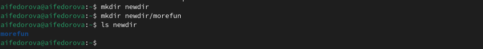{#fig:008 width=70%}

## Выполнение команд mkdir, rmdir и rm

В домашнем каталоге создайте одной командой три новых каталога с именами
letters, memos, misk при помощи mkdir, вводя их имена в строку через пробел (рис.9)

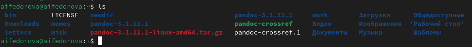{#fig:009 width=70%}

Удаляю также эти каталоги при помощи rmdir (рис.10)

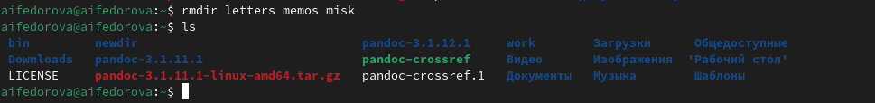{#fig:010 width=70%}

## Выполнение команд mkdir, rmdir и rm

Добавляю к предыдущей команде опцию -r. Вижу, что каталог был удален(рис.12)

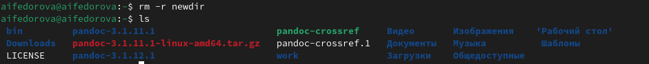{#fig:012 width=70%}

## Выполнение команды man

Ввожу команду man для команды ls. В документации вижу, что нужно использо-
вать опцию -R для просмотра содержимое не только указанного каталога, но и подкаталогов,
входящих в него. (рис.13)

{#fig:013 width=70%}

## Выполнение команды man

Cнова ввожу команду man для команды ls. Вижу набор опций, позволяющий отсортировать по времени последнего изменения выводимый список содержимого каталога
с развёрнутым описанием файлов (рис.14)

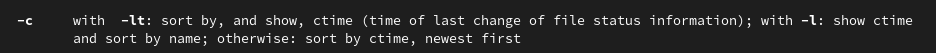{#fig:014 width=70%}

## Выполнение команды man

Используйте команду man для просмотра описания команды cd.(рис.15)

1. -Р - позвояет следовать символическим ссылкам перед тем как обработаны все переходы ".."
2. -L - переходит после того как обработаны все переходы "..".
3. -е - позволяет выйти с ошибкой в которую нужно перейти, не найдена.

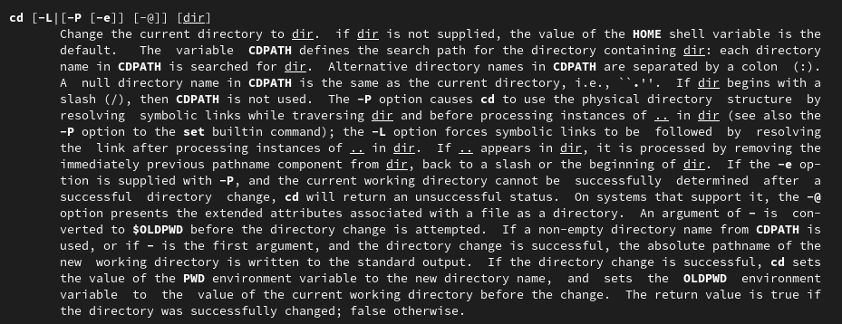{#fig:015 width=70%}

## Выполнение команды man

Использую команду man для просмотра описания команды pwd. (рис.16)

1. -L - брать директорию из переменной окружения, даже если она содержит сиволические ссылки.
2. -Р - отбрасывать все символические ссылки.

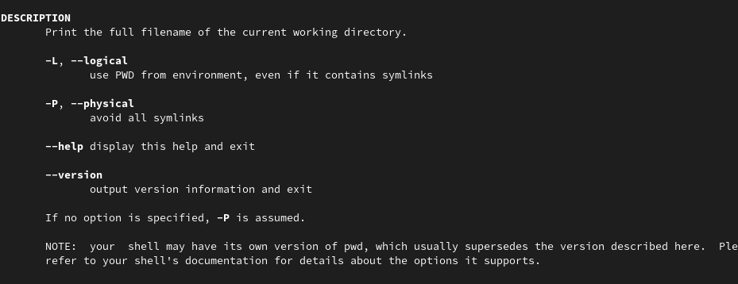{#fig:016 width=70%}

## Модификация и команда history 

С помощью команды history я смотрю на историю всех выполненных команд. (рис.20)

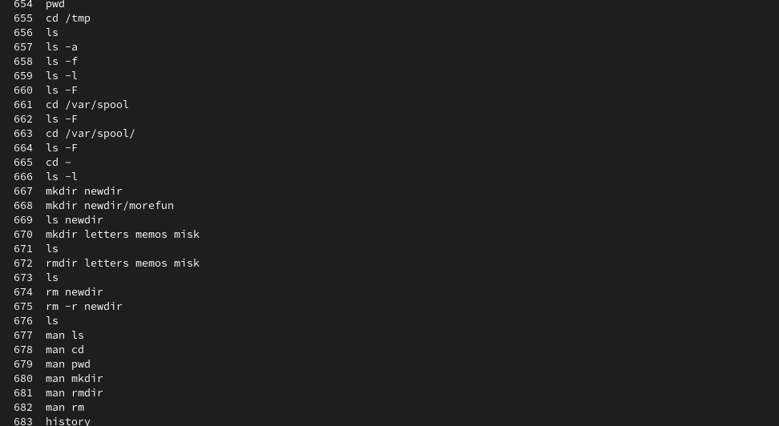{#fig:020 width=70%}

## Модификация и команда history 

Модифицирую команду по номером 662 (рис.21)

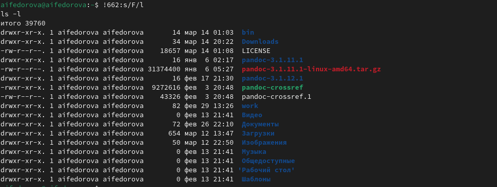{#fig:021 width=70%}

## Результаты

Я приобрела практические навыки взаимодействия пользователя с системой по-
средством командной строки.

## Итоговый слайд

Спасибо за внимание!

