---
## Front matter
title: "Отчет по лабораторной работе №6"
subtitle: "Операционные системы"
author: "Федорова Анжелика Игоревна"

## Generic otions
lang: ru-RU
toc-title: "Содержание"

## Bibliography
bibliography: bib/cite.bib
csl: pandoc/csl/gost-r-7-0-5-2008-numeric.csl

## Pdf output format
toc: true # Table of contents
toc-depth: 2
lof: true # List of figures
lot: true # List of tables
fontsize: 12pt
linestretch: 1.5
papersize: a4
documentclass: scrreprt
## I18n polyglossia
polyglossia-lang:
  name: russian
  options:
	- spelling=modern
	- babelshorthands=true
polyglossia-otherlangs:
  name: english
## I18n babel
babel-lang: russian
babel-otherlangs: english
## Fonts
mainfont: PT Serif
romanfont: PT Serif
sansfont: PT Sans
monofont: PT Mono
mainfontoptions: Ligatures=TeX
romanfontoptions: Ligatures=TeX
sansfontoptions: Ligatures=TeX,Scale=MatchLowercase
monofontoptions: Scale=MatchLowercase,Scale=0.9
## Biblatex
biblatex: true
biblio-style: "gost-numeric"
biblatexoptions:
  - parentracker=true
  - backend=biber
  - hyperref=auto
  - language=auto
  - autolang=other*
  - citestyle=gost-numeric
## Pandoc-crossref LaTeX customization
figureTitle: "Рис."
tableTitle: "Таблица"
listingTitle: "Листинг"
lofTitle: "Список иллюстраций"
lotTitle: "Список таблиц"
lolTitle: "Листинги"
## Misc options
indent: true
header-includes:
  - \usepackage{indentfirst}
  - \usepackage{float} # keep figures where there are in the text
  - \floatplacement{figure}{H} # keep figures where there are in the text
---

# Цель работы

Приобретение практических навыков взаимодействия пользователя с системой по-
средством командной строки.

# Задание

1. Определите полное имя вашего домашнего каталога. 

2. Выполните следующие действия:

2.1. Перейдите в каталог /tmp.

2.2. Выведите на экран содержимое каталога /tmp. Для этого используйте команду ls

с различными опциями. Поясните разницу в выводимой на экран информации.

2.3. Определите, есть ли в каталоге /var/spool подкаталог с именем cron?

2.4. Перейдите в Ваш домашний каталог и выведите на экран его содержимое. Опре-
делите, кто является владельцем файлов и подкаталогов?

3. Выполните следующие действия:
3.1. В домашнем каталоге создайте новый каталог с именем newdir.

3.2. В каталоге ~/newdir создайте новый каталог с именем morefun.

3.3. В домашнем каталоге создайте одной командой три новых каталога с именами
letters, memos, misk. Затем удалите эти каталоги одной командой.

3.4. Попробуйте удалить ранее созданный каталог ~/newdir командой rm. Проверьте,
был ли каталог удалён.

3.5. Удалите каталог ~/newdir/morefun из домашнего каталога. Проверьте, был ли
каталог удалён.
4. С помощью команды man определите, какую опцию команды ls нужно использо-
вать для просмотра содержимое не только указанного каталога, но и подкаталогов,
входящих в него.

5. С помощью команды man определите набор опций команды ls, позволяющий отсорти-
ровать по времени последнего изменения выводимый список содержимого каталога
с развёрнутым описанием файлов.

6. Используйте команду man для просмотра описания следующих команд: cd, pwd, mkdir,
rmdir, rm. Поясните основные опции этих команд.

7. Используя информацию, полученную при помощи команды history, выполните мо-
дификацию и исполнение нескольких команд из буфера команд.

# Теоретическое введение

В операционной системе типа Linux взаимодействие пользователя с системой обычно осуществляется с помощью командной строки посредством построчного ввода команд. При этом обычно используется командные интерпретаторы языка shell: /bin/sh; /bin/csh; /bin/ksh.

Командой в операционной системе называется записанный по специальным правилам текст (возможно с аргументами), представляющий собой указание на выполнение какой-либо функций (или действий) в операционной системе. Обычно первым словом идёт имя команды, остальной текст — аргументы или опции, конкретизирующие действие.

Общий формат команд можно представить следующим образом: <имя_команды><разделитель><аргументы> Команда man. Команда man используется для просмотра (оперативная помощь) в диалоговом режиме руководства (manual) по основным командам операционной системы типа Linux.

Формат команды: man <команда>

Файловая система ОС типа Linux — иерархическая система каталогов, подкаталогов и файлов, которые обычно организованы и сгруппированы по функциональному признаку. Самый верхний каталог в иерархии называется корневым и обозначается символом /. Корневой каталог содержит системные файлы и другие каталоги.

В работе с командами, в качестве аргументов которых выступает путь к какому-либо каталогу или файлу, можно использовать сокращённую запись пути.

# Выполнение лабораторной работы

Определяю полное имя вашего домашнего каталога. (рис.1).

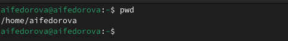{#fig:001 width=70%}

Перехожу в каталог  /tmp и вывожу его содержимое с помощью команды ls. Команда показывает все файлы и каталоги (рис.2).

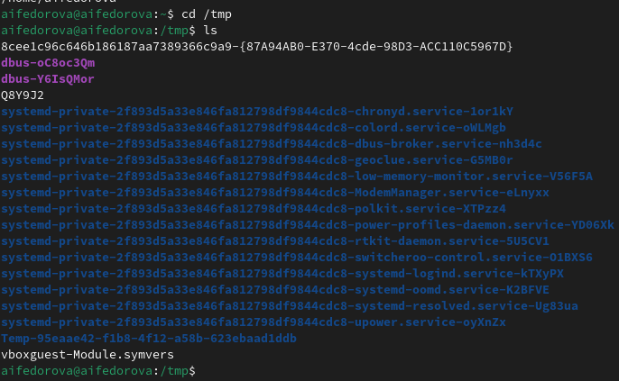{#fig:002 width=70%}

Если добавить к данной команде опцию -а, то отобразятся имена скрытых файлов (рис.3)

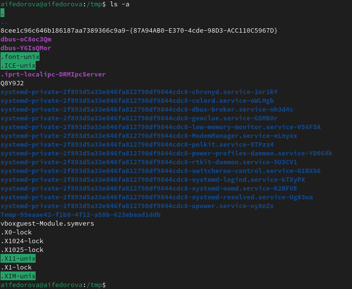{#fig:003 width=70%}

Если добавить к данной команде опцию -l, то будет выведена подробная информация о каждом файле и каталоге: тип файла, право доступа, число ссылок, владелец, размер, дата последней ревизии, имя файла или каталога.(рис.4)

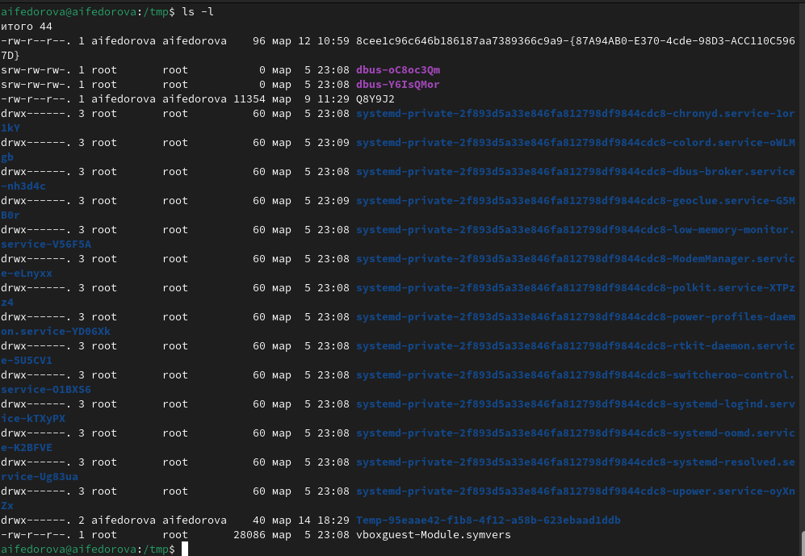{#fig:004 width=70%}

Если добавить к данной команде опцию -F, то отобразятся имена только входящих каталогов (рис.5)

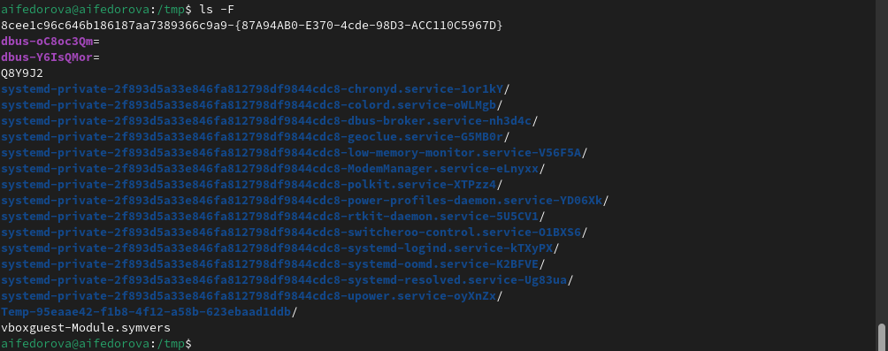{#fig:005 width=70%}

Перехожу в каталог /var/spool и применяю команду ls -F, чтобы посмотреть имена всех каталогов. Вижу, что не существует каталога cron (рис.6)

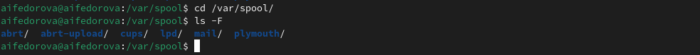{#fig:006 width=70%}

При помощи команды  ls -l я могу видеть имя владельца. Владельцем файлов является aifedorova aifedorova.  (рис.7)

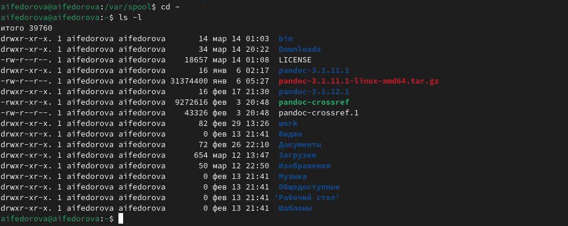{#fig:007 width=70%}

В домашнем каталоге создаю новый каталог с именем newdir при помощи команды mkdir. В каталоге ~/newdir создаю новый каталог с именем morefun также с mkdir(рис.8)

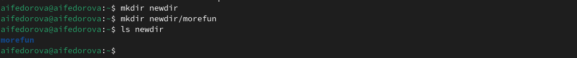{#fig:008 width=70%}

В домашнем каталоге создайте одной командой три новых каталога с именами
letters, memos, misk при помощи mkdir, вводя их имена в строку через пробел (рис.9)

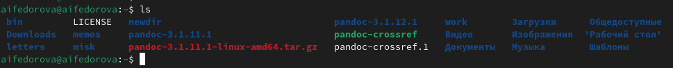{#fig:009 width=70%}

Удаляю также эти каталоги при помощи rmdir (рис.10)

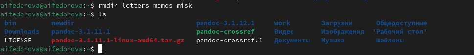{#fig:010 width=70%}

Пробую удалить ранее созданный каталог ~/newdir командой rm. Вижу, что это невозможно, поскольку он не пустой. (рис.11)

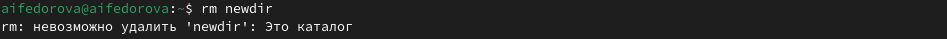{#fig:011 width=70%}

Добавляю к предыдущей команде опцию -r. Вижу, что каталог был удален(рис.12)

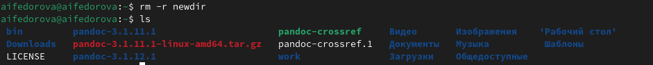{#fig:012 width=70%}

Ввожу команду man для команды ls. В документации вижу, что нужно использо-
вать опцию -R для просмотра содержимое не только указанного каталога, но и подкаталогов,
входящих в него. (рис.13)

{#fig:013 width=70%}

Cнова ввожу команду man для команды ls. Вижу набор опций, позволяющий отсортировать по времени последнего изменения выводимый список содержимого каталога
с развёрнутым описанием файлов (рис.14)

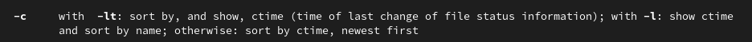{#fig:014 width=70%}

Используйте команду man для просмотра описания команды cd.(рис.15)

1. -Р - позвояет следовать символическим ссылкам перед тем как обработаны все переходы ".."
2. -L - переходит после того как обработаны все переходы "..".
3. -е - позволяет выйти с ошибкой в которую нужно перейти, не найдена.

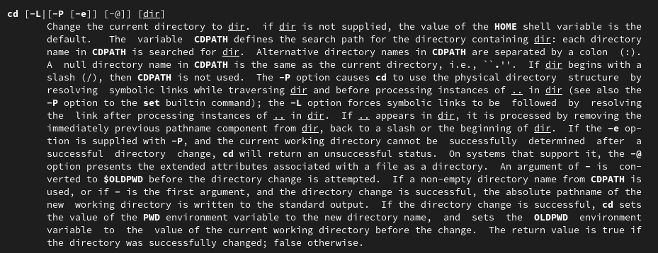{#fig:015 width=70%}

Использую команду man для просмотра описания команды pwd. (рис.16)

1. -L - брать директорию из переменной окружения, даже если она содержит сиволические ссылки.
2. -Р - отбрасывать все символические ссылки.

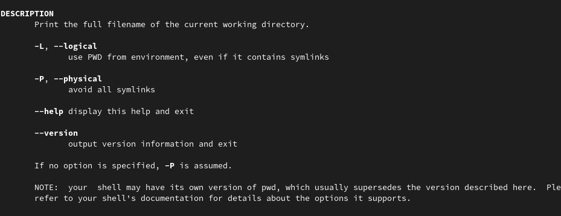{#fig:016 width=70%}

Использую команду man для просмотра описания команды mkdir (рис.17)

1. -m - устанавливает права доступа создаваемой директории как сhmod синтаксис так же как сhmod 
2. -р - позволяет рекурсивно создавать директории и их подкаталоги
3. -v  - выводит сообщение о созданных каталогах
4. -z - установить контекст SElinux для создаваемой директории по умолчанию
5. -context - установить контекст SElinux для создаваемой директории CTX 

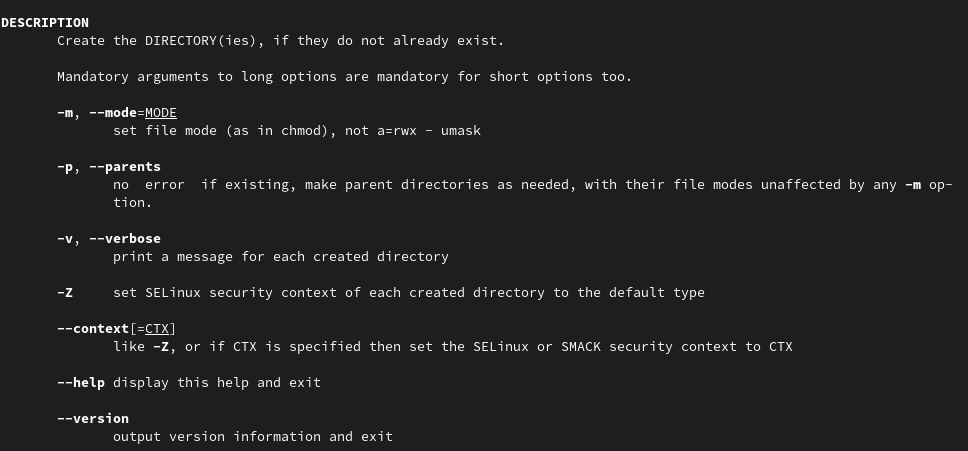{#fig:017 width=70%}

C помощью команды man узнаю описание команды rmdir и ее опции: (рис.18)

1. --ignore-fail-on-non-empty - отменяет вывод ошибки если каталог непустой. Просто его игнорирует.
2. -р - удаляет рекурсивно каталоги, если они содержат в себе только удаляемый каталог.
3. -v  - выводит сообщение о каждом удалении директории.

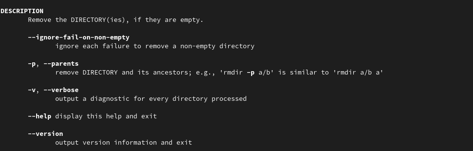{#fig:018 width=70%}

C помощью команды man узнаю описание команды rm и ее опции: (рис.19)

1. -f - игнорировать несуществующие файлы или аргументы, никогда не выводить запрос на подтверждение удаления
2. -i - выводить запрос на подтверждение удаления каждого файла
3. -I - вывести запрос на подтверждение удаления один раз, для всех файлов, если удаляется больше 3-х файлов или идет рекурсивное удаление
4. --interactive - заменяет предыдущие три опции, можно выбрать одну из них.
5. --one-file-system - во время рекурсивного удаления пропускать директории из других файловых систем
6. --no-preserve-root если в качестве директории задана корневая, то считать что это обычная директория и начать удаление.
7. -r, -R - удаляет директории их содержимое рекурсивно
8. -d, --dir - удаляет пустые директории
9. -v - прописывает все действия команды

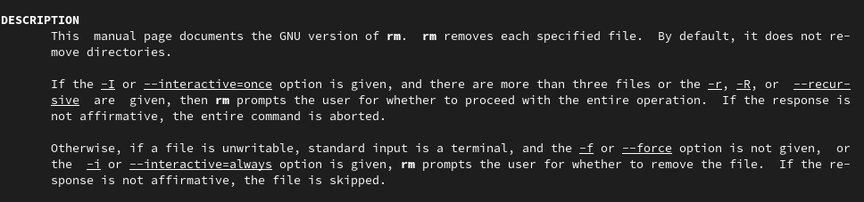{#fig:019 width=70%}

С помощью команды history я смотрю на историю всех выполненных команд. (рис.20)

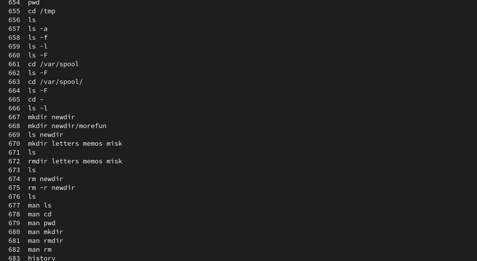{#fig:020 width=70%}

Модифицирую команду по номером 662 (рис.21)

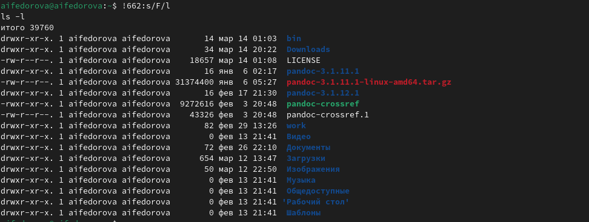{#fig:021 width=70%}

Модифицирую команду по номером 665 (рис.22)

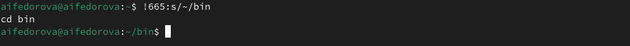{#fig:022 width=70%}

Модифицирую команду по номером 667 (рис.23)

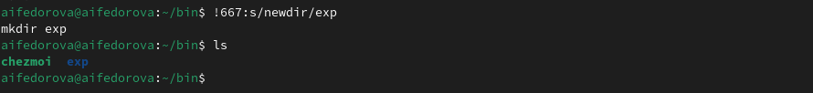{#fig:023 width=70%}

# Выводы

Я приобрела практические навыки взаимодействия пользователя с системой по-
средством командной строки.

# Ответы на контрольные вопросы

1. Командная строка - это текстовая система, которая передает команды компьютеру и возвращает результаты пользователю. В операционной системе типа Linux взаимодействие пользователя с системой обычно осуществляется с помощью командной строки посредством построчного ввода команд.
2. Для определения абсолютного пути к текущему каталогу используется команда pwd. Например: если я введу pwd в своем домашнем каталоге то получу 
3. С помощью команды ls можно определить имена файлов, при помощи опции -F уже мы сможем определить тип файлов, если нам необходимы скрытые файлы, добавим опцию -a. Пример есть в лабораторной работе.
4. С помощью команды ls можно определить имена файлов, если нам необходимы скрытые файлы, добавим опцию -a. Пример есть в лабораторной работе.
5. rmdir по умолчанию удаляет пустые каталоги, не удаляет файлы. rm удаляет файлы, без дополнительных опций (-d, -r) не будет удалять каталоги. Удалить в одной строчке одной командой можно файл и каталог. Если файл находится в каталоге, используем рекурсивное удаление, если файл и каталог не связаны подобным образом, то добавим опцию -d, введя имена через пробел после утилиты.
6. Вывести информацию о последних выполненных пользователем команд можно с помощью history. Пример приведет в лабораторной работе.
7. Используем синтаксиси !номеркоманды в выводе history:s/что заменяем/на что заменяем Примеры приведены в лабораторной работе.
8. Предположим, я нахожусь не в домашнем каталоге. Если я введу "cd ; ls", то окажусь в домашнем каталоге и получу вывод файлов внутри него.
9. Символ экранирования - (обратный слеш) добавление перед спецсимволом обратный слеш, чтобы использовать специальный символ как обычный. Также позволяет читать системе название директорий с пробелом. Пример: cd work/Операционные\ системы/
10. Опция -l позволит увидеть дополнительную информацию о файлах в каталоге: время создания, владельца, права доступа
11. Относительный путь к файлу начинается из той директории, где вы находитесь (она сама не прописывается в пути), он прописывается относительно данной директории. Абсолютный путь начинается с корневого каталога.
12. Использовать man <имя команды> или <имя команды> --help
13. Клавиша Tab.

# Список литературы

[Лабораторная работа №6](file:///home/aifedorova/Downloads/004-lab_shell-1.pdf)
