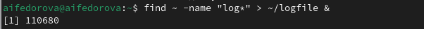

---
## Front matter
lang: ru-RU
title: Презентация по лабораторной работы №9
subtitle: Операционные системы
author:
  - Федорова А.И
institute:
  - Российский университет дружбы народов, Москва, Россия
  

## i18n babel
babel-lang: russian
babel-otherlangs: english

## Formatting pdf
toc: false
toc-title: Содержание
slide_level: 2
aspectratio: 169
section-titles: true
theme: metropolis
header-includes:
 - \metroset{progressbar=frametitle,sectionpage=progressbar,numbering=fraction}
 - '\makeatletter'
 - '\beamer@ignorenonframefalse'
 - '\makeatother'
 
## Fonts
mainfont: PT Serif
romanfont: PT Serif
sansfont: PT Sans
monofont: PT Mono
mainfontoptions: Ligatures=TeX
romanfontoptions: Ligatures=TeX
sansfontoptions: Ligatures=TeX,Scale=MatchLowercase
monofontoptions: Scale=MatchLowercase,Scale=0.9

---

## Цели и задачи

Цель данной лабораторной работы - ознакомление с инструментами поиска файлов и фильтрации текстовых данных, а также приобретение практических навыков по управлению процессами (и заданиями), по проверке использования диска и по обслуживанию файловых систем.

## Задание

- Запись в файл

- Вывод на экран

- Поиск файлов с помощью grep

- Поиск файлов с помощью find

- Запуск в фоновом режиме

- Индентификация процесса

- Завершение процесса

- функция df

- функция du

- Вывод имен всех директорий

## Запись в файл

Я вошла в систему под соотвествующим именем пользователя, открыла терминал, записала в файл file.txt названия файлов из каталога /etc с помощью перенаправления ">" (и файл создала, и записала в него то, что могло быть выведено ls -lR /etc). В файл я добавила также все файлы из подкаталогов (рис. fig:001).

{#fig:001 width=70%}

## Запись в файл

Проверила, что в файл записались нужные значения с помощью команды сat (рис. @fig:002).

{#fig:002 width=70%}

## Вывод на экран

Вывела на экран имена всех файлов, имеющих расширение ".conf" с помощью утилиты grep (рис. fig:004).

{#fig:004 width=70%}

## Поиск файлов с помощью grep

Определяю,какие файлы в домашнем каталоге начинаютя с символа "c" с помощью утилиты find, прописываю ей в аргументах домашнюю директорию (тогда вывод относительно корневого каталога, а не домашнего будет), выбираю опцию -name (ищем по имени), и пишу маску, по которой будем искать имя, где * - любое кол-во любых символов, добавляю опцию -print, чтобы мне вывелся результат (рис. fig:006). Но таким образом я получаю информацию даже о файлах из подкаталогов домашнего каталога.

{#fig:006 width=70%}

## Поиск файлов с помощью find

С помощью метода find, чьи опции я расписала ранее, ищу все файлы, начинающиеся с буквы "h" (рис. @fig:008).

{#fig:008 width=70%}

## Запуск в фоновом режиме

Запускаю в фоновом режиме (на это указывает символ &) процесс, который будет записывать в файл logfile (с помощью перенаправления >) файлы, имена которых начинаются с log (рис. fig:009).

{#fig:009 width=70%}

## Запуск в фоновом режиме

Запускаю в консоли в фоновом режиме (с помощью символа &) редактор mousepad, потому что редактора gedit у меня, к сожалению, но работают они идентично (рис. @fig:011).

{#fig:011 width=70%}

## Индентификация процесса

С помощью утилиты ps определяю идентификатор процесса mousepad, его значение 3913 (рис. @fig:012). Также мы можем определить идентификатор с помощью pgrep.

{#fig:012 width=70%}

## Завершение процесса

Прочитала справку команды kill и использую команду kill и идентификатор процесса, чтобы его удалить (рис. fig:013). Заметила, как у меня закрылась программа gedit.

{#fig:013 width=70%}

## функция df 

Прочитала документацию про функции df и du. Теперь я использую утилиту df с файлом сonf.txt. (fig:014). Эта утилита нам нужна, чтобы выяснить, сколько свободного места есть у нашей системы.

{#fig:014 width=70%}

## функция du

Использую утилиту du. Она нужна чтобы просмотреть, сколько места занимают файлы в определенной директории и найти самые большие из них (рис. fig:017).

{#fig:015 width=70%}

## Вывод имен всех директорий

Прочитала документацию о команде find (рис. fig:018).

Вывела имена всех директорий, имеющихся в моем домашнем каталоге, используя аргумент d у утилиты find опции -type, то есть указываю тип файлов, который мне нужен и этот тип Директория (рис.fig:016). Утилита -а позволит увидеть размер всех файлов, а не только диреткорий.

{#fig:016 width=70%}

## Результаты

В результате данной лабораторной работы я ознакомилась с инструментами поиска файлов и фильтрации текстовых данных, а также приобрела практические навыки по управлению процессами (и заданиями), по проверке использования диска и по обслуживанию файловых систем.

## Итоговый слайд

Спасибо за внимание!

