---
## Front matter
lang: ru-RU
title: Презентация по  по лабораторной работе №9
subtitle: Операционные системы
author:
  - Федорова А.И
institute:
  - Российский университет дружбы народов, Москва, Россия
  

## i18n babel
babel-lang: russian
babel-otherlangs: english

## Formatting pdf
toc: false
toc-title: Содержание
slide_level: 2
aspectratio: 169
section-titles: true
theme: metropolis
header-includes:
 - \metroset{progressbar=frametitle,sectionpage=progressbar,numbering=fraction}
 - '\makeatletter'
 - '\beamer@ignorenonframefalse'
 - '\makeatother'
 
## Fonts
mainfont: PT Serif
romanfont: PT Serif
sansfont: PT Sans
monofont: PT Mono
mainfontoptions: Ligatures=TeX
romanfontoptions: Ligatures=TeX
sansfontoptions: Ligatures=TeX,Scale=MatchLowercase
monofontoptions: Scale=MatchLowercase,Scale=0.9
---

## Цели и задачи

Цель данной лабораторной работы - освоение основных возможностей командной оболочки Midnight Commander, приобретение навыков практической работы по просмотру каталогов и файлов; манипуляций с ними

## Выполнение лабораторной работы

С помощью команды man mc прочитала документацию про командную оболочку (рис. fig:001).

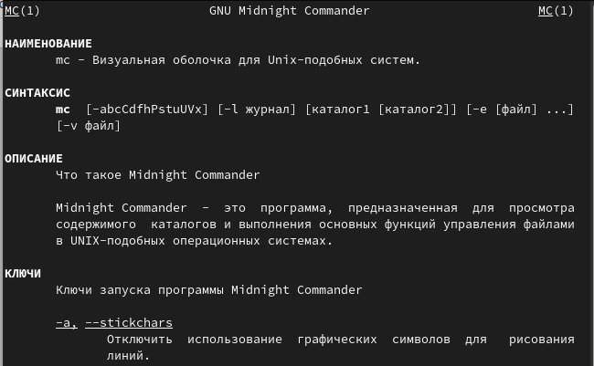{#fig:001 width=70%}

## Выполнение лабораторной работы

Ввожу в терминале mc и получаю окно, в котором далее смогу работать (рис. fig:002).

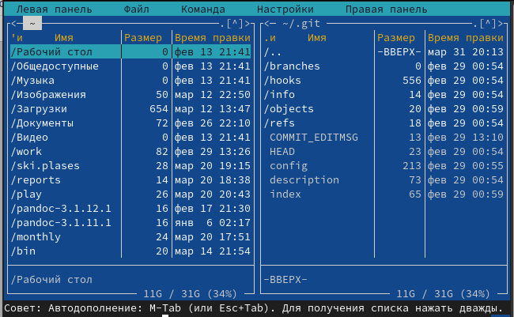{#fig:002 width=70%}

## Выполнение лабораторной работы

С помощью стрелочек влево вправо я могу перемещаться по директориям, а с помощью стрелочек вверх вниз перебирать файлы в директории, в которой нахожусь (рис. fig:003).

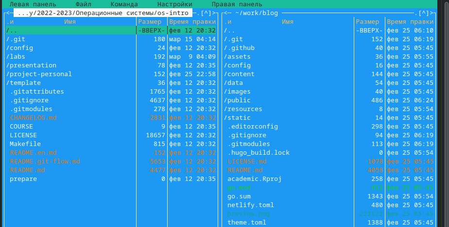{#fig:003 width=70%}

## Выполнение лабораторной работы

В меню левой панели вывела информацию о файле, получаю информации больше чем в выводе ls -l  (рис. fig:006).

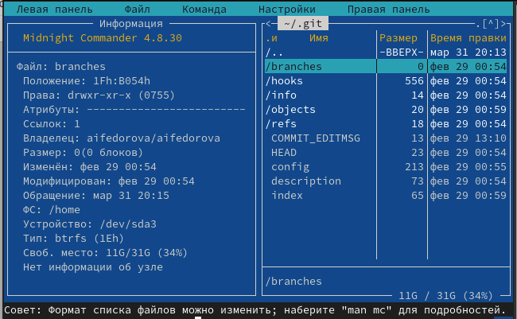{#fig:006 width=70%}

## Выполнение лабораторной работы

Используя возможности подменю "Файл" я просмотрела содержимое текстового файла  (рис. fig:007).

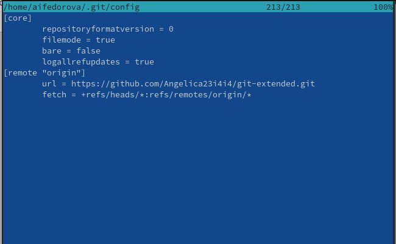{#fig:007 width=70%}

## Выполнение лабораторной работы

Открыла файл на изменение, поменяла пару строк и закрыла файл без сохранения (рис. fig:008).

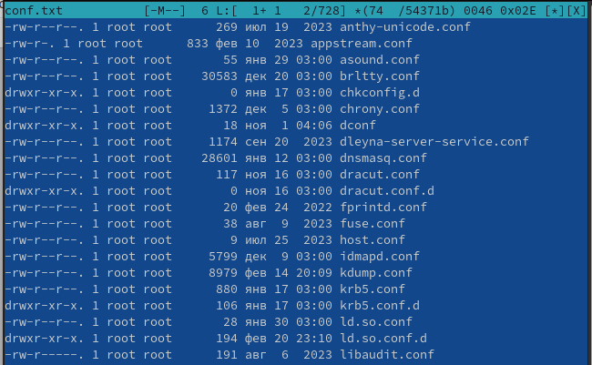{#fig:008 width=70%}

## Выполнение лабораторной работы

Создала новый каталог (рис. fig:009).

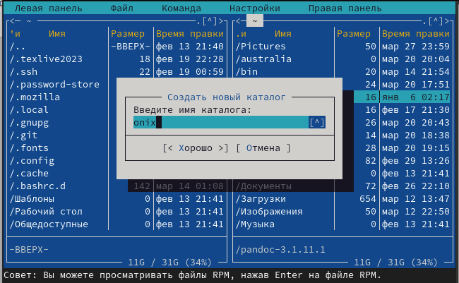{#fig:009 width=70%}

## Выполнение лабораторной работы

Копирую файл в созданный каталог  (рис. fig:010).
Действия выше можно было сделать с помощью горячих клавиш.

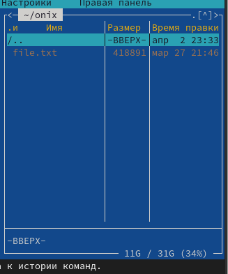{#fig:010 width=70%}

## Выполнение лабораторной работы

С помощью средств подменю Команда можно найти файл с заданным условием, я искала файлы с содержанием repository  (рис. fig:011).

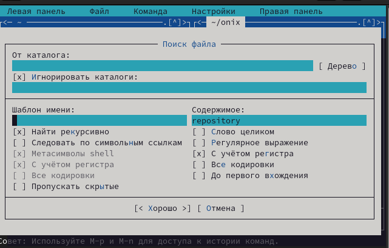{#fig:011 width=70%}

## Выполнение лабораторной работы

Можно перемещаться между директориями, я перемещусь в домашнюю (рис. fig:012).

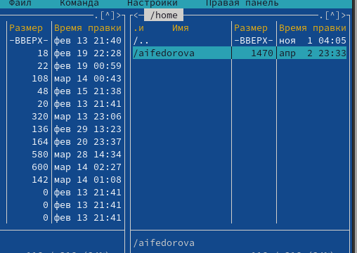{#fig:012 width=70%}

## Выполнение лабораторной работы

Можно использовать историю команд и применить команду из истории (рис. fig:013).

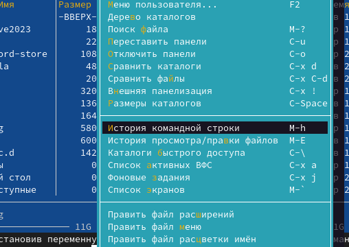{#fig:013 width=70%}

## Выполнение лабораторной работы

Анализирую файл расширения  (рис. fig:014).

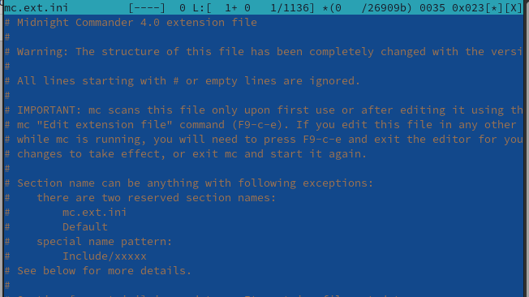{#fig:014 width=70%}

## Выполнение лабораторной работы

Анализирую файл меню (рис. fig:015).

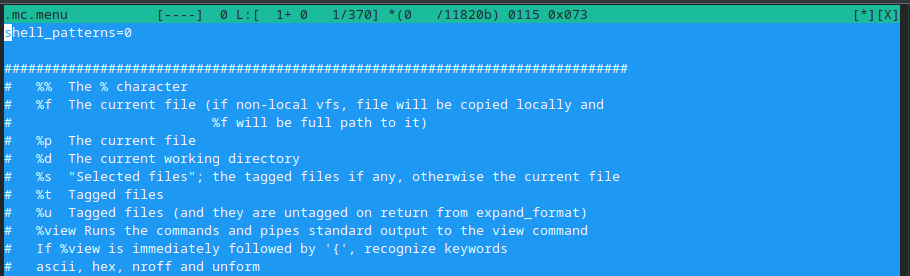{#fig:015 width=70%}

## Выполнение лабораторной работы

Командой touch text.txt создала файл (рис. @fig:020).

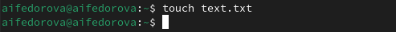{#fig:020 width=70%}

## Выполнение лабораторной работы

Клавишей F4 открыла файл для записи, добавила в него текст (рис. @fig:021).

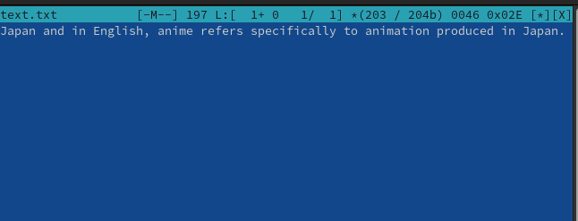{#fig:021 width=70%}

## Выполнение лабораторной работы

Удалила строку текста с помощью ctrl+y  (рис. fig:022).

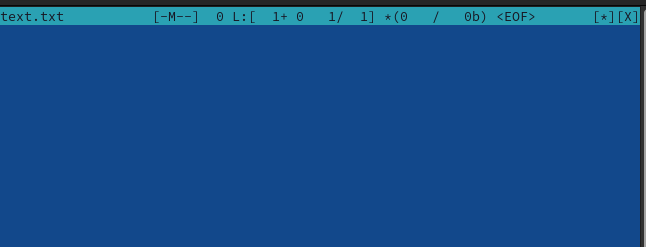{#fig:022 width=70%}

## Выполнение лабораторной работы

Перемещаю выделенный текст с помощью клавиши F6 (рис. @fig:023).

{#fig:023 width=70%}

## Выполнение лабораторной работы

С помощью ctrl+u отменяю последнее действие (рис. fig:024).

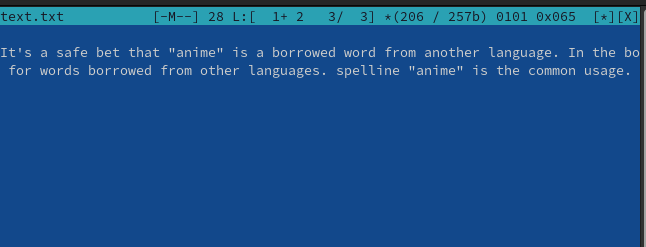{#fig:024 width=70%}

## Выполнение лабораторной работы

С помощью клавиш pgup pgdn у меня получилось попасть в начало и в конец файла соответственно, я добавила текст в начало (рис. fig:025) и потом в конец файла 

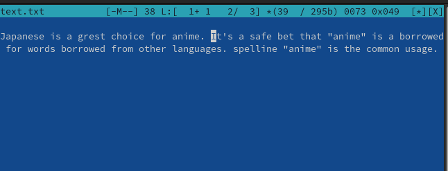{#fig:025 width=70%}

## Выполнение лабораторной работы

Сохраняю изменения в файле с помощью горячей клавиши F2 и закрываю файл (рис. fig:027).

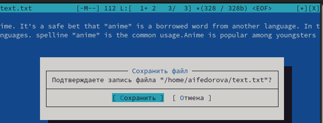{#fig:027 width=70%}

## Выполнение лабораторной работы

Открываю файл формата .js, с кодом на JS, встроенный редактор mc вывел его содержимое с подсветкой (рис. fig:028).

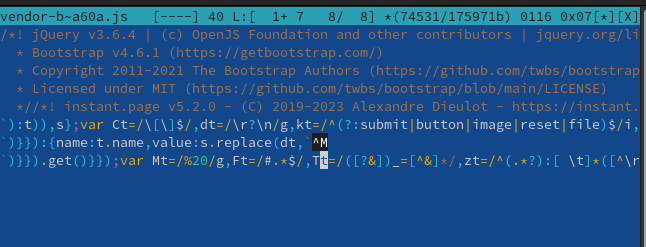{#fig:028 width=70%}

## Выполнение лабораторной работы

Я отключила подсветку и вывела снова тот же самый файл, но уже без подсветки (рис. fig:29).

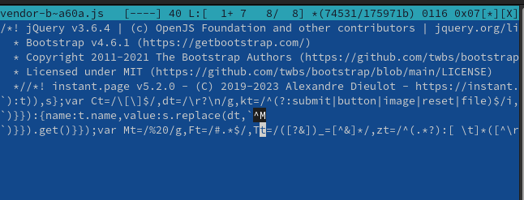{#fig:029 width=70%}

## Результаты

Я освоила основные возможности командной оболочки Midnight Commander, приобрела навыки практической работы по просмотру каталогов и файлов; манипуляций с ними

## Итоговый слайд

Спасибо за внимание!
