---
## Front matter
lang: ru-RU
title: Презентация по лабораторной работе №10
subtitle: Операционные системы
author:
  - Федорова А.И
institute:
  - Российский университет дружбы народов, Москва, Россия
  

## i18n babel
babel-lang: russian
babel-otherlangs: english

## Formatting pdf
toc: false
toc-title: Содержание
slide_level: 2
aspectratio: 169
section-titles: true
theme: metropolis
header-includes:
 - \metroset{progressbar=frametitle,sectionpage=progressbar,numbering=fraction}
 - '\makeatletter'
 - '\beamer@ignorenonframefalse'
 - '\makeatother'
 
## Fonts
mainfont: PT Serif
romanfont: PT Serif
sansfont: PT Sans
monofont: PT Mono
mainfontoptions: Ligatures=TeX
romanfontoptions: Ligatures=TeX
sansfontoptions: Ligatures=TeX,Scale=MatchLowercase
monofontoptions: Scale=MatchLowercase,Scale=0.9
---

## Цели и задачи

Цель данной лабораторной работы - познакомиться с операционной системой Linux, получить практические навыки работы с редактором vi, установленным по умолчанию практически во всех дистрибутивах.

## Материалы и методы

1. Ознакомиться с теоретическим материалом.
2. Ознакомиться с редактором vi.
3. Выполнить упражнения, используя команды vi.

## Выполнение лабораторной

Создаю директорию, в которой буду работать, с помощью команды mkdir, перехожу в нее с помощью команды cd, создаю и открываю для редактирования файл с помощью встроенного текстового редактора vi (рис.1, рис.2, рис.3).

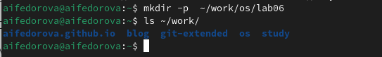{#fig:001 width=70%}

## Выполнение лабораторной

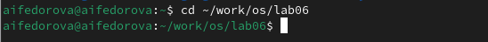{#fig:002 width=70%}

## Выполнение лабораторной

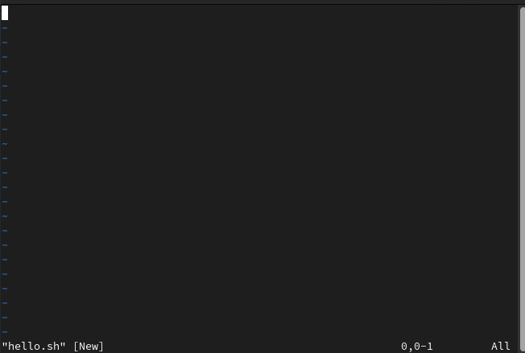{#fig:003 width=70%}

## Выполнение лабораторной

Нажимаю i, чтобы начать редактирование и добавляться текст (режим добавления), далее добавляю текст (рис.4).

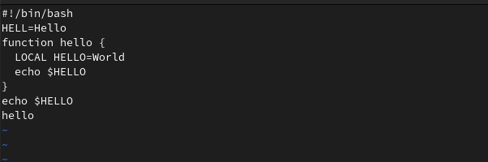{#fig:004 width=70%}

## Выполнение лабораторной

Нажимаю esc, чтобы выйти из режима добавления и перейти в командный режим. Перехожу в режим последней строки (рис.5).

{#fig:005 width=70%}

## Выполнение лабораторной

Ввожу w для сохранения и q для выхода и нажимаю enter, после чего файл сохраняется с изменениями и я возвращаюсь в терминал (рис.6).

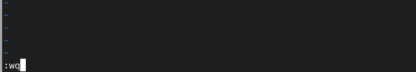{#fig:006 width=70%}

## Выполнение лабораторной

С помощью chmod добавляю права на исполнение файла, делая его исполняемым (рис.7).

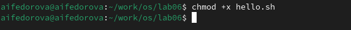{#fig:007 width=70%}

## Выполнение лабораторной

Снова открываю этот файл с помощью текстового редактора vi и изменяю слово HELL на HELLO(рис.8).

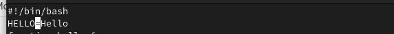{#fig:008 width=70%}

## Выполнение лабораторной

В режиме добавления (клавиша i) удаляю слово LOCAL, снова перехожу в командный режим с помощью esc (рис.9).

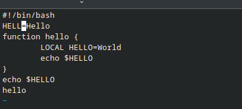{#fig:009 width=70%}

## Выполнение лабораторной

В режиме добавления (клавиша i) добавляю слово local, снова перехожу в командный режим с помощью esc (рис.10).

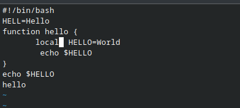{#fig:010 width=70%}

## Выполнение лабораторной

В режиме добавления (клавиша i) перехожу в конец последней строки и добавляю новую строку, снова перехожу в командный режим с помощью esc. (рис.11). 

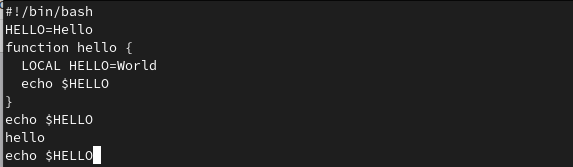{#fig:011 width=70%}

## Выполнение лабораторной

После этого я удалила строку и вернулась в командный режим (рис.12).

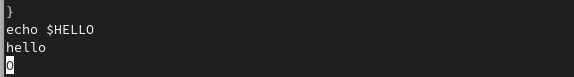{#fig:012 width=70%}

## Выполнение лабораторной

В командном режиме я нажала "u" и отменила последнее действие, удаление строки (рис.13).

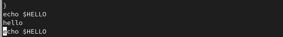{#fig:013 width=70%}

## Выполнение лабораторной

Перешла в режим последней строки и ввела w для сохранения файла и q для выхода, нажала enter и файл закрылся (рис.14).

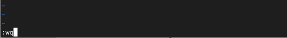{#fig:014 width=70%}

## Результаты

Я познакомилась с операционной системой Linux, получила практические навыки работы с редактором vi, установленным по умолчанию практически во всех дистрибутивах.

## Итоговый слайд

Спасибо за внимание!

