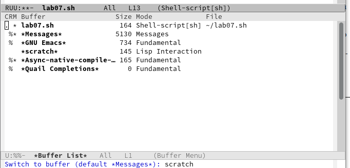
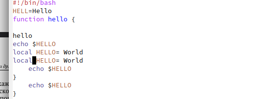

---
## Front matter
lang: ru-RU
title: Презентация по лабораторной работе №11
subtitle: Операционные системы
author:
  - Федорова А.И
institute:
  - Российский университет дружбы народов, Москва, Россия
  
## i18n babel
babel-lang: russian
babel-otherlangs: english

## Formatting pdf
toc: false
toc-title: Содержание
slide_level: 2
aspectratio: 169
section-titles: true
theme: metropolis
header-includes:
 - \metroset{progressbar=frametitle,sectionpage=progressbar,numbering=fraction}
 - '\makeatletter'
 - '\beamer@ignorenonframefalse'
 - '\makeatother'
 
## Fonts
mainfont: PT Serif
romanfont: PT Serif
sansfont: PT Sans
monofont: PT Mono
mainfontoptions: Ligatures=TeX
romanfontoptions: Ligatures=TeX
sansfontoptions: Ligatures=TeX,Scale=MatchLowercase
monofontoptions: Scale=MatchLowercase,Scale=0.9
---

## Цели и задачи

Цель данной лабораторной работы - познакомиться с операционной системой Linux. Получить практические навыки работы с редактором Emacs.

## Материалы и методы

1. Ознакомиться с теоретическим материалом.
2. Ознакомиться с редактором emacs.
3. Выполнить упражнения.
4. Ответить на контрольные вопросы

## Выполнение лабораторной работы

Создаю файл lab07.sh с помощью комбинации Ctrl-x Ctrl-f (рис.fig:002).

{#fig:002 width=70%}

## Выполнение лабораторной работы

Прописываю в файле текст программы (рис.fig:003).

{#fig:003 width=70%}

## Выполнение лабораторной работы

Сохраняю файл с помощью комбинации C-x C-s (рис.fig:004).

{#fig:004 width=70%}

## Выполнение лабораторной работы

Вырезаю одной командой целую строку (С-k) (рис.fig:005).

{#fig:005 width=70%}

## Выполнение лабораторной работы

Вставляю эту строку в конец файла (C-y) (рис.fig:006).

{#fig:006 width=70%}

## Выполнение лабораторной работы

Выделияю область текста (C-space), копирую область в буфер обмена (M-w), вырезаю эту область с помощью C-w (рис.fig:007).

{#fig:007 width=70%}

## Выполнение лабораторной работы

Вставляю область в конец файла (С-у)(рис.fig:008).

{#fig:008 width=70%}

## Выполнение лабораторной работы

Отменяю последнее действие С-/ (рис.fig:009).

{#fig:009 width=70%}

## Выполнение лабораторной работы

Перевожу курсор в начало строки С-а (рис.fig:010).

{#fig:010 width=70%}

## Выполнение лабораторной работы

Перемещаю курсор в конец строки С-е ( рис. fig:011).

{#fig:011 width=70%}

## Выполнение лабораторной работы

Перемещаю курсор в начало файла М-< ( рис. fig:012).

{#fig:012 width=70%}

## Выполнение лабораторной работы

Перемещаю курсор в конец файлаM->(рис. fig:013).

{#fig:013 width=70%}

## Выполнение лабораторной работы

Открываю список активных буферов в другом окне C-x C-b (рис.fig:014).

{#fig:014 width=70%}

## Выполнение лабораторной работы

Переключаюсь на другой буфер C-x o (рис.fig:015).

{#fig:015 width=70%}

## Выполнение лабораторной работы

Закрываю окно другого буфера C-x 0 (рис. fig:016).

{#fig:016 width=70%}

## Выполнение лабораторной работы

Открываю другой буфер без вывода их списка на экран с помощью C-x b(рис. fig:017).

{#fig:017 width=70%}

## Выполнение лабораторной работы

Делю фрейм на 4 части: сначала на два окна по вертикали (C-x 3),
а затем каждое из этих окон на две части по горизонтали (C-x 2) (рис. fig:018).

{#fig:018 width=70%}

## Выполнение лабораторной работы

В каждом из четырех созданных окон с помощью C-x b открыла разные буферы и (рис.fig:019).

{#fig:019 width=70%}

## Выполнение лабораторной работы

Перехожу в режим поиска с помощью C-s, ищу слова в тексте, они подсвечиваются (рис. fig:020).

{#fig:020 width=70%}

## Выполнение лабораторной работы

С помощью C-g выхожу из режима поиска, снимается выделение (рис. fig:021).

{#fig:021 width=70%}

## Выполнение лабораторной работы

Перехожу в режим поиска и замены с помощью M-%, ввожу какое слово хочу заменить, затем ввожу на какое хочу заменить (рис. fig:023).

{#fig:022 width=70%}

## Выполнение лабораторной работы

Видим, что слова были заменены успешно (рис.fig:023).

{#fig:023 width=70%}

## Выполнение лабораторной работы

С помощью M+s перехожу в другой режим поиска. Он отличается от предыдущего тем, что выводит результат в отдельном окне от окна буфера (рис. fig:024).

{#fig:024 width=70%}

## Результаты

В ходе данной лаборатрной работы я познакомилась с операционной системой Linuх, получила практические навыки работы с редактором Emacs.

## Итоговый слайд

Спасибо за внимание!

