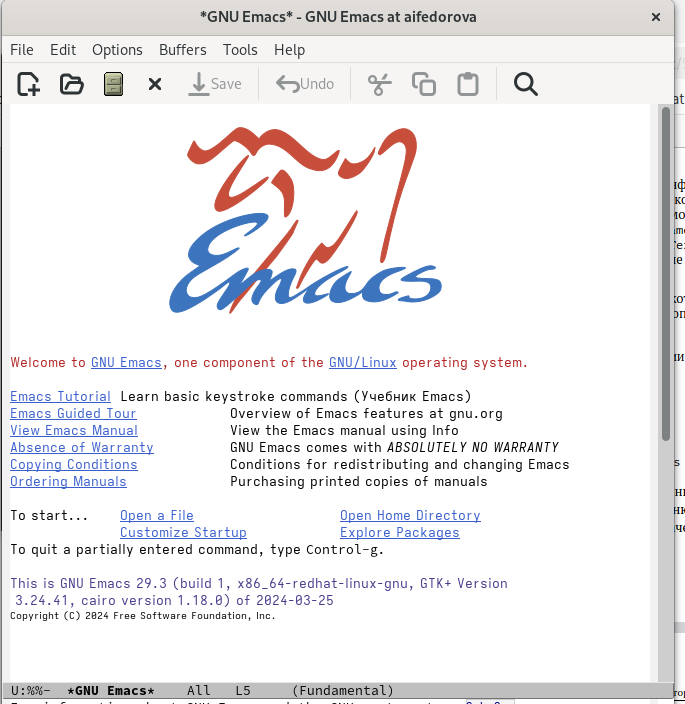
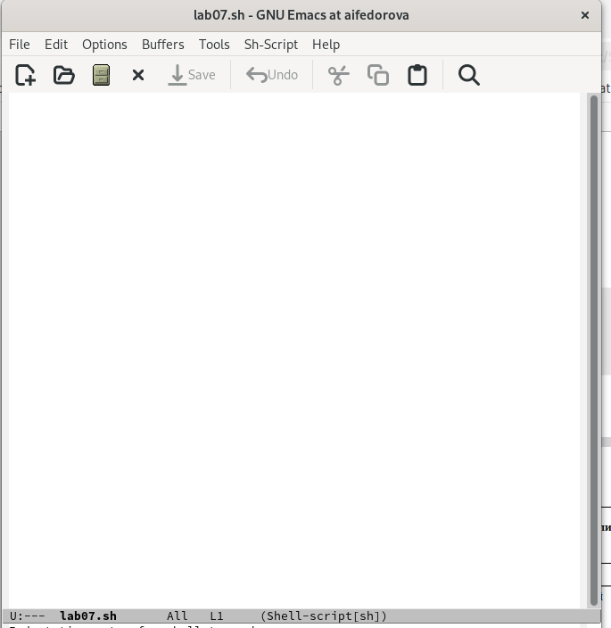
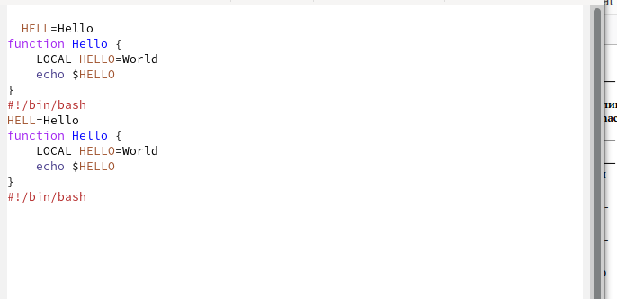
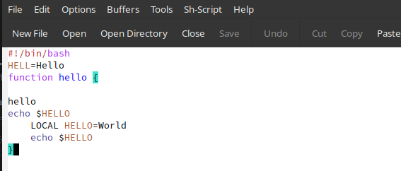
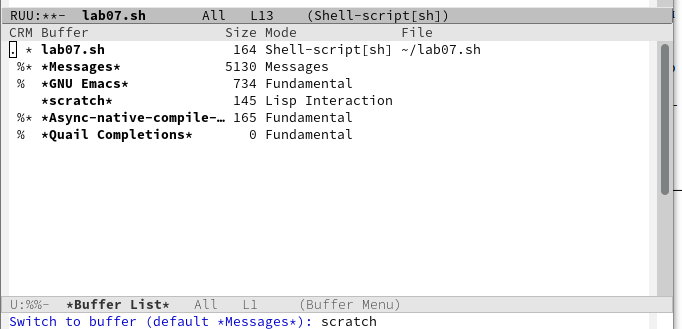
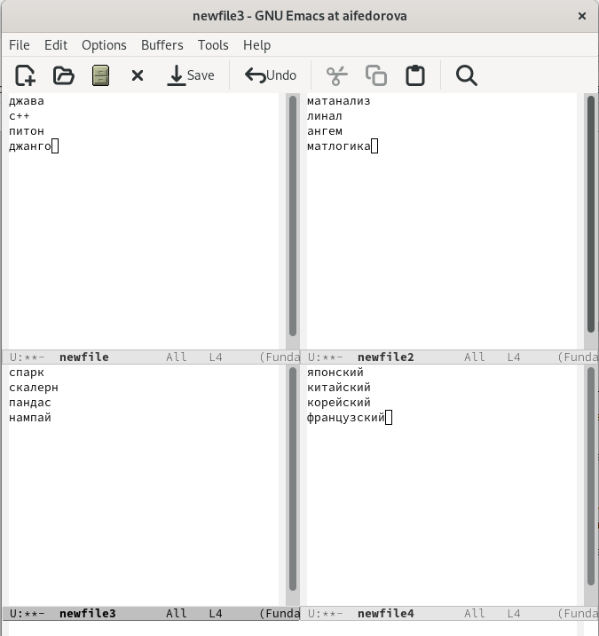
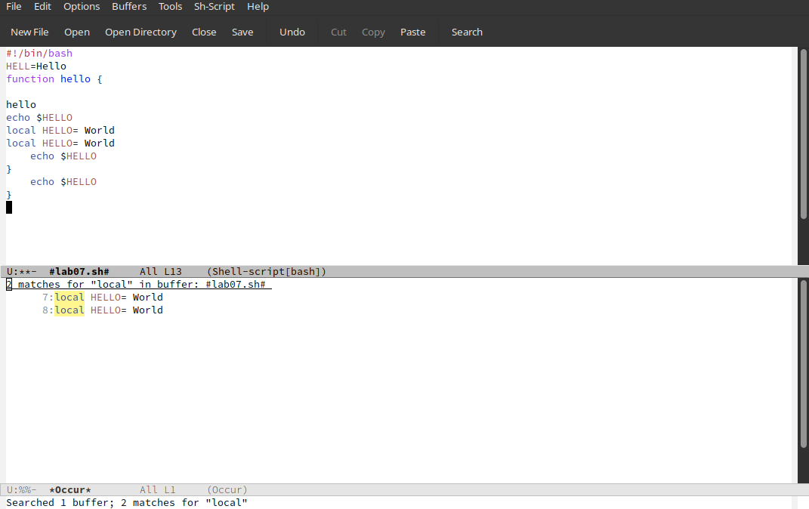

---
## Front matter
title: "Отчет по лабораторной работе №11"
subtitle: "Операционные системы"
author: "Федорова Анжелика Игоревна"

## Generic otions
lang: ru-RU
toc-title: "Содержание"

## Bibliography
bibliography: bib/cite.bib
csl: pandoc/csl/gost-r-7-0-5-2008-numeric.csl

## Pdf output format
toc: true # Table of contents
toc-depth: 2
lof: true # List of figures
lot: true # List of tables
fontsize: 12pt
linestretch: 1.5
papersize: a4
documentclass: scrreprt
## I18n polyglossia
polyglossia-lang:
  name: russian
  options:
	- spelling=modern
	- babelshorthands=true
polyglossia-otherlangs:
  name: english
## I18n babel
babel-lang: russian
babel-otherlangs: english
## Fonts
mainfont: PT Serif
romanfont: PT Serif
sansfont: PT Sans
monofont: PT Mono
mainfontoptions: Ligatures=TeX
romanfontoptions: Ligatures=TeX
sansfontoptions: Ligatures=TeX,Scale=MatchLowercase
monofontoptions: Scale=MatchLowercase,Scale=0.9
## Biblatex
biblatex: true
biblio-style: "gost-numeric"
biblatexoptions:
  - parentracker=true
  - backend=biber
  - hyperref=auto
  - language=auto
  - autolang=other*
  - citestyle=gost-numeric
## Pandoc-crossref LaTeX customization
figureTitle: "Рис."
tableTitle: "Таблица"
listingTitle: "Листинг"
lofTitle: "Список иллюстраций"
lotTitle: "Список таблиц"
lolTitle: "Листинги"
## Misc options
indent: true
header-includes:
  - \usepackage{indentfirst}
  - \usepackage{float} # keep figures where there are in the text
  - \floatplacement{figure}{H} # keep figures where there are in the text
---

# Цель работы

Цель данной лабораторной работы - познакомиться с операционной системой Linux. Получить практические навыки работы с редактором Emacs.

# Задание

1. Ознакомиться с теоретическим материалом.
2. Ознакомиться с редактором emacs.
3. Выполнить упражнения.
4. Ответить на контрольные вопросы

# Теоретическое введение

Emacs — один из наиболее мощных и широко распространённых редакторов, используемых в мире UNIX. По популярности он соперничает с редактором vi и его клонами. В зависимости от ситуации, Emacs может быть:

- текстовым редактором;
- программой для чтения почты и новостей Usenet;
- интегрированной средой разработки (IDE);
- операционной системой;

Всё это разнообразие достигается благодаря архитектуре Emacs, которая позволяет расширять возможности редактора при помощи языка Emacs Lisp. На языке C написаны лишь самые базовые и низкоуровневые части Emacs, включая полнофункциональный интерпретатор языка Lisp. Таким образом, Emacs имеет встроенный язык программирования, который может использоваться для настройки, расширения и изменения поведения редактора. В действительности, большая часть того редактора, с которым пользователи Emacs работают в наши дни, написана на языке Lisp.

Первая версия редактора Emacs была написана в 70-х годах 20-го столетия Richard Stallman (Ричардом Столманом) как набор макросов для редактора TECO . В дальнейшем, уже будучи основателем Фонда Свободного программного обеспечения Free Software Foundation и проекта GNU, Stallman разработал GNU Emacs в развитие оригинального Emacs и до сих пор сопровождает эту программу. Emacs является одним из старейших редакторов. Он использовался тысячами программистов на протяжении последних 20 с лишним лет, для него создано много дополнительных пакетов расширений. Эти дополнения позволяют делать с помощью Emacs такие вещи, которые Stallman , вероятно, даже не считал возможными в начале своей работы над редактором.

# Выполнение лабораторной работы

Открываю Emacs через терминал (рис. fig:001).

{#fig:001 width=70%}

Создаю файл lab07.sh с помощью комбинации Ctrl-x Ctrl-f (рис.fig:002).

{#fig:002 width=70%}

Прописываю в файле текст программы (рис.fig:003).

{#fig:003 width=70%}

Сохраняю файл с помощью комбинации C-x C-s (рис.fig:004).

{#fig:004 width=70%}

Вырезаю одной командой целую строку (С-k) (рис.fig:005).

{#fig:005 width=70%}

Вставляю эту строку в конец файла (C-y) (рис.fig:006).

{#fig:006 width=70%}

Выделияю область текста (C-space), копирую область в буфер обмена (M-w), вырезаю эту область с помощью C-w (рис.fig:007).

{#fig:007 width=70%}

Вставляю область в конец файла (С-у)(рис.fig:008).

{#fig:008 width=70%}

Отменяю последнее действие С-/ (рис.fig:009).

{#fig:009 width=70%}

Перевожу курсор в начало строки С-а (рис.fig:010).

{#fig:010 width=70%}

Перемещаю курсор в конец строки С-е ( рис. fig:011).

{#fig:011 width=70%}

Перемещаю курсор в начало файла М-< ( рис. fig:012).

{#fig:012 width=70%}

Перемещаю курсор в конец файлаM->(рис. fig:013).

{#fig:013 width=70%}

Открываю список активных буферов в другом окне C-x C-b (рис.fig:014).

{#fig:014 width=70%}

Переключаюсь на другой буфер C-x o (рис.fig:015).

{#fig:015 width=70%}

Закрываю окно другого буфера C-x 0 (рис. fig:016).

{#fig:016 width=70%}

Открываю другой буфер без вывода их списка на экран с помощью C-x b(рис. @fig:017).

{#fig:017 width=70%}

Делю фрейм на 4 части: сначала на два окна по вертикали (C-x 3),
а затем каждое из этих окон на две части по горизонтали (C-x 2) (рис. @fig:018).

{#fig:018 width=70%}

В каждом из четырех созданных окон с помощью C-x b открыла разные буферы и (рис. @fig:019).

{#fig:019 width=70%}

Перехожу в режим поиска с помощью C-s, ищу слова в тексте, они подсвечиваются (рис. @fig:020).

{#fig:020 width=70%}

С помощью C-g выхожу из режима поиска, снимается выделение (рис. @fig:021).

{#fig:021 width=70%}

Перехожу в режим поиска и замены с помощью M-%, ввожу какое слово хочу заменить, затем ввожу на какое хочу заменить (рис. @fig:023).

{#fig:022 width=70%}

Видим, что слова были заменены успешно (рис.fig:023).

{#fig:023 width=70%}

С помощью M+s перехожу в другой режим поиска. Он отличается от предыдущего тем, что выводит результат в отдельном окне от окна буфера (рис. ig:024).

{#fig:024 width=70%}

# Выводы

В ходе данной лаборатрной работы я познакомилась с операционной системой Linuх, получила практические навыки работы с редактором Emacs.

# Ответы на контрольные вопросы

1. Кратко охарактеризуйте редактор emacs.

Emacs — один из наиболее мощных и широко распространённых редакторов, используемых в мире UNIX. Написан на языке высокого уровня Lisp.

2. Какие особенности данного редактора могут сделать его сложным для освоения новичком?

Большое разнообразие сложных комбинаций клавиш, которые необходимы для редактирования файла и в принципе для работа с Emacs.

3. Своими словами опишите, что такое буфер и окно в терминологии emacs’а.

Буфер - это объект в виде текста. Окно - это прямоугольная область, в которой отображен буфер.

4. Можно ли открыть больше 10 буферов в одном окне?

Да, можно.

5. Какие буферы создаются по умолчанию при запуске emacs?

Emacs использует буферы с именами, начинающимися с пробела, для внутренних целей. Отчасти он обращается с буферами с такими именами особенным образом — например, по умолчанию в них не записывается информация для отмены изменений.

6. Какие клавиши вы нажмёте, чтобы ввести следующую комбинацию C-c | и C-c C-|?

Ctrl + c, а потом | и Ctrl + c Ctrl + |

7. Как поделить текущее окно на две части?

С помощью команды Ctrl + x 3 (по вертикали) и Ctrl + x 2 (по горизонтали).

8. В каком файле хранятся настройки редактора emacs?

Настройки emacs хранятся в файле . emacs, который хранится в домашней дирректории пользователя. Кроме этого файла есть ещё папка . emacs.

9. Какую функцию выполняет клавиша и можно ли её переназначить?

Выполняет функцию стереть, думаю можно переназначить.

10. Какой редактор вам показался удобнее в работе vi или emacs? Поясните почему.

Для меня удобнее был редактор Emacs, так как у него есть командая оболочка. А vi открывается в терминале, и выглядит своеобразно.
