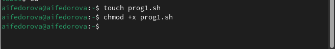
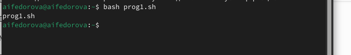
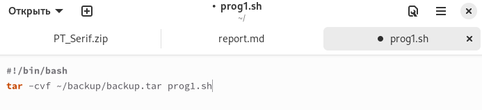
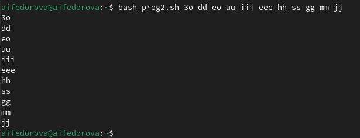
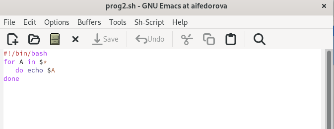
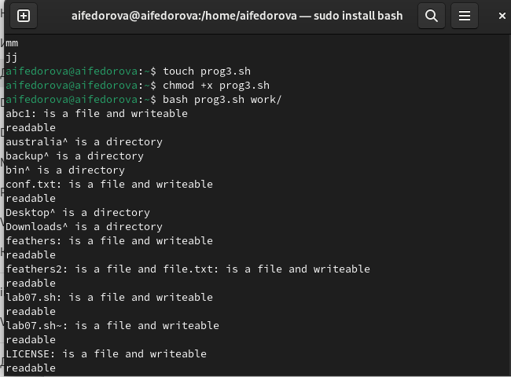
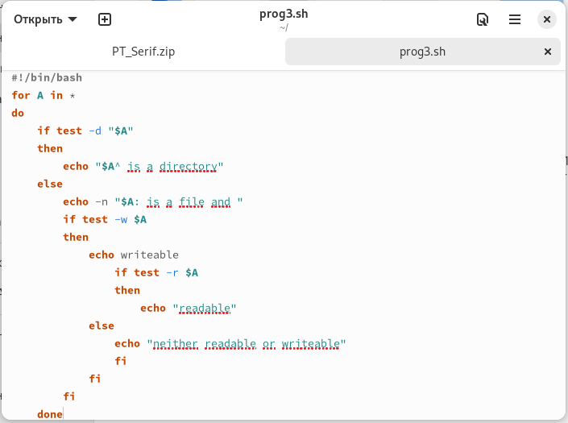
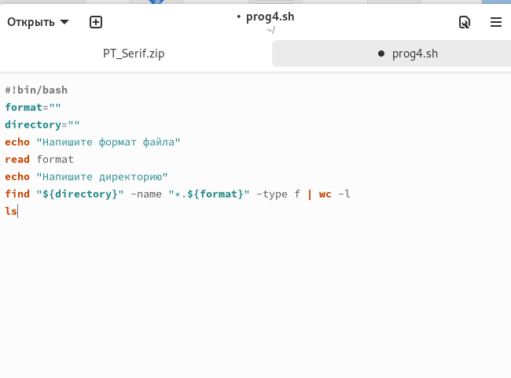
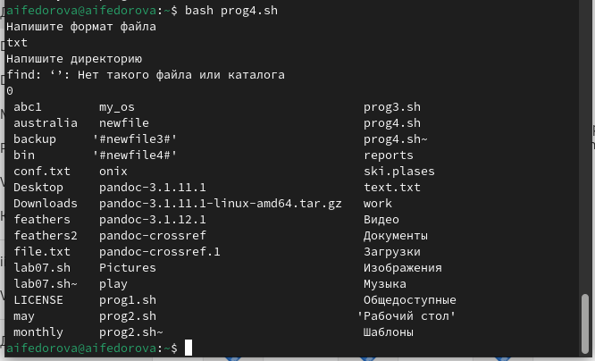

---
## Front matter
lang: ru-RU
title: Презентация по лабораторной работе №12
subtitle: Операционные системы
author:
  - Федорова А.И
institute:
  - Российский университет дружбы народов, Москва, Россия
  

## i18n babel
babel-lang: russian
babel-otherlangs: english

## Formatting pdf
toc: false
toc-title: Содержание
slide_level: 2
aspectratio: 169
section-titles: true
theme: metropolis
header-includes:
 - \metroset{progressbar=frametitle,sectionpage=progressbar,numbering=fraction}
 - '\makeatletter'
 - '\beamer@ignorenonframefalse'
 - '\makeatother'
 
## Fonts
mainfont: PT Serif
romanfont: PT Serif
sansfont: PT Sans
monofont: PT Mono
mainfontoptions: Ligatures=TeX
romanfontoptions: Ligatures=TeX
sansfontoptions: Ligatures=TeX,Scale=MatchLowercase
monofontoptions: Scale=MatchLowercase,Scale=0.9
---

## Цели и задачи

Цель данной лабораторной работы - изучить основы программирования в оболочке ОС UNIX/Linux, научиться писать небольшие командные файлы

## Материалы и методы

1. Написать скрипт, который при запуске будет делать резервную копию самого себя (то
есть файла, в котором содержится его исходный код) в другую директорию backup
в вашем домашнем каталоге. При этом файл должен архивироваться одним из архиваторов на выбор zip, bzip2 или tar. Способ использования команд архивации
необходимо узнать, изучив справку.
2. Написать пример командного файла, обрабатывающего любое произвольное число
аргументов командной строки, в том числе превышающее десять. Например, скрипт
может последовательно распечатывать значения всех переданных аргументов.
3. Написать командный файл — аналог команды ls (без использования самой этой команды и команды dir). Требуется, чтобы он выдавал информацию о нужном каталоге
и выводил информацию о возможностях доступа к файлам этого каталога.
4. Написать командный файл, который получает в качестве аргумента командной строки
формат файла (.txt, .doc, .jpg, .pdf и т.д.) и вычисляет количество таких файлов
в указанной директории. Путь к директории также передаётся в виде аргумента командной строки

## Выполнение лабораторной работы 

Создаю файл prog1.sh в котором буду пистаь программу с расширением sh (shell) с помощью утилиты touch, далее делаю его исполняемым с помощью chmod +x, открываю файл в любом текстовом редакторе, пишу в нем код, и после того как я написала программу в файле, я могу его запустить bash <имя командного файла> <аргументы> (рис. fig:001 и fig.002).

{#fig:001 width=70%}

## Выполнение лабораторной работы 

{#fig:002 width=70%}

## Выполнение лабораторной работы 

скрипт, который при запуске будет делать резервную копию самого себя (то
есть файла, в котором содержится его исходный код) в другую директорию backup
в вашем домашнем каталоге. При этом файл должен архивироваться одним из архиваторов на выбор zip, bzip2 или tar (рис.fig:003).

{#fig:003 width=70%}

## Выполнение лабораторной работы 

Создаю файл prog2.sh в котором буду писать программу с расширением sh (shell) с помощью утилиты touch, далее делаю его исполняемым с помощью chmod +x, открываю файл в любом текстовом редакторе, пишу в нем код, и после того как я написала программу в файле, я могу его запустить bash <имя командного файла> <аргументы> (рис. fig:003).

{#fig:004 width=70%}

## Выполнение лабораторной работы 

Пример командного файла, обрабатывающего любое произвольное число
аргументов командной строки, в том числе превышающее десять. Например, скрипт
может последовательно распечатывать значения всех переданных аргументов (рис.fig:005).

{#fig:005 width=70%}

## Выполнение лабораторной работы 

Создаю файл prog3.sh в котором буду пистаь программу с расширением sh (shell) с помощью утилиты touch, далее делаю его исполняемым с помощью chmod +x, открываю файл в любом текстовом редакторе, пишу в нем код, и после того как я написала программу в файле, я могу его запустить bash <имя командного файла> <аргументы> (рис. fig:006).

{#fig:006 width=70%}

## Выполнение лабораторной работы 

Командный файл — аналог команды ls (без использования самой этой команды и команды dir). Требуется, чтобы он выдавал информацию о нужном каталоге
и выводил информацию о возможностях доступа к файлам этого каталога. (рис. @fig:007).

{#fig:007 width=70%}

## Выполнение лабораторной работы 

Создаю файл prog4.sh в котором буду пистаь программу с расширением sh (shell) с помощью утилиты touch, далее делаю его исполняемым с помощью chmod +x, открываю файл в любом текстовом редакторе, пишу в нем код (рис. fig:008).

{#fig:008 width=70%}

## Выполнение лабораторной работы 

Командный файл, который получает в качестве аргумента командной строки
формат файла (.txt, .doc, .jpg, .pdf и т.д.) и вычисляет количество таких файлов
в указанной директории. Путь к директории также передаётся в виде аргумента командной строки (рис.fig:09).

{#fig:009 width=70%}

## Выполнение лабораторной работы 

И после того как я написала программу в файле, я могу его запустить bash <имя командного файла> <аргументы> (рис.fig:011).

{#fig:010 width=70%}

## Результаты

При выполнении данной лабораторной работы я изучила основы программирования в оболочке ОС UNIX/Linux, научилась писать небольшие командные файлы.

## Итоговый слайд

Спасибо за внимание

