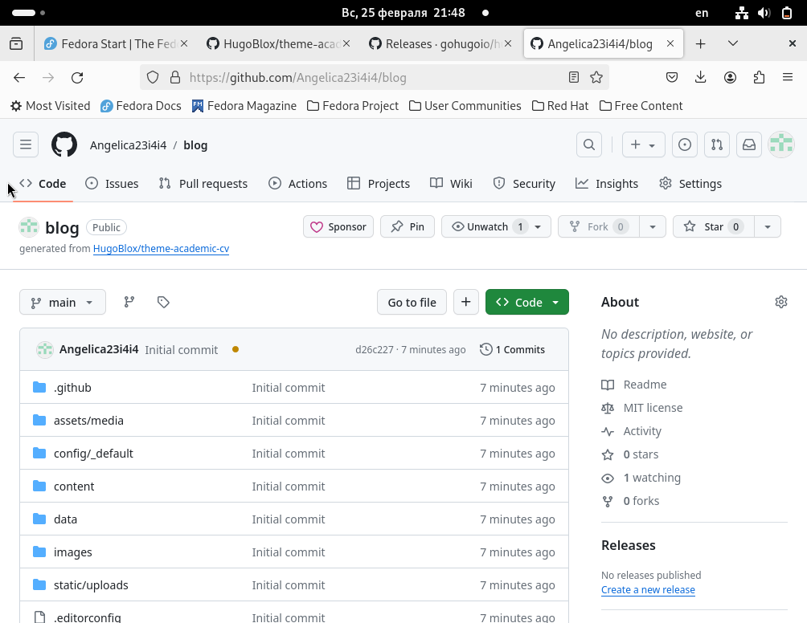
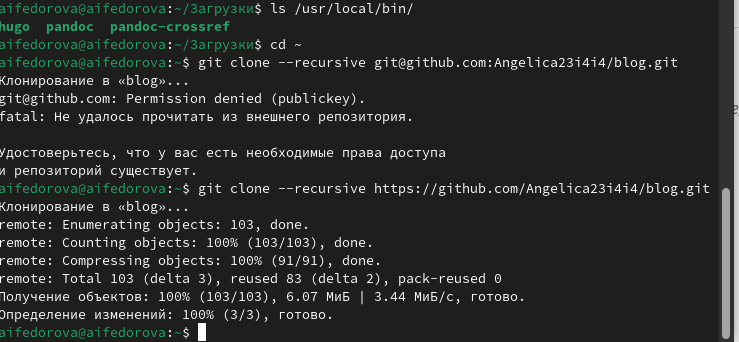
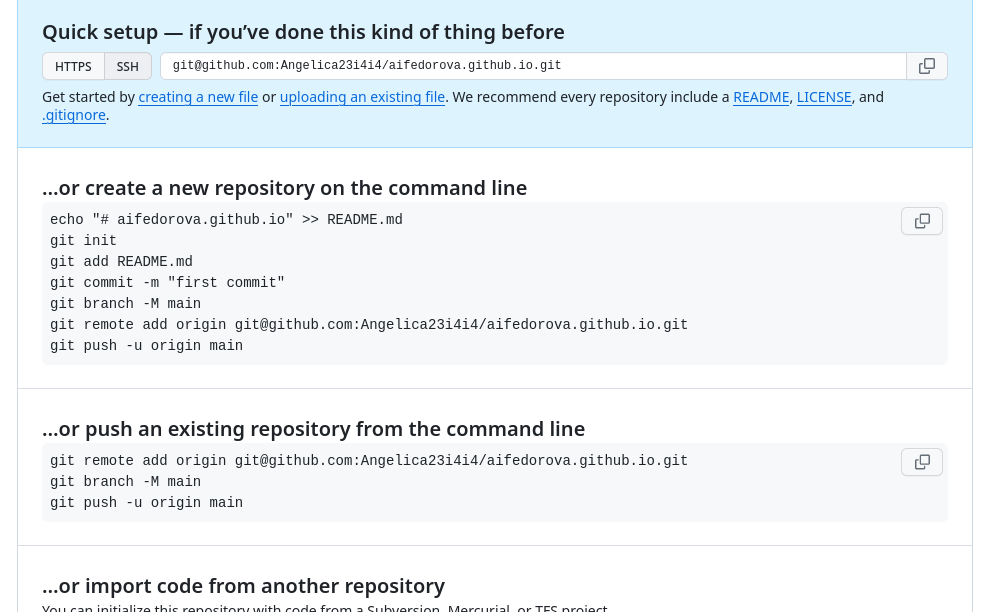
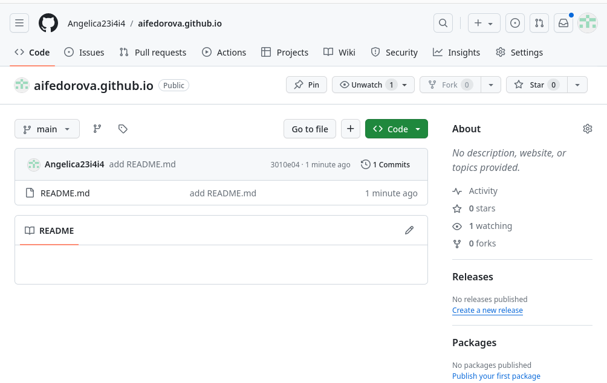
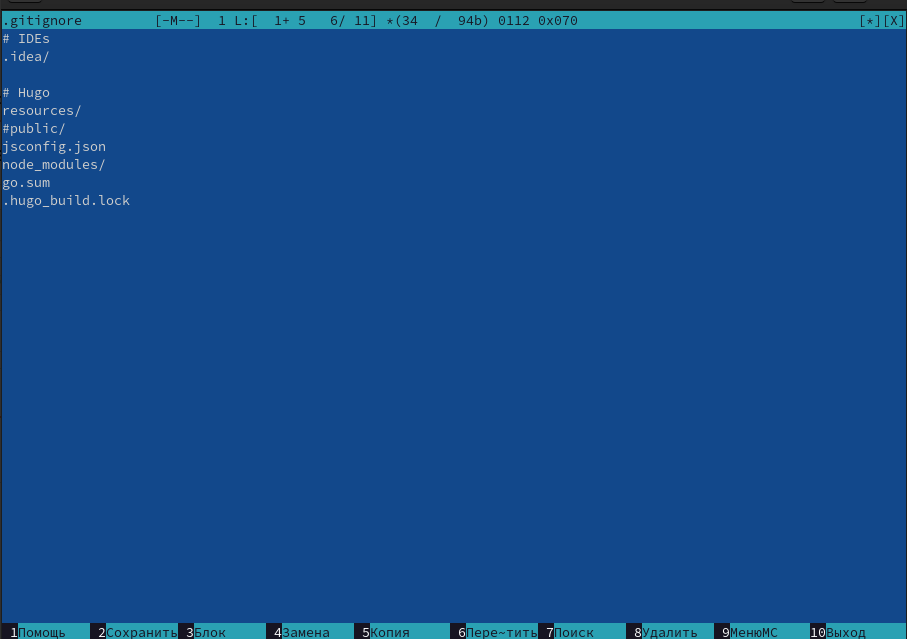
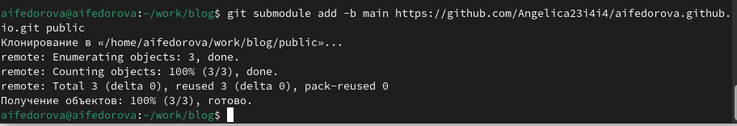
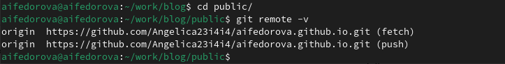
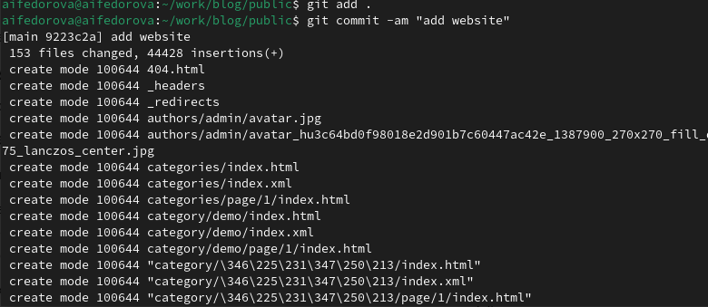
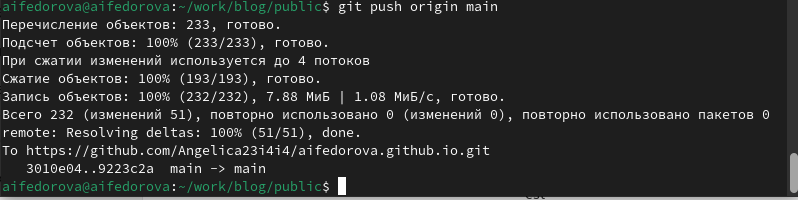

---
## Front matter
lang: ru-RU
title: Презентация по индивидуальному проекту №1
subtitle: Операционные системы 
author:
  - Федорова А.И
institute:
  - Российский университет дружбы народов, Москва, Россия
  
## i18n babel
babel-lang: russian
babel-otherlangs: english

## Formatting pdf
toc: false
toc-title: Содержание
slide_level: 2
aspectratio: 169
section-titles: true
theme: metropolis
header-includes:
 - \metroset{progressbar=frametitle,sectionpage=progressbar,numbering=fraction}
 - '\makeatletter'
 - '\beamer@ignorenonframefalse'
 - '\makeatother'
---

# Актуальность

Научному сотруднику полезно иметь свой собственный сайт, куда можно выкладывать свое портфолио.

# Цели 

Размещение на Github pages заготовки для персонального сайта.

# Задачи

1. Установка ПО.
2. Скачивание шаблона темы сайта.
3. Размещение на хостинге git.
4. Установка параметра для URLs сайта.
5. Размещение заготовки сайта на Github pages.

# Содержание исследования

## Установка ПО

Открываю  репозиторий, который нужно использовать как шаблон для собственного репозитория blog, который я также создаю(рис.fig:001).

{#fig:001 width=70%}

Устанавливаю последнюю версию hugo и клонирую открытый репозиторий в каталоге work (рис.fig:002)

{#fig:002 width=70%}

## Скачивание шаблона темы сайта.

Получаю шаблон для своего будущего сайта (рис.fig:003)

{#fig:003 width=70%}

## Размещение на хостинге git

Далее я создаю новый репозиторий специально для своего сайта и называю его также, как назван мой пользователь в Github(рис.fig:004)

{#fig:004 width=70%}

Загружаю на него первый материал, чтобы сделать репозиторий рабочим (рис.fig:005)

{#fig:005 width=70%}

## Установка параметра для URLs сайта

Создавая URLs сайта, я захожу в файл .gitignore и редактирую его добавляя слэш перед словом public.(рис.fig:006)

{#fig:006 width=70%}

Я добавляю новый каталог public с помощью команды submodule, чтобы сделать свой сайт общедоступным (рис.fig:012)

{#fig:007 width=70%}

Захожу в каталог public и связываю его с удаленным репозиторием  помощью команды git remote -v, чтобы связать созданный каталог с URL с репозиторием (рис.fig:008)

{#fig:008 width=70%}

## Размещение заготовки сайта на Github pages

Снова использую команды git add, git commit (рис.fig:009)

{#fig:009 width=70%}

Наконец, с помощью команды git push origin выгружаю данные файлы из public в новый репозиторий, а следовательно делаю его доступным для размещения на Github pages.(рис.fig:010)

{#fig:010 width=70%}

Теперь я копирую название репозитория и вставляю в поисковую строку. Вижу, что мой сайт успешно загружается(рис.fig:011)

{#fig:011 width=70%}

# Результаты

- Создала шаблон для собственного сайта
- Выгрузила созданный шаблон на  Github pages

# Итоговый слайд

Спасибо за внимание!

