---
## Front matter
title: "Отчёта по индивидуальному проекту №1"
subtitle: "Операционные системы"
author: "Федорова Анжелика Игоревна"

## Generic otions
lang: ru-RU
toc-title: "Содержание"

## Bibliography
bibliography: bib/cite.bib
csl: pandoc/csl/gost-r-7-0-5-2008-numeric.csl

## Pdf output format
toc: true # Table of contents
toc-depth: 2
lof: true # List of figures
lot: true # List of tables
fontsize: 12pt
linestretch: 1.5
papersize: a4
documentclass: scrreprt
## I18n polyglossia
polyglossia-lang:
  name: russian
  options:
	- spelling=modern
	- babelshorthands=true
polyglossia-otherlangs:
  name: english
## I18n babel
babel-lang: russian
babel-otherlangs: english
## Fonts
mainfont: PT Serif
romanfont: PT Serif
sansfont: PT Sans
monofont: PT Mono
mainfontoptions: Ligatures=TeX
romanfontoptions: Ligatures=TeX
sansfontoptions: Ligatures=TeX,Scale=MatchLowercase
monofontoptions: Scale=MatchLowercase,Scale=0.9
## Biblatex
biblatex: true
biblio-style: "gost-numeric"
biblatexoptions:
  - parentracker=true
  - backend=biber
  - hyperref=auto
  - language=auto
  - autolang=other*
  - citestyle=gost-numeric
## Pandoc-crossref LaTeX customization
figureTitle: "Рис."
tableTitle: "Таблица"
listingTitle: "Листинг"
lofTitle: "Список иллюстраций"
lotTitle: "Список таблиц"
lolTitle: "Листинги"
## Misc options
indent: true
header-includes:
  - \usepackage{indentfirst}
  - \usepackage{float} # keep figures where there are in the text
  - \floatplacement{figure}{H} # keep figures where there are in the text
---

# Цель работы

Размещение на Github pages заготовки для персонального сайта.

# Задание

1. Установить необходимое программное обеспечение.
2. Скачать шаблон темы сайта.
3. Разместить его на хостинге git.
4. Установить параметр для URLs сайта.
5. Разместить заготовку сайта на Github pages.

# Выполнение лабораторной работы

Открываю  репозиторий, который нужно использовать как шаблон для собственного репозитория blog, который я также создаю(рис.fig:001).

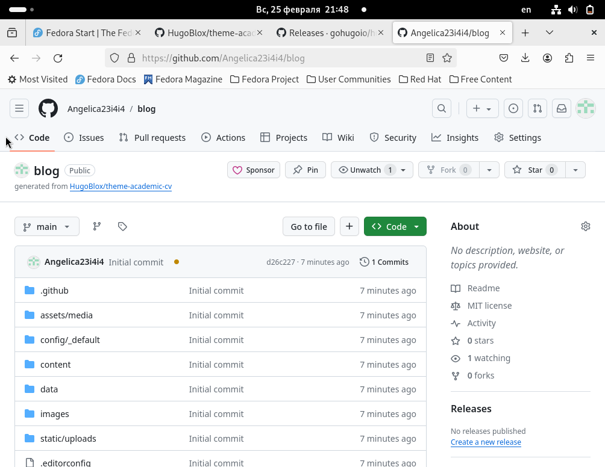{#fig:001 width=70%}

Устанавливаю последнюю версию hugo и клонирую открытый репозиторий в каталоге work (рис.fig:002)

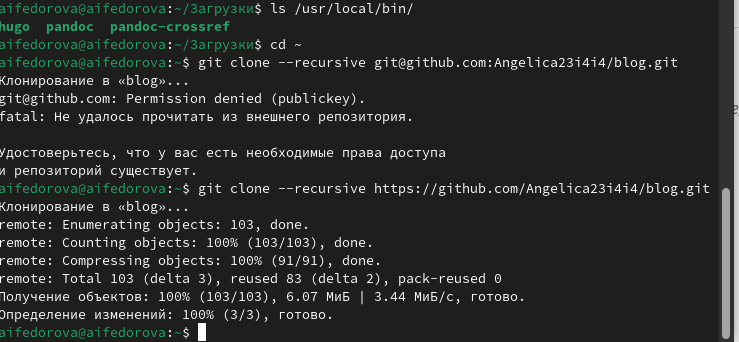{#fig:002 width=70%}

Захожу в каталог клонированного репозитория blog и запускаю команду hugo (рис.fig:003)

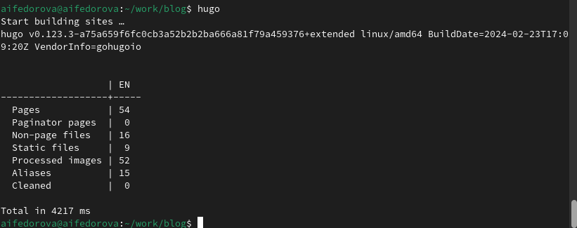{#fig:003 width=70%}

Теперь запускаю команду hugo server, чтобы создать сайт. (рис.fig:004)

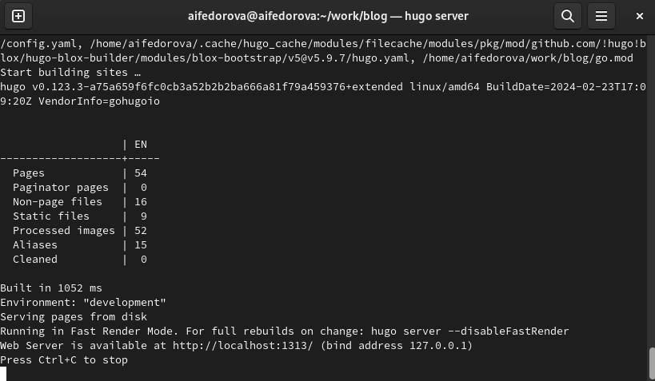{#fig:004 width=70%}

Теперь я вставляю выданную ссылку в браузер, не нажимая ctrl+c, и вижу шаблон своего сайта.(рис.fig:005)

{#fig:005 width=70%}

Далее я создаю новый репозиторий и называю его также, как назван мой пользователь в Github(рис.fig:006)

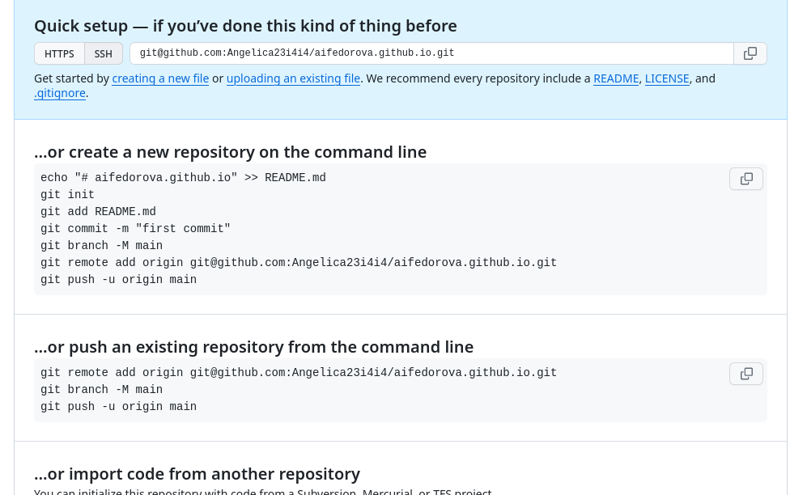{#fig:006 width=70%}

Теперь я снова захожу в каталог work и клонирую созданный репозиторий (рис.fig:007)

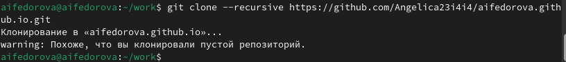{#fig:007 width=70%}

Захожу в один из созданных каталогов в ново-созданном репозитории (рис.fig:008)

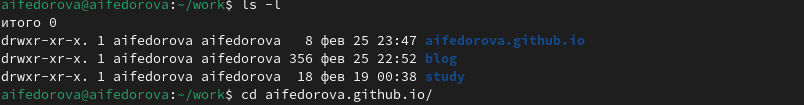{#fig:008 width=70%}

С помощью команды git checkout я перехожу на новую ветку main, а также создаю файл Readme(рис.fig:009)

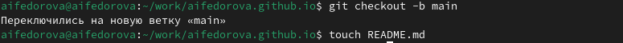{#fig:009 width=70%}

C помощью команд git add, git commit, git push origin(важно использовать, чтобы точно отправилось на нужную ветку) я выгружаю созданный файл в новый репозиторий (рис.fig:010)

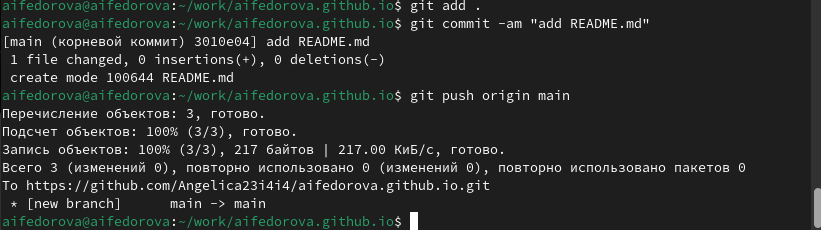{#fig:010 width=70%}

Вижу, что файл успешно был загружен в репозиторий (рис.fig:011)

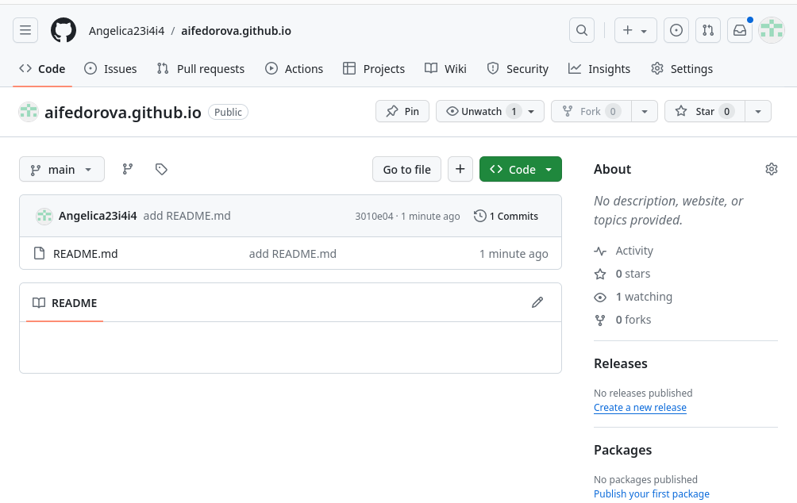{#fig:011 width=70%}

Поскольку после создания репозитория blog я удаляю каталог public в том же каталоге, то сейчас я добавляю новый каталог public с помощью команды submodule (рис.fig:012)

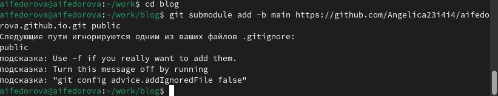{#fig:012 width=70%}

Чтобы исправить возникшую ошибку я захожу в файл .gitignore и редактирую его добавляя слэш перед словом public.(рис.fig:013)

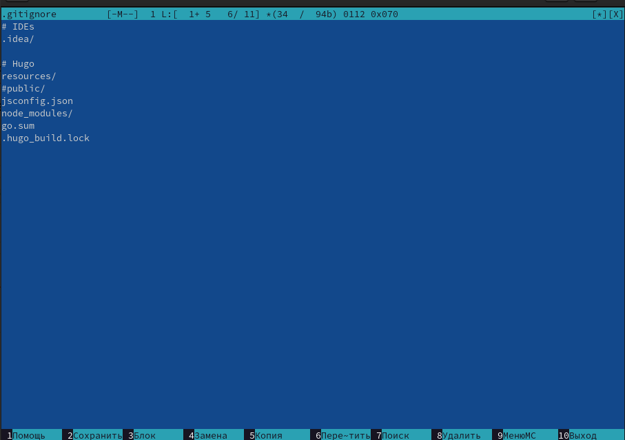{#fig:013 width=70%}

Снова применяю предыдущую команду и вижу, что она работает успешно (рис.fig:014)

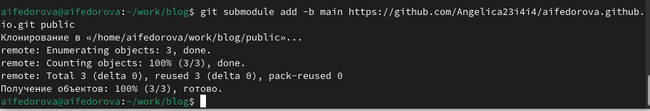{#fig:014 width=70%}

Снова применяю команду hugo (рис.fig:015)

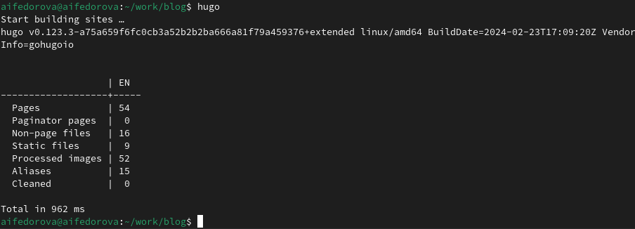{#fig:015 width=70%}

Теперь захожу в новый каталог public внутри каталога blog и вижу, что в нем появились необходимые файлы.(рис.fig:016)

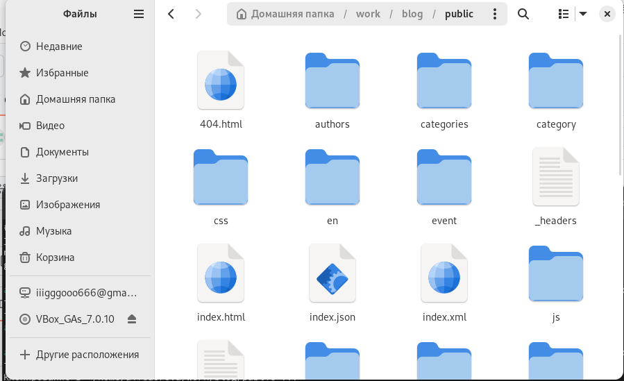{#fig:016 width=70%}

Захожу в каталог public и связываю его с удаленным репозиторием  помощью команды git remote -v (рис.fig:017)

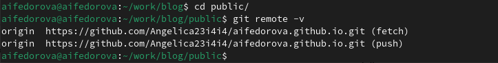{#fig:017 width=70%}

Снова использую команды git add, git commit (рис.fig:018)

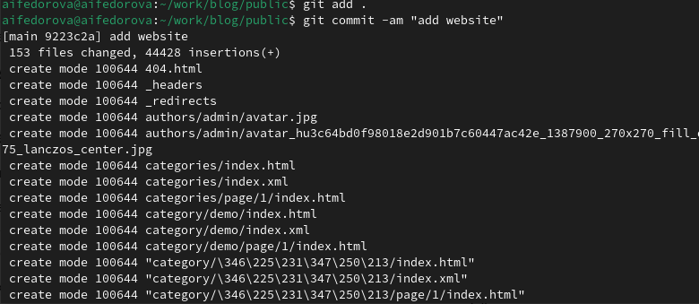{#fig:018 width=70%}

Наконец, с помощью команды git push origin выгружаю данные файлы из public в новый репозиторий.(рис.fig:019)

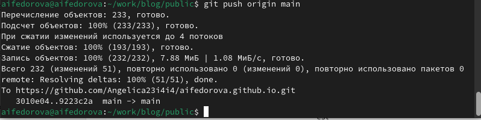{#fig:019 width=70%}

Вижу, что файлы успешно были загружены (рис.fig:020)

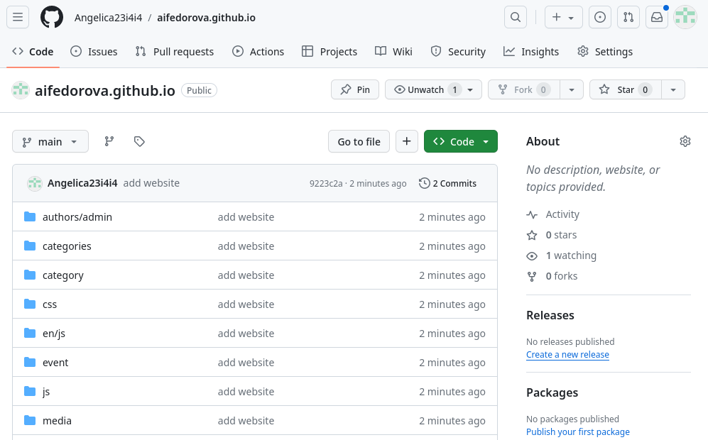{#fig:020 width=70%}

Теперь я копирую название репозитория и вставляю в поисковую строку. Вижу, что мой сайт успешно загружается(рис.fig:021)

{#fig:021 width=70%}

# Выводы
Я научилась размещать на Github pages заготовки для персонального сайта.

