---
## Front matter
lang: ru-RU
title: Презентация по второму этапу индивидуального проекта
subtitle: Операционные системы
author:
  - Федорова А.И
institute:
  - Российский университет дружбы народов, Москва, Россия
  

## i18n babel
babel-lang: russian
babel-otherlangs: english

## Formatting pdf
toc: false
toc-title: Содержание
slide_level: 2
aspectratio: 169
section-titles: true
theme: metropolis
header-includes:
 - \metroset{progressbar=frametitle,sectionpage=progressbar,numbering=fraction}
 - '\makeatletter'
 - '\beamer@ignorenonframefalse'
 - '\makeatother'
 
## Fonts
mainfont: PT Serif
romanfont: PT Serif
sansfont: PT Sans
monofont: PT Mono
mainfontoptions: Ligatures=TeX
romanfontoptions: Ligatures=TeX
sansfontoptions: Ligatures=TeX,Scale=MatchLowercase
monofontoptions: Scale=MatchLowercase,Scale=0.9
 
---

## Актуальность

Сайт научного сотрудника должен отражать важную информацию о нем и подробно рассказывать о его деятельности. Для этого нужно подобрать подходящее оформление.

## Цели и задачи

Оформить созданный сайт, разместив информацию о себе и тематические посты.

## Этапы

1. Добавление к сайту данные о себе.
2. Пост по прошедшей неделе.
3. Пост на тему по выбору:

- Управление версиями. Git.
- Непрерывная интеграция и непрерывное развертывание (CI/CD).

4. Отправка изменений в Github

## Добавление к сайту данных о себе.

Сначала захожу в каталог blog и запускаю команду hugo server, чтобы открыть свой сайт и отслеживать любые изменения. Желательно запустить данную команду во второй вкладке в терминале и не выходить из нее, чтобы мгновенно фиксировать и просматривать все изменения на сайте.(рис.1).

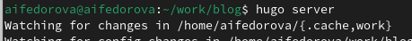{#fig:001 width=70%}

## Добавление к сайту данных о себе.

Добавляю свою фотографию в данный каталог (рис.3)

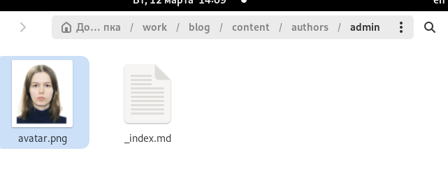{#fig:001 width=70%}

## Добавление к сайту данных о себе.

Теперь вижу, что аватар моего сайта изменился (рис.4)

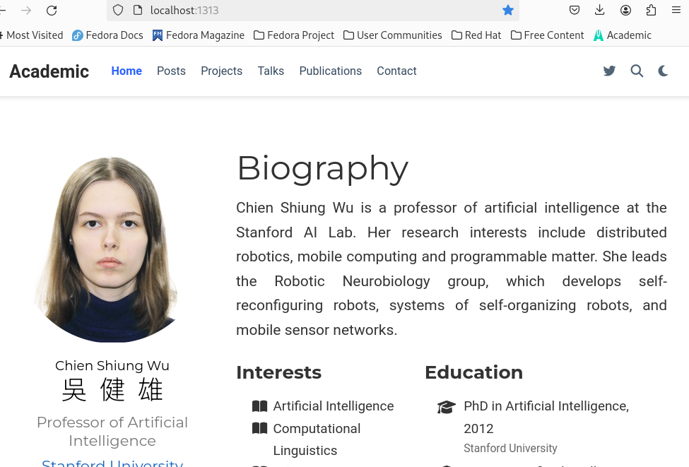{#fig:001 width=70%}

## Добавление к сайту данных о себе.

Далее я открываю файл _index.md, который содержит информацию о владельце сайта и начинаю редактирование.(рис.5)

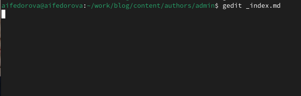{#fig:001 width=70%}

## Добавление к сайту данных о себе.

Теперь смотрю, как мой сайт изменился после сохраненных изменений. (рис.10)

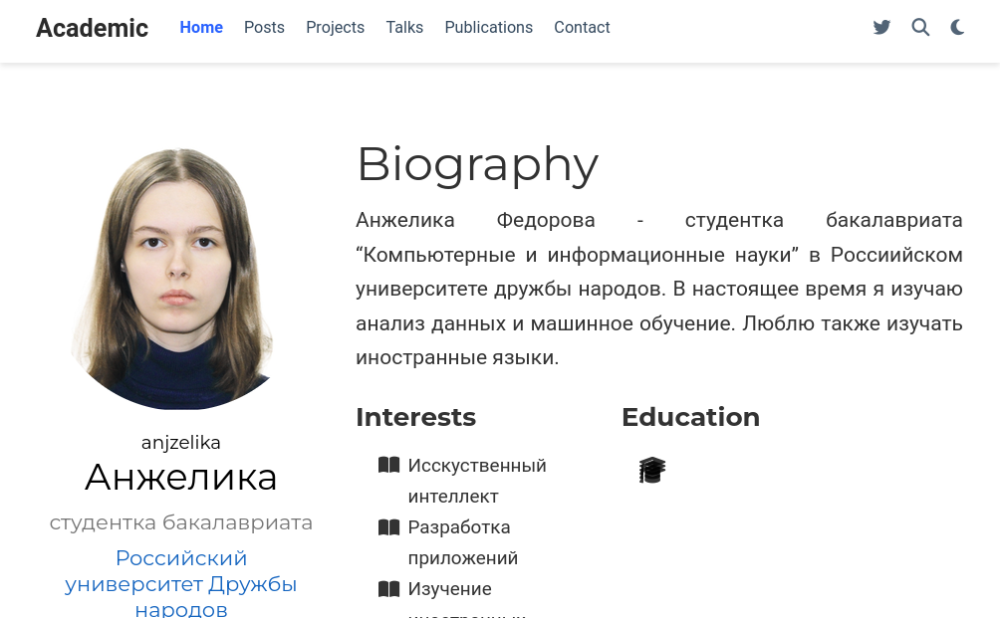{#fig:001 width=70%}

## Пост по прошедшей неделе.

Захожу в каталог getting-started и копирую шаблон поста из index.md в файл myweek.md, который создастся в каталоге post1. (рис.12)

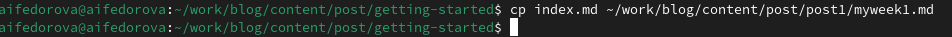{#fig:001 width=70%}

## Пост по прошедшей неделе.

hugo server считывает только файлы с именем index.md, поэтому я создаю файл с таким же названием и копирую в него содержимое предыдущего файла. Открываю новый файл и начинаю и начинаю писать пост о прошедшей недели. Старый файл потом удалю.(рис.13)

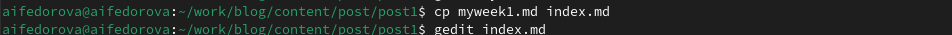{#fig:001 width=70%}

## Пост по прошедшей неделе.

После редактирования данного файла я сохраняю изменения и перехожу на свой сайт, чтобы посмотреть на опубликованный пост. (рис.14)

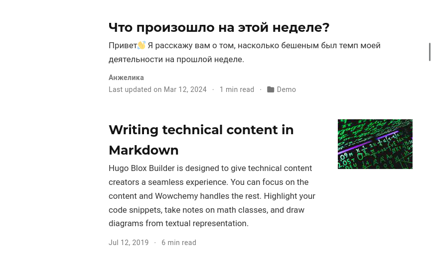{#fig:001 width=70%}

## Пост на тему "Управление версиями. Git."

Я выбрала тему "Управление версиями. Git" для своего поста. Перейдя в каталог post2, я начинаю заполнять файл с содержимым поста.(рис.17)

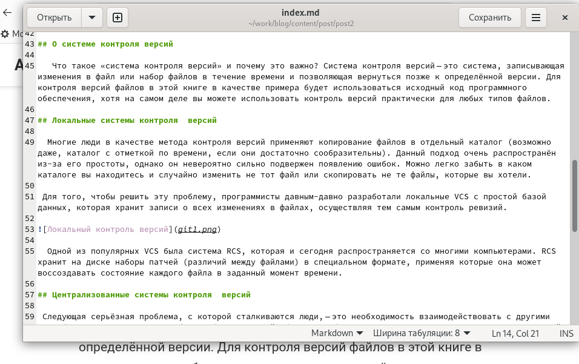{#fig:001 width=70%}

## Пост на тему "Управление версиями. Git."

Снова перехожу на свой сайт, чтобы посмотреть на опубликованный пост. (рис.18)

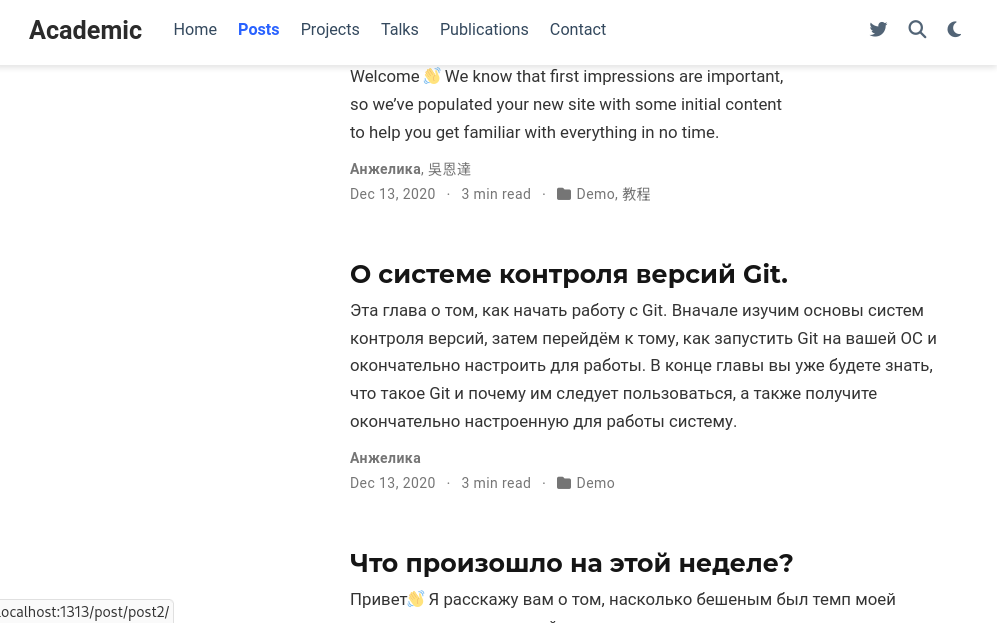{#fig:001 width=70%}

## Отправка изменений в Github

Перейдя в каталог blog, окончательно отправляю изменения в репозиторий(рис.20)

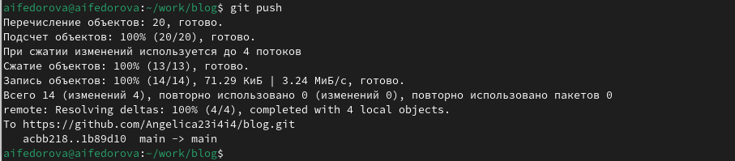{#fig:001 width=70%}

## Отправка изменений в Github

Для того, чтобы произведенные изменения были заметны всем зрителям на сайте, я захожу в каталог public 
и запускаю те же самые 2 команды. (рис.21)

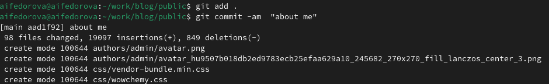{#fig:001 width=70%}

## Отправка изменений в Github

Отправляю изменения с помощью команды git push.(рис.22)

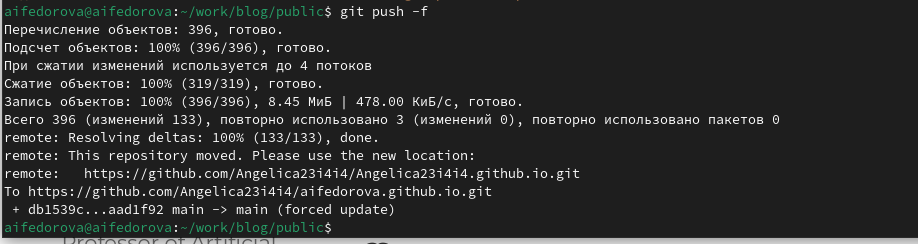{#fig:001 width=70%}

## Отправка изменений в Github

Ввожу имя своего пользователя в Github в адрессную строку и вижу, что оформление сайта было успешно обновлено.(рис.23)

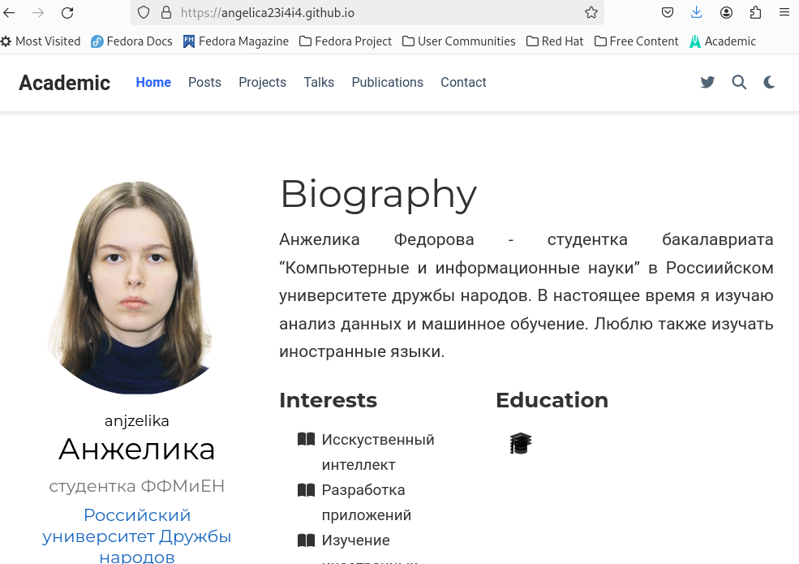{#fig:001 width=70%}

## Результаты

- Разобралась с функционалом при работы с hugo
- Изменила оформление своего сайта-страницы.

## Итоговый слайд

Спасибо за внимание!

