---
## Front matter
title: "Отчёта по второму этапу индивидуального проекта"
subtitle: "Операционные системы"
author: "Федорова Анжелика Игоревна"

## Generic otions
lang: ru-RU
toc-title: "Содержание"

## Bibliography
bibliography: bib/cite.bib
csl: pandoc/csl/gost-r-7-0-5-2008-numeric.csl

## Pdf output format
toc: true # Table of contents
toc-depth: 2
lof: true # List of figures
lot: true # List of tables
fontsize: 12pt
linestretch: 1.5
papersize: a4
documentclass: scrreprt
## I18n polyglossia
polyglossia-lang:
  name: russian
  options:
	- spelling=modern
	- babelshorthands=true
polyglossia-otherlangs:
  name: english
## I18n babel
babel-lang: russian
babel-otherlangs: english
## Fonts
mainfont: PT Serif
romanfont: PT Serif
sansfont: PT Sans
monofont: PT Mono
mainfontoptions: Ligatures=TeX
romanfontoptions: Ligatures=TeX
sansfontoptions: Ligatures=TeX,Scale=MatchLowercase
monofontoptions: Scale=MatchLowercase,Scale=0.9
## Biblatex
biblatex: true
biblio-style: "gost-numeric"
biblatexoptions:
  - parentracker=true
  - backend=biber
  - hyperref=auto
  - language=auto
  - autolang=other*
  - citestyle=gost-numeric
## Pandoc-crossref LaTeX customization
figureTitle: "Рис."
tableTitle: "Таблица"
listingTitle: "Листинг"
lofTitle: "Список иллюстраций"
lotTitle: "Список таблиц"
lolTitle: "Листинги"
## Misc options
indent: true
header-includes:
  - \usepackage{indentfirst}
  - \usepackage{float} # keep figures where there are in the text
  - \floatplacement{figure}{H} # keep figures where there are in the text
---

# Цель работы

Оформить созданный сайт созданный с помощью hugo.

# Задание

Добавить к сайту данные о себе.
Список добавляемых данных:
        Разместить фотографию владельца сайта.
        Разместить краткое описание владельца сайта (Biography).
        Добавить информацию об интересах (Interests).
        Добавить информацию от образовании (Education).
Сделать пост по прошедшей неделе.
Добавить пост на тему "Управление версиями. Git."

# Выполнение лабораторной работы

Сначала захожу в каталог blog и запускаю команду hugo server, чтобы открыть свой сайт и отслеживать любые изменения. Желательно запустить данную команду во второй вкладке в терминале и не выходить из нее, чтобы мгновенно фиксировать и просматривать все изменения на сайте.(рис.1).

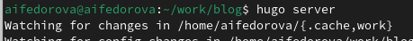{#fig:001 width=70%}

Перехожу во внутренний каталог сontent и далее в каталог authors, а затем в каталог admin.(рис.2)

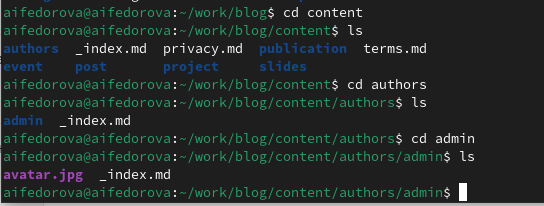{#fig:001 width=70%}

Добавляю свою фотографию в данный каталог (рис.3)

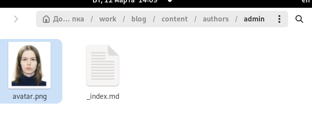{#fig:001 width=70%}

Теперь вижу, что аватар моего сайта изменился (рис.4)

{#fig:001 width=70%}

Далее я открываю файл _index.md, который содержит информацию о владельце сайта и начинаю редактирование.(рис.5)

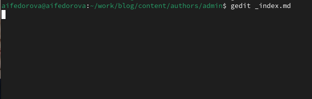{#fig:001 width=70%}

Меняю био и интересы.(рис.6)

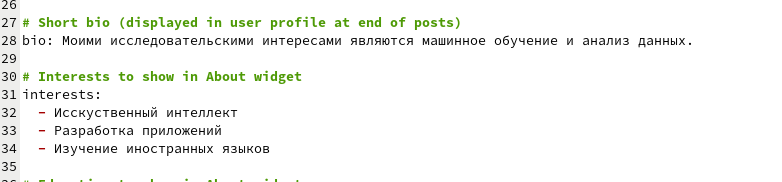{#fig:001 width=70%}

Меняю список пройденных курсов. (рис.7)

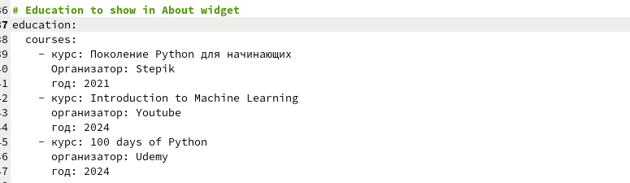{#fig:001 width=70%}

Меняю биографию, которая будет отображаться при открытии сайта.  (рис.8)

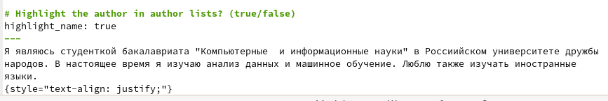{#fig:001 width=70%}

Меняю имя владельца сайта-страницы (рис.9)

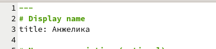{#fig:001 width=70%}

Теперь смотрю, как мой сайт изменился после сохраненных изменений. (рис.10)

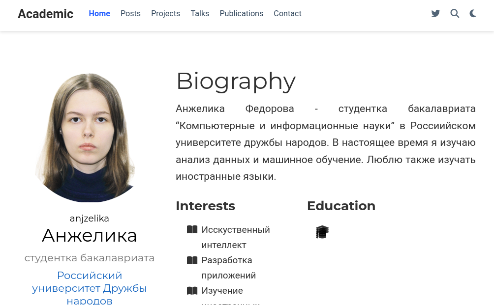{#fig:001 width=70%}

Теперь я захожу в каталог post и создаю директории post1 и post2. (рис.11)

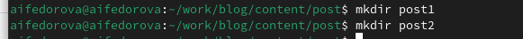{#fig:001 width=70%}

Захожу в каталог getting-started и копирую шаблон поста из index.md в файл myweek.md, который создастся в каталоге post1. (рис.12)

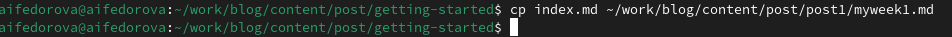{#fig:001 width=70%}

hugo server считывает только файлы с именем index.md, поэтому я создаю файл с таким же названием и копирую в него содержимое предыдущего файла. Открываю новый файл и начинаю и начинаю писать пост о прошедшей недели. Старый файл потом удалю.(рис.13)

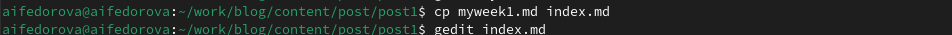{#fig:001 width=70%}

После редактирования данного файла я сохраняю изменения и перехожу на свой сайт, чтобы посмотреть на опубликованный пост. (рис.14)

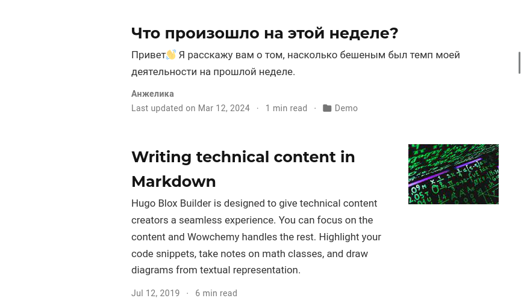{#fig:001 width=70%}

Снова перехожу в getting-started и копирую содержимое файла index.md в файл с таким же названием, но расположенным в каталоге post2. (рис.15)

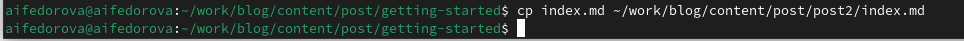{#fig:001 width=70%}

Перехожу в каталог post2. (рис.16)

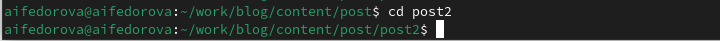{#fig:001 width=70%}

Я выбрала тему "Управление версиями. Git." для своего поста. Начинаю заполнять файл с содержимым поста.(рис.17)

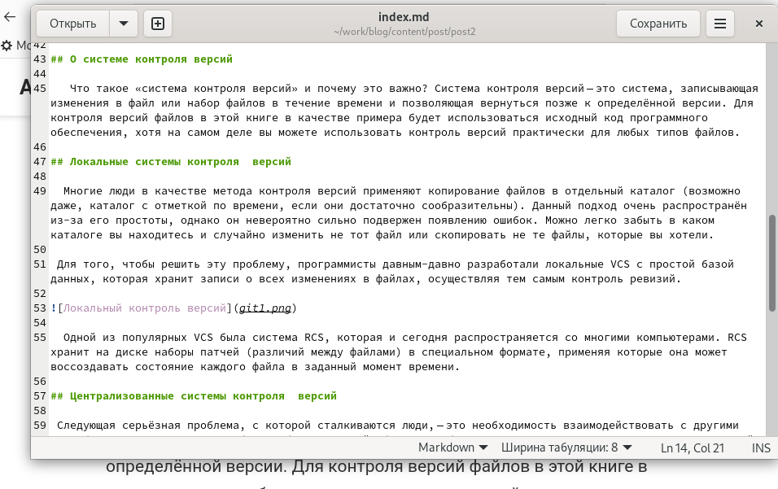{#fig:001 width=70%}

Снова перехожу на свой сайт, чтобы посмотреть на опубликованный пост. (рис.18)

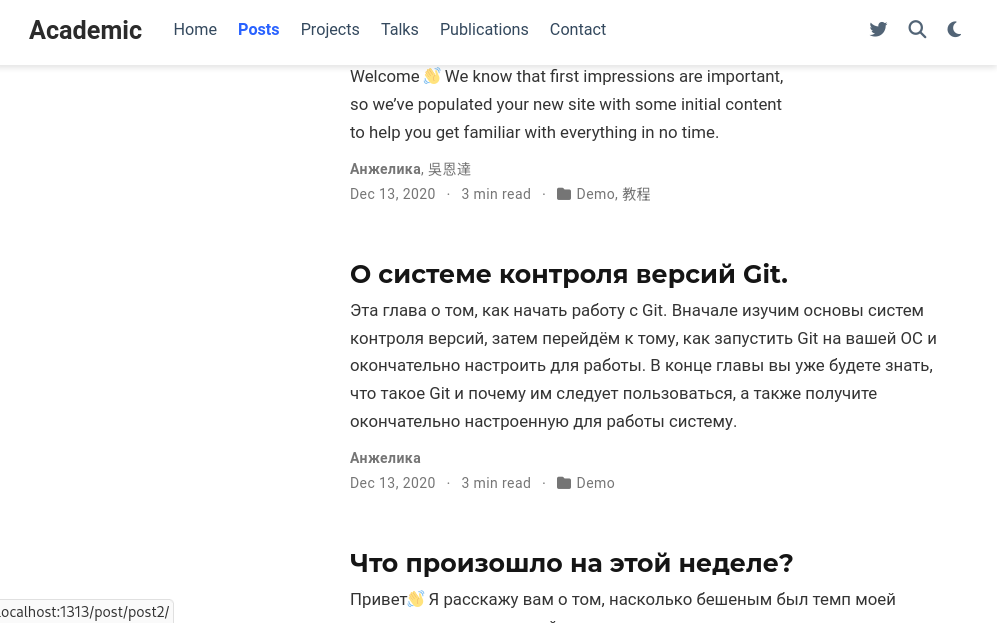{#fig:001 width=70%}

После выполнения всех заданий я выгружаю изменения в репозиторий blog с помощью команд  git add и git commit, предворительно перейдя в каталог blog(рис.19)

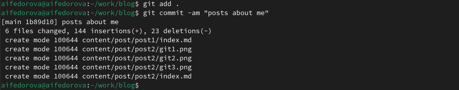{#fig:001 width=70%}

Окончательно отправляю изменения в репозиторий (рис.20)

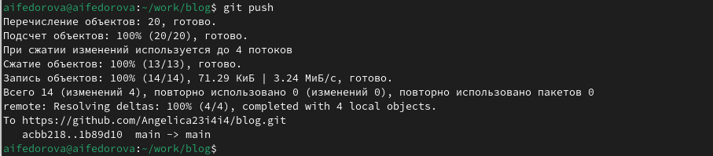{#fig:001 width=70%}

Для того, чтобы произведенные изменения были заметны всем зрителям на сайте, я захожу в каталог public 
и запускаю те же самые 2 команды. (рис.21)
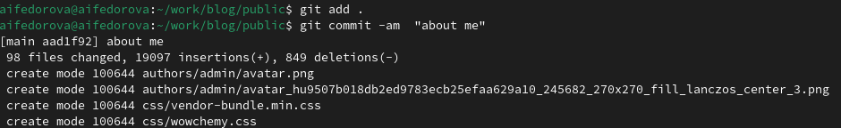{#fig:001 width=70%}

Отправляю изменения с помощью команды git push.(рис.22)

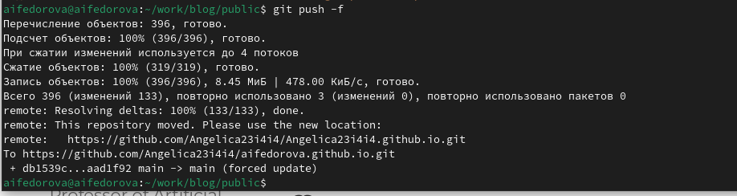{#fig:001 width=70%}

Ввожу имя своего пользователя в Github в адрессную строку и вижу, что оформление сайта было успешно обновлено.(рис.23)

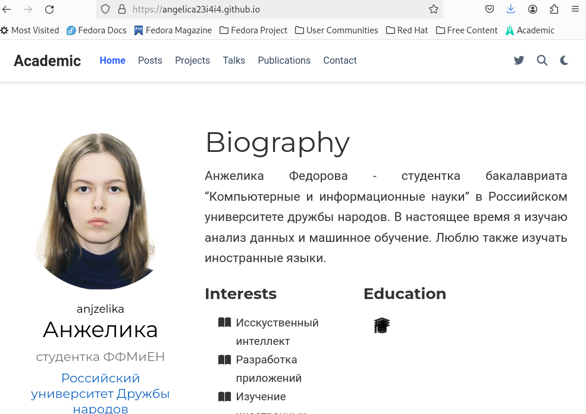{#fig:001 width=70%}

# Выводы

Я приобрела навыки по оформлению собственного сайта, созданного с помощью hugo.

