---
## Front matter
lang: ru-RU
title: Презентация по 3-ему этапу индивидаульаного проекта
subtitle: Операционные системы
author:
  - Федорова А.С
institute:
  - Российский университет дружбы народов, Москва, Россия
  
## i18n babel
babel-lang: russian
babel-otherlangs: english

## Formatting pdf
toc: false
toc-title: Содержание
slide_level: 2
aspectratio: 169
section-titles: true
theme: metropolis
header-includes:
 - \metroset{progressbar=frametitle,sectionpage=progressbar,numbering=fraction}
 - '\makeatletter'
 - '\beamer@ignorenonframefalse'
 - '\makeatother'
 
## Fonts
mainfont: PT Serif
romanfont: PT Serif
sansfont: PT Sans
monofont: PT Mono
mainfontoptions: Ligatures=TeX
romanfontoptions: Ligatures=TeX
sansfontoptions: Ligatures=TeX,Scale=MatchLowercase
monofontoptions: Scale=MatchLowercase,Scale=0.9

---

## Актуальность

Персональная страница научного сотрудника должна давать полную информациою о его навыках,опыте и достижениях.

## Цели и задачи

Офоромить свой персональный сайт, добавив информацию об опыте и навыках.

## Материалы и методы

1. Добавить к сайту достижения.
Список достижений.
- Добавить информацию о навыках (Skills).

- Добавить информацию об опыте (Experience).

- Добавить информацию о достижениях (Accomplishments).

2. Сделать пост по прошедшей неделе.

3. Добавить пост на тему по выбору:

- Легковесные языки разметки.

- Языки разметки. LaTeX.

- Язык разметки Markdown.

## Добавление достижений

Захожу в каталог admin и редактирую файл _index.md, содержащий информацию о владельце страницы (рис.1).

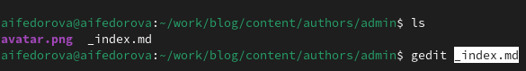{#fig:001 width=70%}

## Добавление достижений

Редактирую информацию о своих хобби и навыках (рис.2)

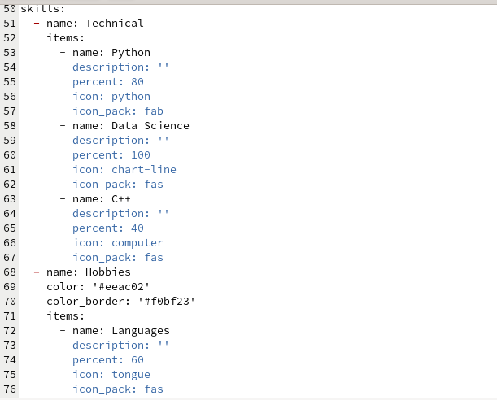{#fig:002 width=70%}

## Добавление достижений

Вижу, что дизайн моего сайта был обновлен (рис.3)

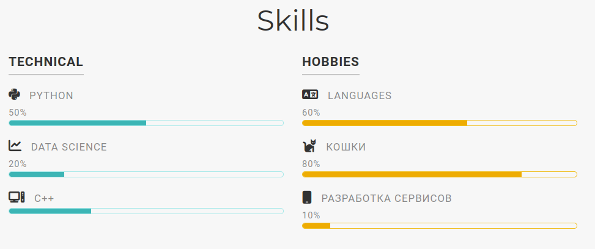{#fig:003 width=70%}

## Добавление достижений

Редактирую информацию о своем опыте в файле (рис.5)

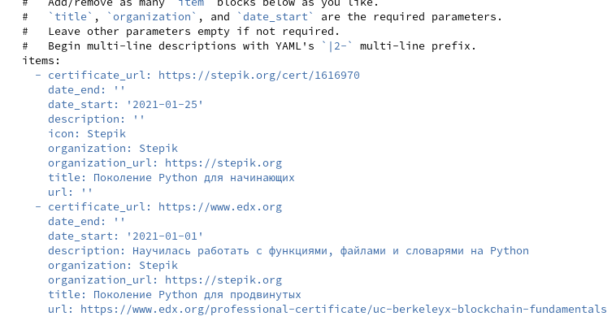{#fig:005 width=70%}

## Добавление достижений

Смотрю на обновления на странице (рис.6)

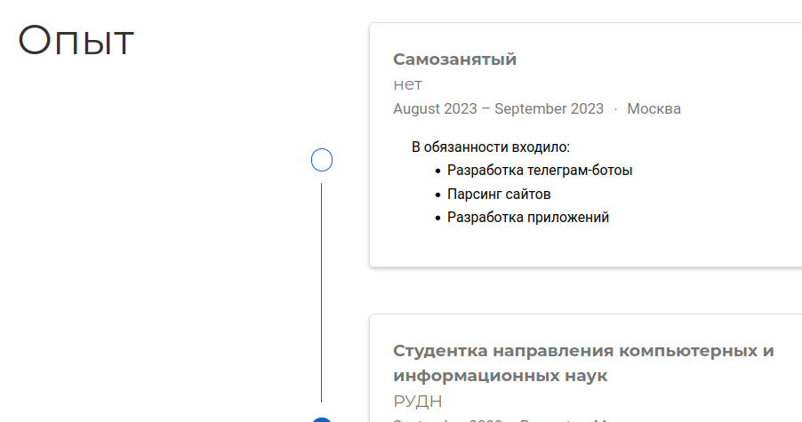{#fig:006 width=70%}

## Добавление достижений

Я также реадктирую информацию о своих достижениях и вижу, что информация обновилась (рис.7)

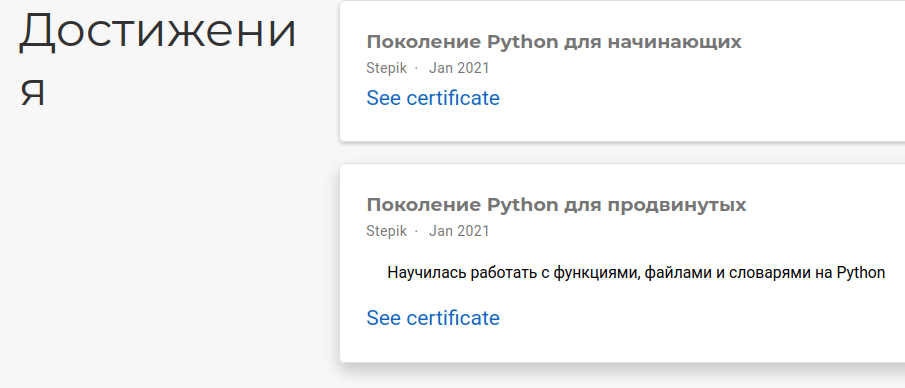{#fig:007 width=70%}

## Пост по прошедшей неделе

Редактирую скопированный файл и пишу пост по прошедшей неделе. Далее сохраняю, чтобы потом пост появился на странице(рис.9)

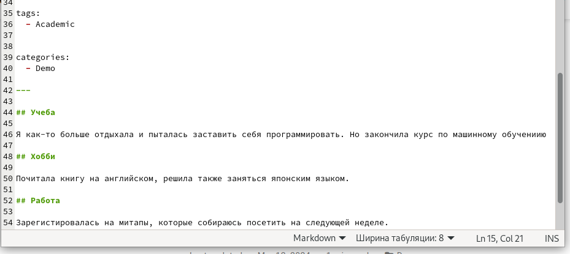{#fig:009 width=70%}

##  Пост по прошедшей неделе

Я выбрала тему для второго поста "Языки разметки. LaTeX" (рис.11)

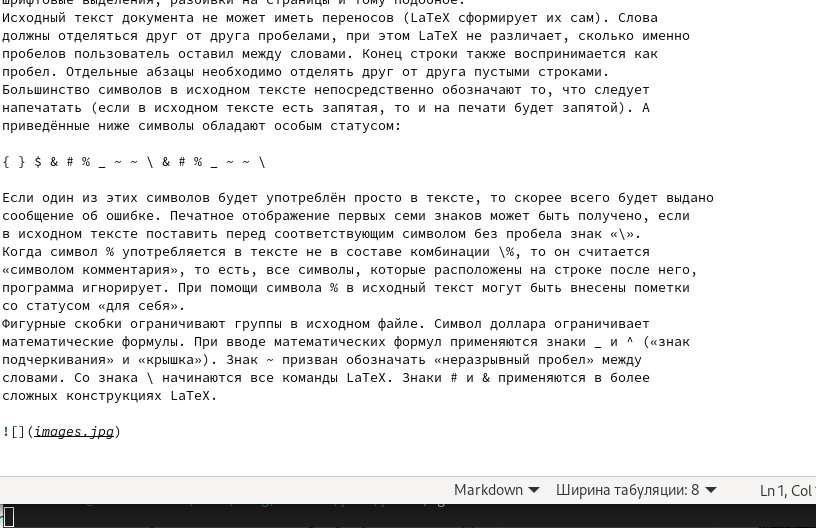{#fig:011 width=70%}

## Пост на тему "Языки разметки. LaTeX"

Второй пост появился на сайте. (рис.12)

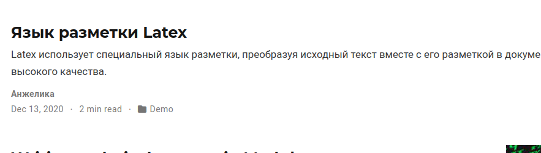{#fig:012 width=70%}

## Отправка результатов

Отправляю изменения в репозиторий blog (рис.13)

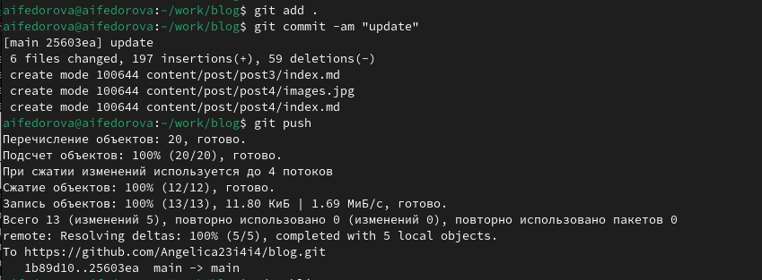{#fig:013 width=70%}

## Отправка результатов

Захожу в каталог public и отправляю изменения в репозиторий сайта для публичного просмотра(рис.14)

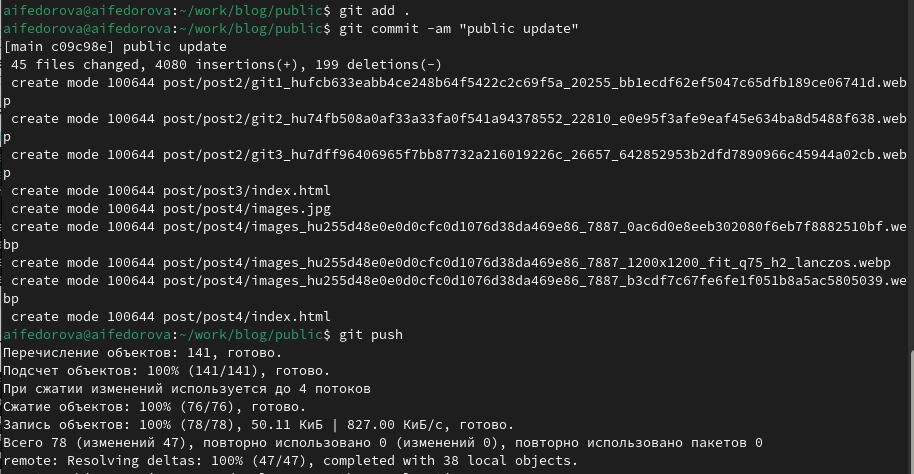{#fig:013 width=70%}

## Отправка результатов

Пишу имя репозитория сайта в адресную строку и вижу, что сайт со всеми обновлениями публично доступен (рис.15)

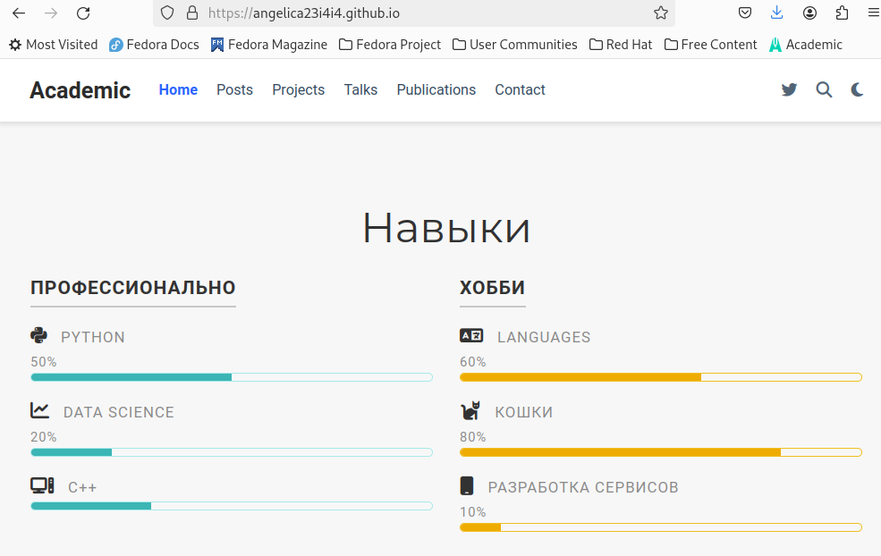{#fig:015 width=70%}

## Результаты

- Добавила инфомацию об опыте, достижениях и навыках

- Создала пост о прошедшей неделе

- Написала один тематический пост.

## Итоговый слайд

Спасибо за внимание!

