---
## Front matter
title: "Отчёт по 3-ему этапу индивидуального проекта"
subtitle: "Операционные системы"
author: "Федорова Анжелика Игоревна"

## Generic otions
lang: ru-RU
toc-title: "Содержание"

## Bibliography
bibliography: bib/cite.bib
csl: pandoc/csl/gost-r-7-0-5-2008-numeric.csl

## Pdf output format
toc: true # Table of contents
toc-depth: 2
lof: true # List of figures
lot: true # List of tables
fontsize: 12pt
linestretch: 1.5
papersize: a4
documentclass: scrreprt
## I18n polyglossia
polyglossia-lang:
  name: russian
  options:
	- spelling=modern
	- babelshorthands=true
polyglossia-otherlangs:
  name: english
## I18n babel
babel-lang: russian
babel-otherlangs: english
## Fonts
mainfont: PT Serif
romanfont: PT Serif
sansfont: PT Sans
monofont: PT Mono
mainfontoptions: Ligatures=TeX
romanfontoptions: Ligatures=TeX
sansfontoptions: Ligatures=TeX,Scale=MatchLowercase
monofontoptions: Scale=MatchLowercase,Scale=0.9
## Biblatex
biblatex: true
biblio-style: "gost-numeric"
biblatexoptions:
  - parentracker=true
  - backend=biber
  - hyperref=auto
  - language=auto
  - autolang=other*
  - citestyle=gost-numeric
## Pandoc-crossref LaTeX customization
figureTitle: "Рис."
tableTitle: "Таблица"
listingTitle: "Листинг"
lofTitle: "Список иллюстраций"
lotTitle: "Список таблиц"
lolTitle: "Листинги"
## Misc options
indent: true
header-includes:
  - \usepackage{indentfirst}
  - \usepackage{float} # keep figures where there are in the text
  - \floatplacement{figure}{H} # keep figures where there are in the text
---

# Цель работы

Офоромить свой персональный сайт, добавив информацию об опыте и навыках.

# Задание

1. Добавить к сайту достижения.
Список достижений.
- Добавить информацию о навыках (Skills).

- Добавить информацию об опыте (Experience).

- Добавить информацию о достижениях (Accomplishments).

2. Сделать пост по прошедшей неделе.

3. Добавить пост на тему по выбору:
- Легковесные языки разметки.

- Языки разметки. LaTeX.

- Язык разметки Markdown.

# Выполнение лабораторной работы

Захожу в каталог admin и редактирую файл _index.md, содержащий информацию о владельце страницы (рис.1).

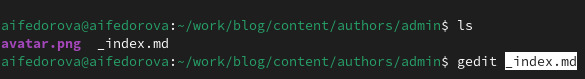{#fig:001 width=70%}

Редактирую информацию о своих хобби и навыках (рис.2)

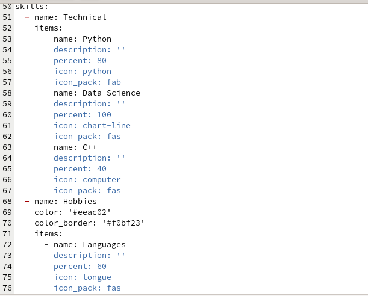{#fig:002 width=70%}

Вижу, что дизайн моего сайта был обновлен (рис.3)

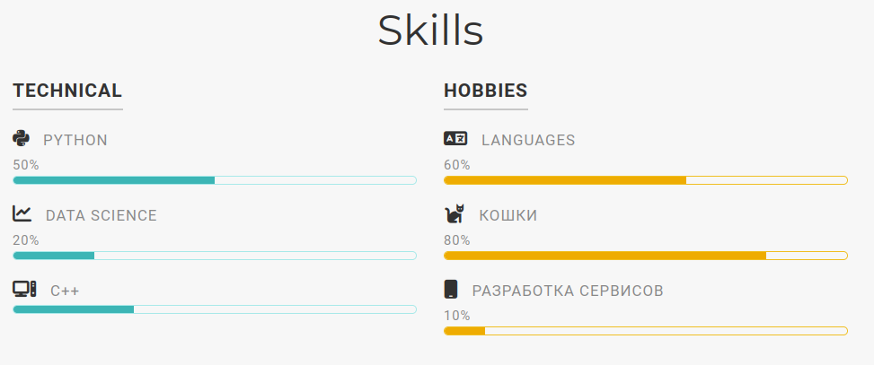{#fig:003 width=70%}

Перехожу в каталог сontent и редактирую файл _index.md (рис.4)

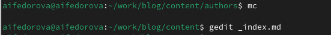{#fig:004 width=70%}

Редактирую информацию о своем опыте в файле (рис.5)

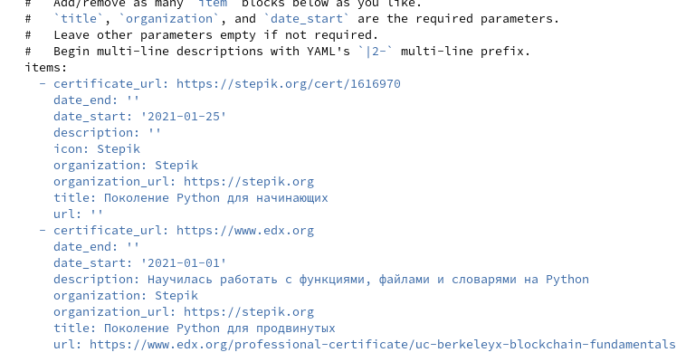{#fig:005 width=70%}

Смотрю на обновления на странице (рис.6)

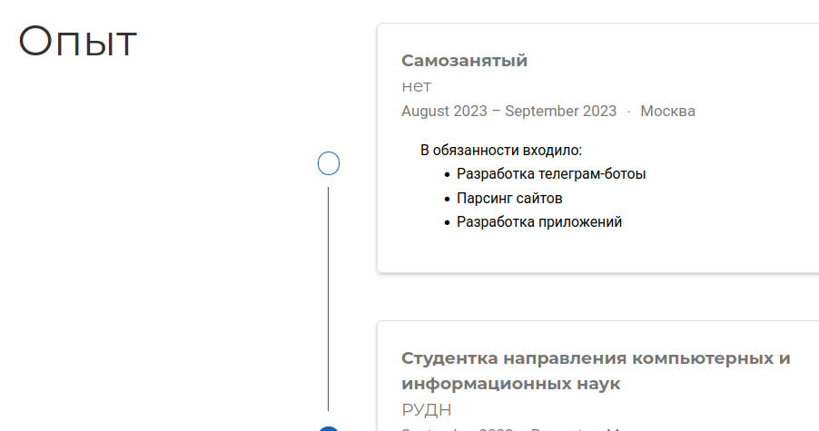{#fig:006 width=70%}

Я также реадктирую информацию о своих достижениях и вижу, что информация обновилась (рис.7)

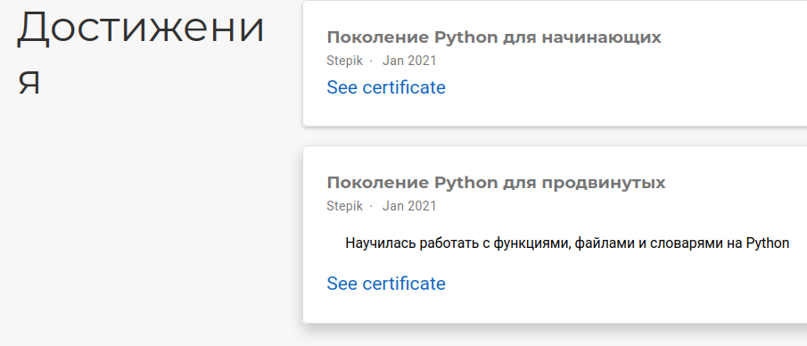{#fig:007 width=70%}

Создаю в каталоге сontent директорию post3 и копирую в данный каталог файл из каталога gettig-started (рис.8) 

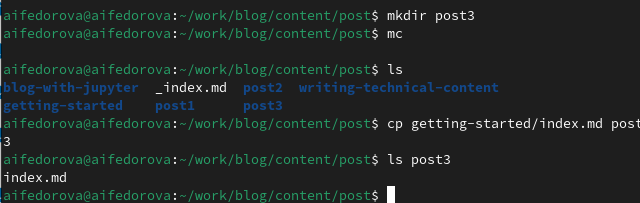{#fig:008 width=70%}

Редактирую скопированный файл и сохраняю, чтобы потом пост появился на странице(рис.9)

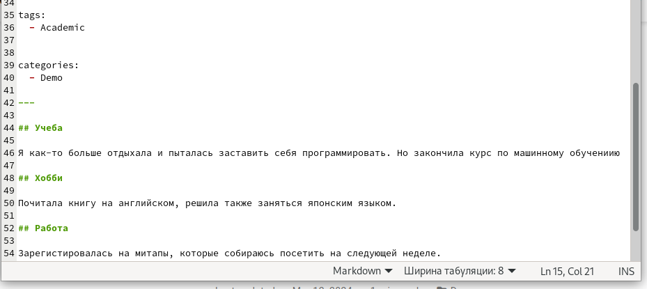{#fig:009 width=70%}

Создаю в каталоге сontent директорию post4 и также копирую в данный каталог файл из каталога gettig-started (рис.10)

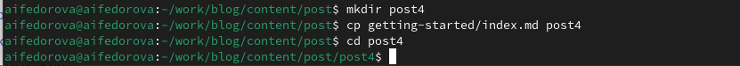{#fig:010 width=70%}

Я выбрала тему для поста "Языки разметки. LaTeX" (рис.11)

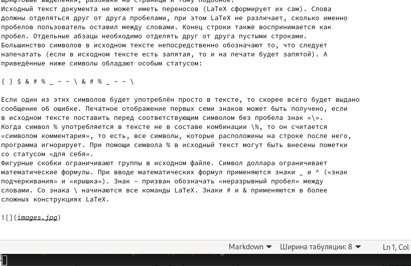{#fig:011 width=70%}

Второй пост появился на сайте. (рис.12)

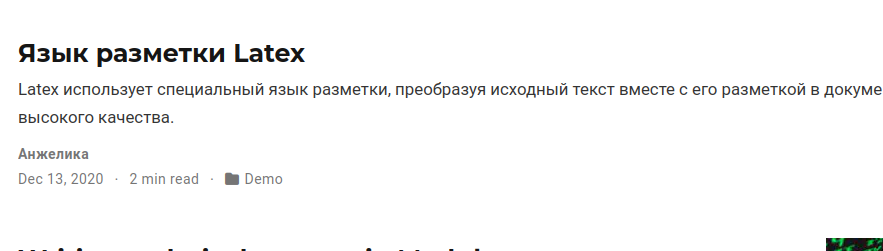{#fig:012 width=70%}

Отправляю изменения в репозиторий blog (рис.13)

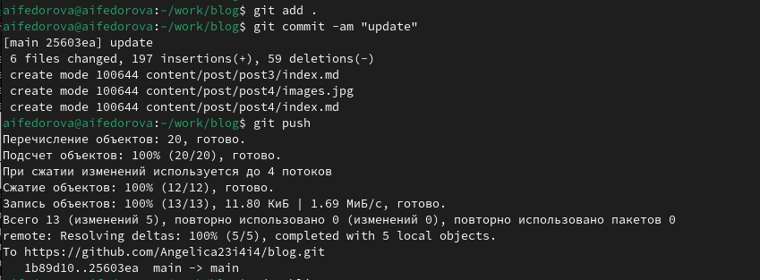{#fig:013 width=70%}

Захожу в каталог public и отправляю изменения в репозиторий сайта для публичного просмотра(рис.14)

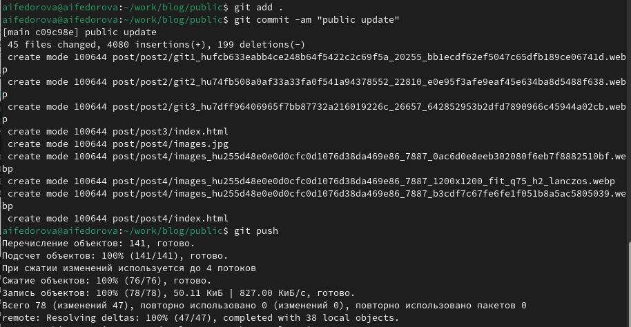{#fig:013 width=70%}

Пишу имя репозитория сайта в адресную строку и вижу, что сайт со всеми обновлениями публично доступен (рис.15)

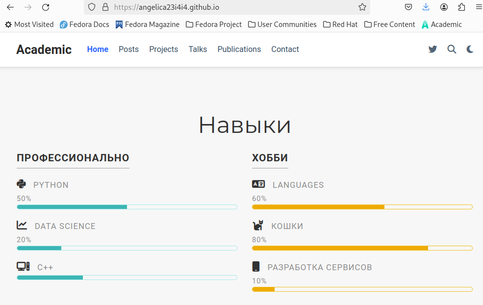{#fig:015 width=70%}

# Выводы

Я научилась оформлять свой персональный сайт, добавив информацию об опыте и навыках.

