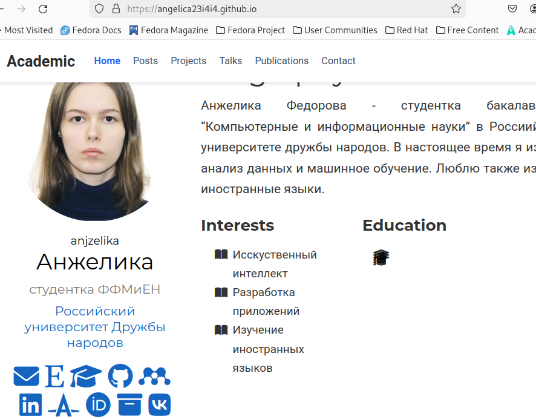

---
## Front matter
lang: ru-RU
title: Презентация по 4-ому этапу индивидуального проэкта
subtitle: Операционные системы
author:
  - Федорова А.И
institute:
  - Российский университет дружбы народов, Москва, Россия
  

## i18n babel
babel-lang: russian
babel-otherlangs: english

## Formatting pdf
toc: false
toc-title: Содержание
slide_level: 2
aspectratio: 169
section-titles: true
theme: metropolis
header-includes:
 - \metroset{progressbar=frametitle,sectionpage=progressbar,numbering=fraction}
 - '\makeatletter'
 - '\beamer@ignorenonframefalse'
 - '\makeatother'
 
## Fonts
mainfont: PT Serif
romanfont: PT Serif
sansfont: PT Sans
monofont: PT Mono
mainfontoptions: Ligatures=TeX
romanfontoptions: Ligatures=TeX
sansfontoptions: Ligatures=TeX,Scale=MatchLowercase
monofontoptions: Scale=MatchLowercase,Scale=0.9

---

## Актуальность

Научному сотруднику важно дать ссылки на платформы, где он публикует свои работы или ведет какую-либо активную деятельность, чтобы специалисты могли ознакомиться с его исследованиями.

## Цели и задачи

Добавить ссылки на сторонние профили или полезные источники, написать посты.

## Материалы и методы

1. Зарегистрироваться на соответствующих ресурсах и разместить на них ссылки на сайте:
 
eLibrary : https://elibrary.ru/;

Google Scholar : https://scholar.google.com/;

ORCID : https://orcid.org/;

Mendeley : https://www.mendeley.com/;
        
ResearchGate : https://www.researchgate.net/;

Academia.edu : https://www.academia.edu/;

arXiv : https://arxiv.org/;

github : https://github.com/.

2. Сделать пост по прошедшей неделе.

3. Добавить пост на тему по выбору:

Оформление отчёта.

Создание презентаций.

Работа с библиографией.

## Выполнение работы

Вставляю ссылки на сайт (рис.9)

{#fig:010 width=70%}

## Выполнение работы

Пишу пост о прошедшей неделе (рис.10)

{#fig:011 width=70%}

## Выполнение работы

Пишу пост на тему создания презентации (рис.11)

{#fig:012 width=70%}

## Выполнение работы

Вижу, что посты были успешно опубликованы (рис.12)

{#fig:013 width=70%}

## Выполнение работы

Выкладываю измения в гитхаб (рис.13 и рис.14)

{#fig:014 width=70%}

{#fig:015 width=70%}

## Выполнение работы

Проверяю изменения на сайте (рис.15)

{#fig:016 width=70%}

## Результаты

Я научилась вставять в свой сайт изменения ссылки на полезные источники или профили.

## Итоговый слайд

Спасибо за внимание

