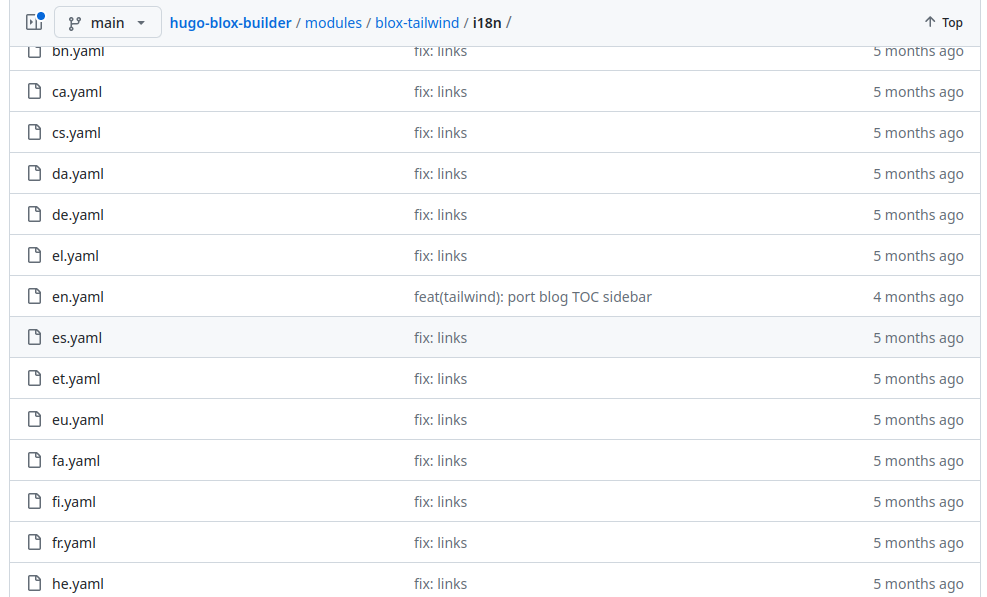
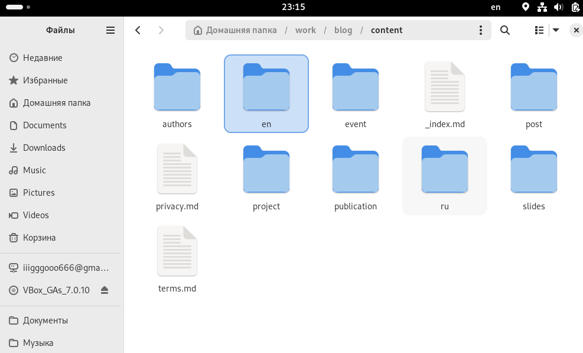
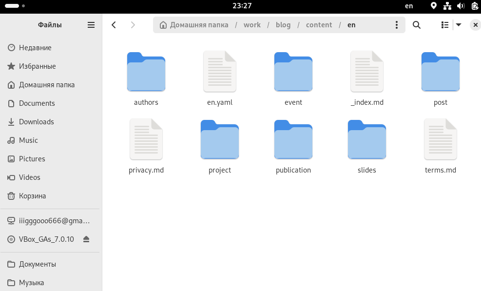
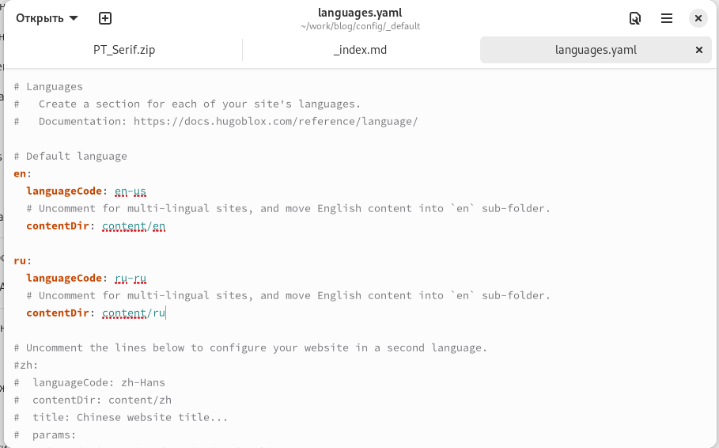
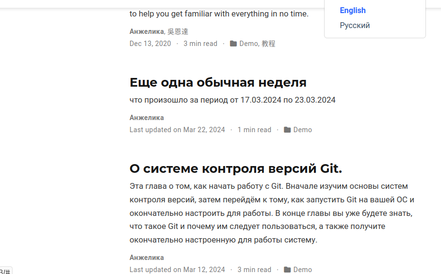
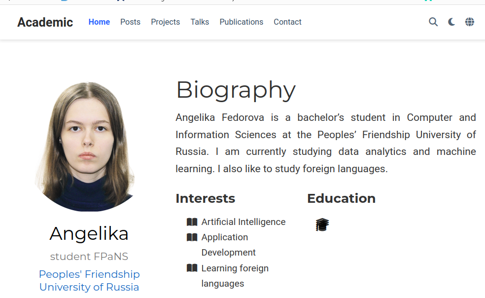
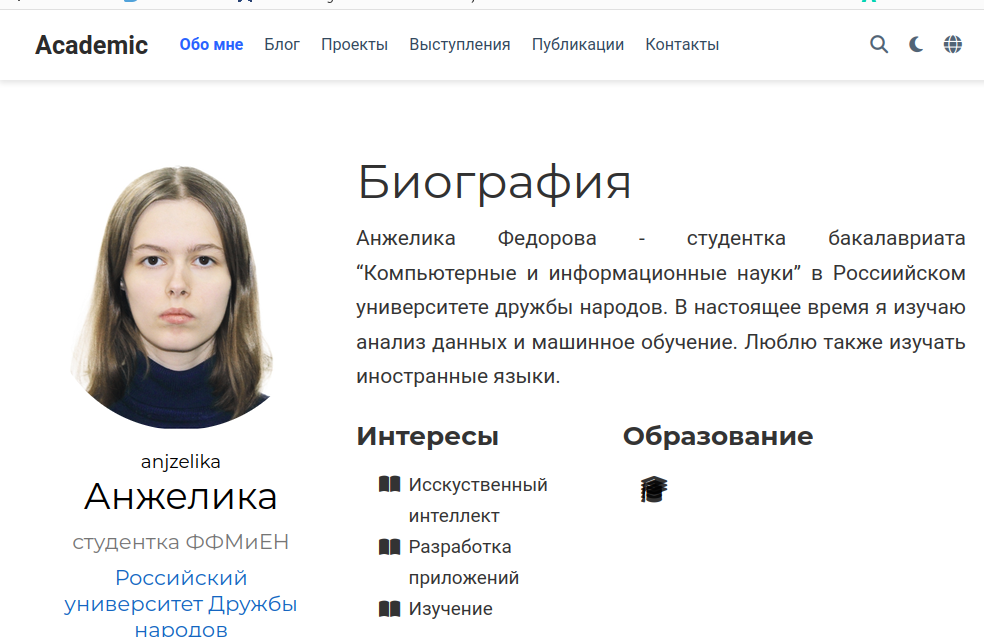
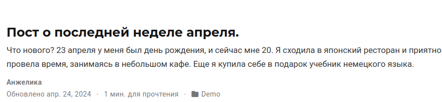
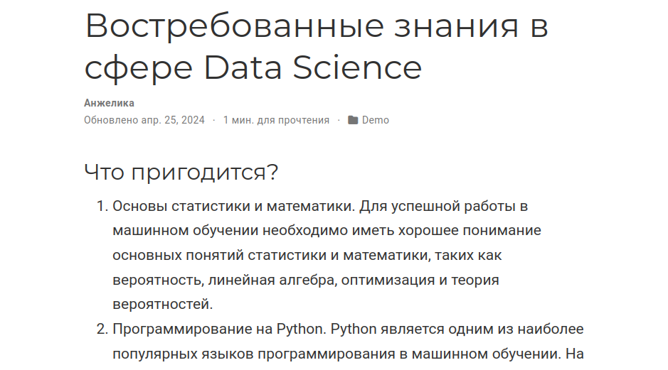
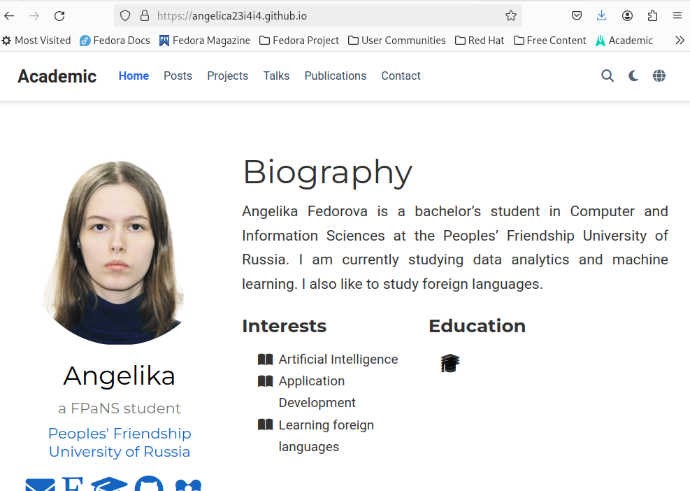

---
## Front matter
lang: ru-RU
title: Презентация по 6-ому этапу индивидуального проекта
subtitle: Операционные системы
author:
  - Федорова А.И
institute:
  - Российский университет дружбы народов, Москва, Россия
  

## i18n babel
babel-lang: russian
babel-otherlangs: english

## Formatting pdf
toc: false
toc-title: Содержание
slide_level: 2
aspectratio: 169
section-titles: true
theme: metropolis
header-includes:
 - \metroset{progressbar=frametitle,sectionpage=progressbar,numbering=fraction}
 - '\makeatletter'
 - '\beamer@ignorenonframefalse'
 - '\makeatother'
 
## Fonts
mainfont: PT Serif
romanfont: PT Serif
sansfont: PT Sans
monofont: PT Mono
mainfontoptions: Ligatures=TeX
romanfontoptions: Ligatures=TeX
sansfontoptions: Ligatures=TeX,Scale=MatchLowercase
monofontoptions: Scale=MatchLowercase,Scale=0.9

---

## Актуальность

Для научного сотрудника выгодно участовать в иностранных проектах и иметь связи с иностранными коллегами. Поэтому личный сайт должен поддерживать английский язык, как международный язык в области науки.

## Цели и задачи

Разместить англоязычную версию сайта и создать контент на обоих языках.

## Материалы и методы

1. Сделать поддержку английского и русского языков.
2. Разместить элементы сайта на обоих языках.
3. Разместить контент на обоих языках.
4. Сделать пост по прошедшей неделе.
5. Добавить пост на тему по выбору (на двух языках).

## Выполнение работы

Сначала я захожу в репозиторий, где могу скачать файлы с поддержкой русского и английского языков (рис.1).

{#fig:001 width=70%}

## Выполнение работы

Создаю папки en и ru(рис.2) 

{#fig:002 width=70%}

## Выполнение работы

и копирую все элементы, содержащиеся в папке сontent в каждую из них и соответствующие языковые файлы для каждой папки(рис.3) 

{#fig:003 width=70%}

## Выполнение работы

В папке config находим файл languages.yamls и вставляем русский язык (рис.4) 

{#fig:004 width=70%}

## Выполнение работы

Вижу, что теперь сайт поддерживает два языка  (рис.5) 

{#fig:005 width=70%}

## Выполнение работы

Я полностью оформила вид сайта на обоих языках (рис.8 и рис.9) 

{#fig:008 width=70%}

## Выполнение работы

{#fig:009 width=70%}

## Выполнение работы

Я пишу пост о прошедшей неделе (рис.12) 

{#fig:011 width=70%}

## Выполнение работы

Пишу тематический пост на тему "Востребованные навыки в сфере Data Science" и публикую это на двух языках 

{#fig:012 width=70%}

## Выполнение работы

{#fig:013 width=70%}

## Выполнение работы

Далее отправляю изменения в репозиторий и смотрю как выглядит сайт (рис.15 и рис.16) 

{#fig:013 width=70%}

## Результаты

Я установила поддержку русского языка, переписала посты на английском и сделала новые записи на двух языках.

## Итоговый слайд

Спасибо за внимание

