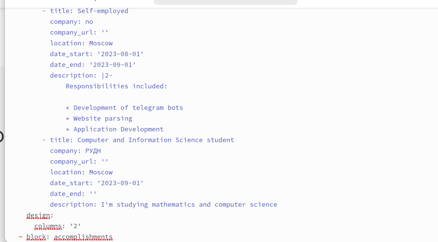

---
## Front matter
title: "Отчет по 6-ому этапу индивидуального проекта"
subtitle: "Операционные системы"
author: "Федорова Анжелика Игоревна"

## Generic otions
lang: ru-RU
toc-title: "Содержание"

## Bibliography
bibliography: bib/cite.bib
csl: pandoc/csl/gost-r-7-0-5-2008-numeric.csl

## Pdf output format
toc: true # Table of contents
toc-depth: 2
lof: true # List of figures
lot: true # List of tables
fontsize: 12pt
linestretch: 1.5
papersize: a4
documentclass: scrreprt
## I18n polyglossia
polyglossia-lang:
  name: russian
  options:
	- spelling=modern
	- babelshorthands=true
polyglossia-otherlangs:
  name: english
## I18n babel
babel-lang: russian
babel-otherlangs: english
## Fonts
mainfont: PT Serif
romanfont: PT Serif
sansfont: PT Sans
monofont: PT Mono
mainfontoptions: Ligatures=TeX
romanfontoptions: Ligatures=TeX
sansfontoptions: Ligatures=TeX,Scale=MatchLowercase
monofontoptions: Scale=MatchLowercase,Scale=0.9
## Biblatex
biblatex: true
biblio-style: "gost-numeric"
biblatexoptions:
  - parentracker=true
  - backend=biber
  - hyperref=auto
  - language=auto
  - autolang=other*
  - citestyle=gost-numeric
## Pandoc-crossref LaTeX customization
figureTitle: "Рис."
tableTitle: "Таблица"
listingTitle: "Листинг"
lofTitle: "Список иллюстраций"
lotTitle: "Список таблиц"
lolTitle: "Листинги"
## Misc options
indent: true
header-includes:
  - \usepackage{indentfirst}
  - \usepackage{float} # keep figures where there are in the text
  - \floatplacement{figure}{H} # keep figures where there are in the text
---

# Цель работы

Разместить англоязычную версию сайта и создать контент на обоих языках.

# Задание

1. Сделать поддержку английского и русского языков.
2. Разместить элементы сайта на обоих языках.
3. Разместить контент на обоих языках.
4. Сделать пост по прошедшей неделе.
5. Добавить пост на тему по выбору (на двух языках).

# Выполнение лабораторной работы

Сначала я захожу в репозиторий, где могу скачать файлы с поддержкой русского и английского языков (рис.1).

{#fig:001 width=70%}

Создаю папки en и ru(рис.2) 

{#fig:002 width=70%}

и копирую все элементы, содержащиеся в папке сontent в каждую из них и соответствующие языковые файлы для каждой папки(рис.3) 

{#fig:003 width=70%}

В папке config находим файл languages.yamls и вставляем русский язык (рис.4) 

{#fig:004 width=70%}

Вижу, что поддерживается 2 языка. Теперь я могу редактировать файлы в папке  en и перевести их на английский язык. (рис.5,6,7) 

{#fig:005 width=70%}

{#fig:006 width=70%}

{#fig:007 width=70%}

Я полностью оформила вид сайта на обоих языках (рис.8,9) 

{#fig:008 width=70%}

{#fig:09 width=70%}

Теперь я размещу весь контент(посты) на двух языках. 

{#fig:010 width=70%}

Я напишу пост о прошедшей неделе (рис.11) 

{#fig:011 width=70%}

Пишу тематический пост на тему "Востребованные навыки в сфере Data Science" и публикую это на двух языках (рис.12 и рис.13) 

{#fig:012 width=70%}

{#fig:013 width=70%}

Далее отправляю изменения в репозиторий и смотрю как выглядит сайт (рис.14) 

{#fig:014 width=70%}

# Выводы

Я установила поддержку русского языка, переписала посты на английском и сделала новые записи на двух языках.
